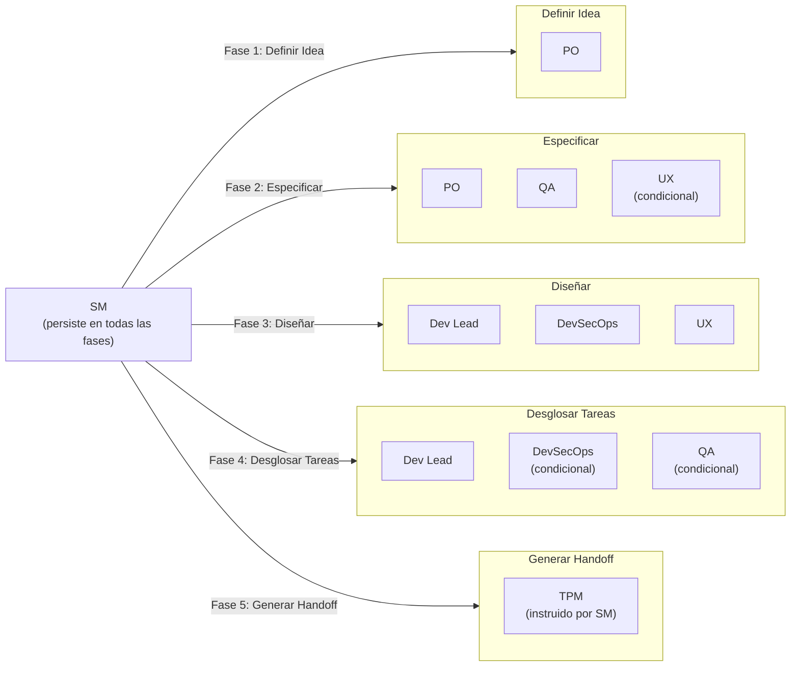
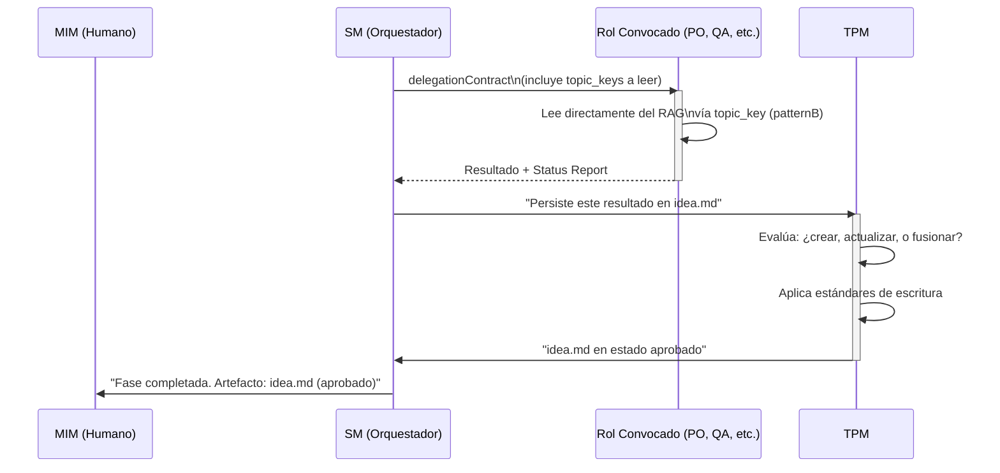
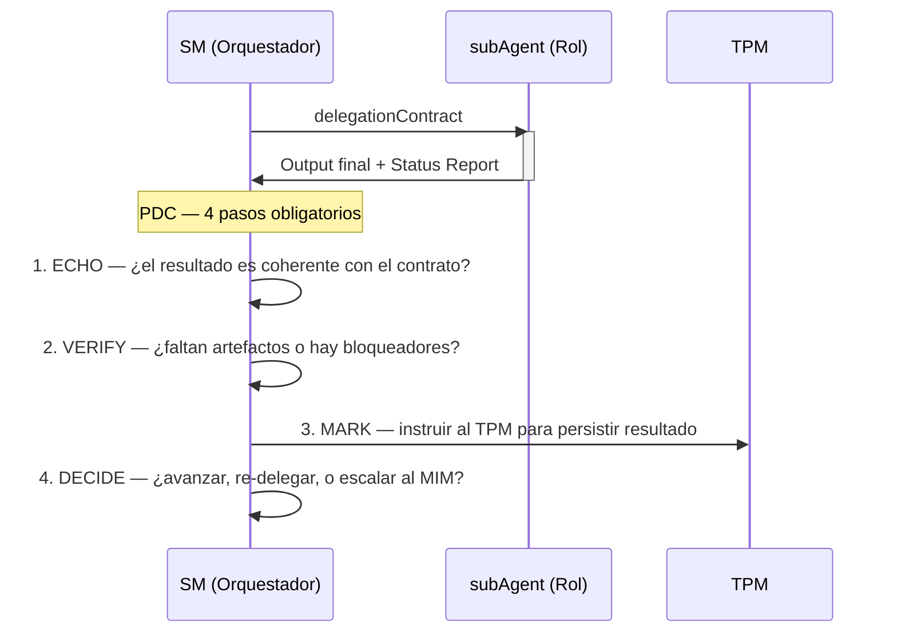
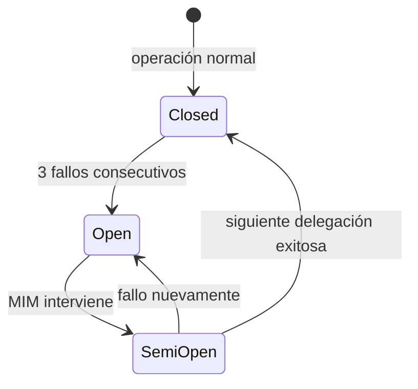
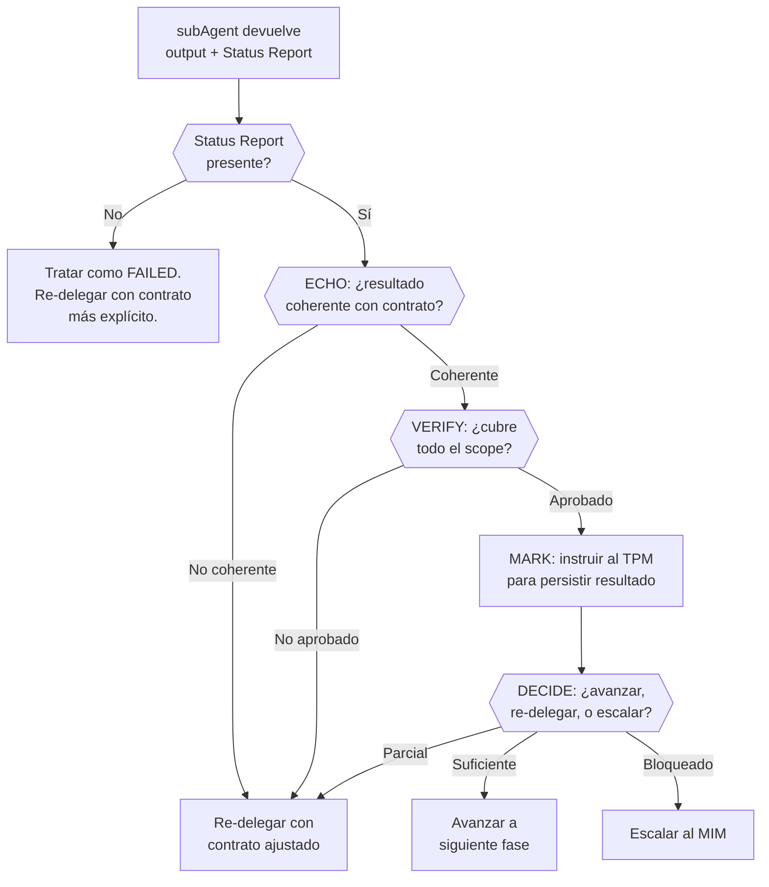

# Delegación, PDC y circuitBreaker

← [Índice principal](../../README.md) | [Planning](../README.md) | [SM Behavior](README.md)

---

## Contenido

- [Principio](#principio)
- [Mapa de Convocatoria por Fase](#mapa-de-convocatoria-por-fase)
- [Reglas de Activación Condicional](#reglas-de-activación-condicional)
- [Regla cardinal: el SM NUNCA toca archivos, SIEMPRE delega](#regla-cardinal-el-sm-nunca-toca-archivos-siempre-delega)
- [El TPM: gestor operativo del RAG](#el-tpm-gestor-operativo-del-rag)
- [Protocolo cuando el MIM no puede responder](#protocolo-cuando-el-mim-no-puede-responder)
- [delegationContract a subAgents](#delegationcontract-a-subagents)

---

## Principio

El SM NO produce artefactos de contenido. El SM:

1. **Detecta** en qué fase está el proyecto
2. **Convoca** a los roles del equipo (default o ad-hoc) que corresponden a esa fase
3. **Extiende** el equipo con roles ad-hoc cuando el proyecto requiere expertise fuera del equipo default
4. **Acota** la función de cada rol convocado (qué esperamos, qué NO)
5. **Valida** que el artefacto de salida quede aprobado (vía TPM)
6. **Bloquea** el avance si el gate no se cumple
7. **Desbloquea** la siguiente fase cuando el artefacto es suficiente
8. **Rastrea** la iteración actual, el historial, y las escalaciones

El SM es el ÚNICO rol que persiste a lo largo de todas las fases. Los demás
roles (default y ad-hoc) entran y salen según la fase los requiera.

---

[↑ Contenido](#contenido)

## Mapa de Convocatoria por Fase

El SM convoca diferentes roles según la fase. Cada rol tiene una función
acotada y un entregable esperado. Los roles listados abajo son el equipo
**default**. El SM puede agregar roles ad-hoc a cualquier fase cuando el
proyecto lo requiera (ver [Roles Ad-Hoc](../roles/ad-hoc.md)).



---

[↑ Contenido](#contenido)

## Reglas de Activación Condicional

No todos los roles se activan siempre. El SM decide según el contexto:

| Condición | Roles que se activan |
|-----------|---------------------|
| Proyecto sin interfaz de usuario (API pura, CLI, librería) | UX NO se convoca en ninguna etapa |
| Proyecto sin requisitos de seguridad especiales | DevSecOps se convoca solo en Diseño (mínimo) |
| Proyecto de un solo desarrollador (tier bajo) | SM + PO en Idea, SM + Dev Lead en Diseño, resto condensado |
| Tech challenge con timebox | SM extrae reglas de proceso en Fase 1. Todas las fases se comprimen. |

El SM evalúa el contexto del proyecto en Fase 1 y decide qué roles default
activar y si se necesitan roles ad-hoc. Esta decisión se re-evalúa mid-cycle
si cambia el scope (ver
[Reglas de Activación Condicional](../roles/profiles-by-phase.md#reglas-de-activación-condicional)).
Todo queda documentado en `idea.md` como "roles
activos para este proyecto" — tanto los roles default activados como
cualquier rol ad-hoc con su justificación.

---

[↑ Contenido](#contenido)

## Regla cardinal: el SM NUNCA toca archivos, SIEMPRE delega

El SM (el agente principal) no lee archivos, no escribe archivos, no edita
archivos, no ejecuta comandos, no produce artefactos. **CERO excepciones.**
Ni siquiera el handoff — eso también lo hace un subAgent.

El SM solo hace tres cosas:

1. Orquestar (convocar roles, definir contratos, validar gates)
2. Comunicarse con el MIM (preguntar, reportar, bloquear)
3. Decidir qué subAgent lanzar y con qué contrato

Cualquier tentación de "hacerlo rápido yo mismo" es exactamente la
racionalización que causa drifts. Si hay que hacerlo, hay que delegarlo.

> **Aclaración**: "Nunca lee archivos" significa que el SM nunca procesa
> artefactos crudos del artifactStore. El SM SÍ procesa: (1) resúmenes
> de estado del TPM, (2) reportes estructurados de subAgents (status
> reports del PDC), (3) metadata de transiciones. La distinción es:
> artefactos crudos → nunca; información procesada/resumida → sí.

---

[↑ Contenido](#contenido)

## El TPM: gestor operativo del RAG

Existe un subAgent permanente que NO es parte del equipo: el
**TPM (Technical Program Manager)**. Es el dueño operativo del RAG y el
puente entre las decisiones del equipo y su materialización como artefactos.

El TPM NO es un embudo tonto de datos. Tiene criterio propio para:

- **Estándares de escritura** — asegura que los artefactos cumplan formato,
  estructura y calidad. Si un rol devuelve un resultado desordenado, el TPM
  lo estructura antes de persistirlo.
- **Operaciones CRUD sobre el RAG** — decide si un artefacto requiere
  creación, actualización (upsert), o en casos excepcionales, eliminación.
  Transiciona artefactos a aprobado cuando corresponde.
- **Contexto acotado para agentes** — cuando el SM o un rol necesitan
  información del RAG, el TPM sirve el slice correcto. No devuelve "todo",
  devuelve lo relevante para el contrato activo.
- **Tracking de completitud** — sabe qué artefactos existen, cuáles están
  aprobados, cuáles tienen gaps. Reporta estado al SM.
- **Release readiness** — en fases finales, verifica que todos los
  artefactos necesarios estén aprobados y consistentes entre sí antes de
  que el SM declare el handoff listo.

Por default, el acceso de lectura sigue el **patternB**: el SM no
intermedia el contenido del RAG hacia el rol convocado. El delegationContract
incluye los `topic_keys` que el rol necesita, y el propio
subAgent los lee directamente contra el RAG. El TPM solo interviene
para persistir (escribir), no para servir lecturas. El patternA —el TPM
sirviendo un slice curado— queda reservado para casos excepcionales (ver
tabla de operaciones más abajo).



| Aspecto | Detalle |
|---------|---------|
| **Nombre** | TPM (Technical Program Manager) |
| **Parte del equipo** | NO — es infraestructura operativa permanente |
| **Personalidad** | Riguroso, metódico, con criterio editorial. Mantiene estándares sin imponer opinión de producto o técnica. |
| **Responsabilidades** | CRUD sobre RAG, estándares de escritura, serving de contexto acotado, tracking de completitud, release readiness |
| **Cuándo se invoca** | Cada vez que hay que persistir, leer, o verificar artefactos en el RAG |
| **Heartbeat** | Notifica operación realizada + estado del artefacto (borrador/en revisión/aprobado/gaps) |

### Operaciones del TPM sobre el RAG

| Operación | Cuándo | Ejemplo |
|-----------|--------|---------|
| **Crear** | Primera vez que una fase produce un artefacto | `idea.md` no existe → el TPM lo crea con estructura y estándares |
| **Actualizar** | Una fase completa información faltante o corrige algo | QA identifica un AC ambiguo → el TPM actualiza `spec.md` |
| **Transition** | El SM valida que el gate pasó y transiciona el artefacto | Gate aprobado → `transition("idea", "approved", "gate passed")` |
| **Leer** | Cuando un agente necesita información | subAgent lee directamente vía `topic_key` (patternB). El TPM no interviene en lecturas. |
| **Servir contexto** | Solo para patternA (8+ consumidores o búsqueda fuzzy) | Default: los agentes leen directo. El TPM solo sirve slices curados en escenarios excepcionales de alto fan-out. |
| **Verificar consistencia** | Antes de generar handoff Y después de cualquier Update a un artefacto upstream | El TPM revisa que artefactos downstream no se contradigan con el upstream editado. Reporta stale artifacts al SM. |
| **Eliminar** | Excepcional. Artefacto obsoleto o duplicado. | Rara vez — el TPM documenta la razón |

---

[↑ Contenido](#contenido)

## Protocolo cuando el MIM no puede responder

Si el MIM responde "no sé" o "tú decide" a una pregunta de gate:

1. El PO (o rol activo) formula una **asunción explícita** basada en
   el contexto disponible y mejores prácticas.
2. La asunción se registra en el artefacto correspondiente → sección
   "Decisiones tomadas" con flag `[ASUNCIÓN — pendiente validación]`.
3. El gate se satisface con la asunción documentada — el flujo NO se
   bloquea indefinidamente.
4. En Fase 6 (Verificar), el QA revisa las asunciones flaggeadas y
   valida si fueron correctas post-implementación.
5. Si la asunción resultó incorrecta → el SM escala al MIM con
   evidencia concreta: "Asumimos X, pero la implementación mostró Y.
   Decisión requerida."

### Clasificación de decisiones por riesgo

Para escalar eficientemente en el modelo de operación con múltiples
agentes, el SM clasifica las decisiones pendientes por nivel de riesgo:

| Nivel | Criterio | Acción del SM |
|-------|----------|---------------|
| Bajo | Reversible, bien definida, precedente existente | Resuelve autónomamente, documenta asunción, notifica al MIM de forma asíncrona |
| Medio | Parcialmente reversible, sin precedente claro | Presenta opciones con recomendación al MIM |
| Alto | Irreversible, arquitectural, sin precedente | Bloquea hasta respuesta del MIM |

Esta clasificación complementa el protocolo de delegación existente y
permite que el MIM gestione múltiples proyectos sin convertirse en
cuello de botella.

---

[↑ Contenido](#contenido)

## delegationContract a subAgents

Cada vez que el SM convoca a un subAgent, DEBE definir un contrato
explícito con estos campos:

### Campos obligatorios del contrato

| Campo | Descripción | Ejemplo |
|-------|-------------|---------|
| **Rol** | Qué rol del equipo representa | `PO`, `QA`, `Dev Lead` |
| **Personalidad** | Cómo se comporta el subAgent (tono, enfoque, prioridades) | "Riguroso con la testeabilidad, escéptico de ACs vagos" |
| **Contexto** | Qué información recibe del RAG (y SOLO esa) | `idea.md` para fase de spec |
| **Input** | Qué se le pide que haga, con alcance acotado | "Validar que cada AC de spec.md sea verificable" |
| **Output esperado** | Qué forma tiene el resultado que debe devolver | "Lista de ACs con veredicto: verificable / no verificable + razón" |
| **Status Report** | Formato obligatorio en el output del subAgent | Bloque Status/Progress/Blocker al final |

### Supervisión Post-Hoc (patrón probado)

Los subAgents son fire-and-forget: el SM los lanza y recibe el resultado
final. NO hay canal bidireccional en tiempo real. La supervisión es
**reactiva**: se evalúa DESPUÉS de cada retorno, no durante la ejecución.

Este patrón está validado empíricamente en proyectos precursores del
framework.

> **Trust but verify**: El PDC y el circuitBreaker son el equivalente de
> "confiar pero verificar" adaptado a agentes IA. No es desconfianza — es
> que los subAgents carecen de memoria persistente y contexto
> compartido, por lo que la verificación post-hoc sustituye la confianza
> interpersonal que existe en equipos humanos.

#### 1. Status Report obligatorio

Todo subAgent DEBE incluir este bloque en su output final:

```plaintext
Status: [SUCCESS | PARTIAL | FAILED | BLOCKED]
Progress: X/Y items completados
Blocker: (si aplica — qué lo detuvo)
Artifacts: (qué produjo — lista de cambios o decisiones)
```

Sin este bloque, el SM trata el resultado como FAILED.

#### 2. Post-Delegation Checkpoint (PDC)

Después de CADA retorno de subAgent, el SM ejecuta 4 pasos obligatorios:



El PDC NO es opcional. No se puede lanzar otro subAgent sin haber
completado los 4 pasos del PDC anterior.

> **VERIFY ahora incluye fortaleza, no solo existencia**: el paso
> VERIFY del PDC ya no se conforma con confirmar que una prueba existe
> para una tarea — la capa de binding (TPM) rastrea esa existencia como
> trazabilidad, pero la fortaleza de la prueba (¿detecta regresiones
> reales?) requiere `virgil verify`. El scan de `virgil verify` corre
> mutation testing, calcula CRAP score, y mide complejidad ciclomática
> sobre el código y las pruebas afectadas por la delegación. Un
> workItem NUNCA alcanza el nivel de confianza `verified` solo porque
> el TPM registró un link tarea↔prueba — ese nivel se otorga
> únicamente después de que `virgil verify` confirma el scan. Antes de
> esa confirmación, el estado máximo posible es `traced` (enlace
> registrado, fortaleza aún no evaluada).

```plaintext
confidence levels:
  untested   → no hay prueba asociada a la tarea
  traced     → existe una prueba asociada (binding del TPM), fortaleza sin evaluar
  verified   → virgil verify confirmó el scan (mutation/CRAP/complejidad dentro de umbral del tier)
```

**Excepción: Fase 7 (Aceptar) — lanzamiento paralelo.** En Fase 7,
los roles de aceptación votan en paralelo (ver
[Contratos por Fase](../roles/profiles-by-phase.md)). Esto incluye los roles
default activos (3-5) más cualquier rol ad-hoc que el SM haya declarado
como voting member en su contrato. Los roles ad-hoc sin declaración de
voto participan como **advisory** — emiten opinión que el SM considera,
pero no tienen poder de BLOCK. El SM lanza todas las delegaciones
simultáneamente y aplica PDC a cada resultado conforme llega. Si un voto
falta (timeout, crash, sin Status Report), se trata como BLOCK implícito y
se re-delega solo ese rol. El merge de votos requiere mayoría simple; un
BLOCK de cualquier voting member detiene el avance hasta resolución.

**Desempate**: si el panel de votación es par y hay empate entre
APPROVE y REQUEST CHANGES (sin BLOCK), el SM escala al MIM con las
posiciones de ambos lados. El MIM decide. En ausencia de respuesta del
MIM, se aplica REQUEST CHANGES como default conservador.

#### 3. circuitBreaker

Si 3 delegaciones consecutivas al mismo rol fallan (Status: FAILED):

1. El SM detiene la cadena
2. Escala al MIM: "El rol X falló 3 veces consecutivas. Contexto: [...]
   ¿Redefinir el contrato, cambiar de enfoque, o continuar manualmente?"
3. NO hay reintento automático después del tercer fallo

**Cap para PARTIAL sin progreso**: si 3 re-delegaciones consecutivas al
mismo rol devuelven PARTIAL con el mismo progreso (X/Y sin cambio), el
SM trata la tercera como FAILED y aplica el circuitBreaker. Progreso
estancado equivale a fallo.

**Alcance del counter**: el contador de fallos consecutivos es de
**sesión**. Si hay compaction, crash, o nueva sesión, el counter se
resetea a 0. Esto es intencional: cross-session, el TPM mantiene un
historial de delegaciones fallidas como metadata del artefacto
afectado, y el SM puede consultarlo al inicio de sesión para ajustar
la estrategia (ver [recovery.md](recovery.md) sección "Historial de
Fallos"). El circuitBreaker NO es context-resilient en el sentido de
sobrevivir compaction — es un mecanismo de protección intra-sesión.

> **Regla de historial obligatorio**: Si un artefacto acumula 3+ fallos
> históricos del mismo tipo (consultados vía `history(artifact)`), el SM
> DEBE escalar al MIM antes de re-delegar. Esta consulta no es
> advisory — es obligatoria en el protocolo de recovery.



#### 4. Context Resilience

La supervisión sobrevive a pérdida de contexto (fin de sesión, compaction,
crash) porque:

- **Los artefactos son la memoria** — el estado del proyecto se deriva del
  RAG, no del contexto del SM
- **Las reglas viajan como texto** — compactRules se inyectan en el
  delegationContract del subAgent, no dependen de que el SM retenga contexto
- **Skill resolution feedback** — los subAgents reportan si recibieron
  las reglas correctamente (`injected` / `self-loaded` / `none`). Si
  reportan `none`, el SM sabe que perdió contexto y debe re-resolver

### Ejemplo de contrato completo

```plaintext
delegationContract:
─────────────────────────────────────────────
Rol:           QA
Personalidad:  Escéptico. Asume que los ACs están mal escritos hasta
               demostrar lo contrario. Prioriza verificabilidad sobre
               completitud.
Contexto:      Leer spec.md del RAG (docs/)
Input:         Validar que cada AC de spec.md sea verificable con una
               prueba concreta. Identificar ACs ambiguos.
Output:        Para cada AC:
               - veredicto: verificable | no verificable
               - si no verificable: qué falta para que lo sea
               - sugerencia de reformulación (si aplica)
Status Report: Obligatorio. Formato:
               Status: SUCCESS|PARTIAL|FAILED|BLOCKED
               Progress: X/Y ACs revisados
               Blocker: (si aplica)
               Artifacts: lista de veredictos producidos
─────────────────────────────────────────────
```

### Validación del output (integrada en el PDC)

La validación del output es el paso ECHO + VERIFY del PDC. El SM evalúa
el output + status report en conjunto:



> **semanticDrift en VERIFY**: el paso VERIFY no solo valida
> completitud estructural — tambien verifica que el contenido del
> artefacto producido sea semanticamente consistente con los artefactos
> upstream. El TPM ejecuta `verifyConsistency` en modo semantico para
> detectar contradicciones (drift critico) o adiciones sin trazabilidad
> (drift menor). Si se detecta drift critico, el SM bloquea la
> aprobacion y re-delega. Si se detecta drift menor, el SM consulta al
> MIM antes de proceder. Ver
> [Detección de semanticDrift](../artifacts/state-machine.md#detección-de-semanticdrift)
> para la definicion completa de indicadores y niveles de severidad.

### Qué pasa cuando un subAgent falla

| Status Report | Acción del SM |
|---------------|--------------|
| FAILED | Evaluar: ¿contrato claro? Si no → mejorar contrato, re-delegar. Si sí → re-delegar con scope más acotado. Incrementar counter del circuitBreaker. |
| PARTIAL | Re-delegar SOLO la parte faltante, pasando lo completado como contexto. NO incrementa circuitBreaker (el agente sí trabajó). |
| BLOCKED + Blocker descrito | Evaluar si el blocker es resoluble por el SM (re-enrutar) o requiere MIM (escalar). |
| BLOCKED sin Blocker | Tratar como FAILED. |
| Sin Status Report | Tratar como FAILED. Re-delegar con instrucciones explícitas del formato requerido. |
| SUCCESS pero output incoherente | ECHO falla. Re-delegar con contrato más acotado. Incrementar circuitBreaker. |

[↑ Contenido](#contenido)
