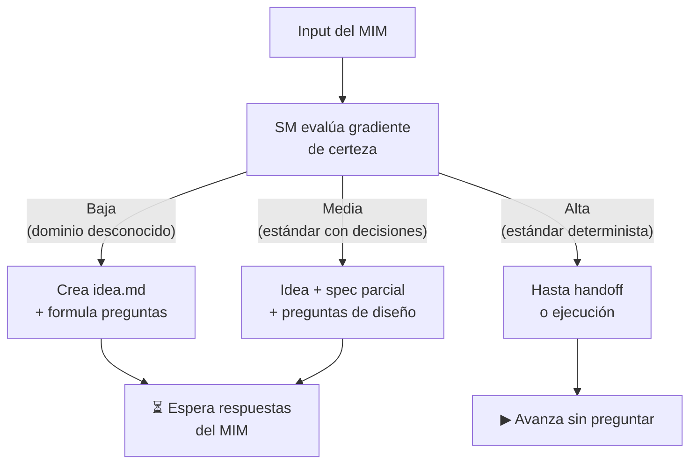
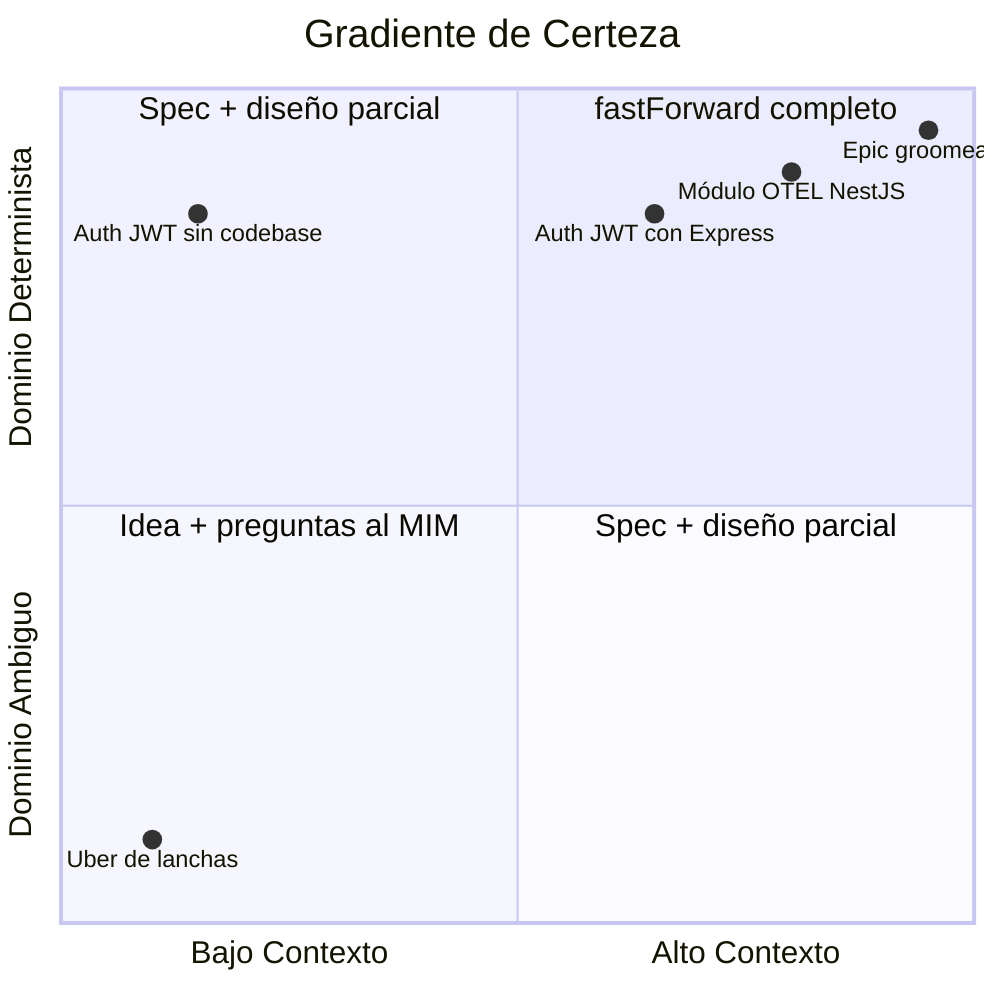
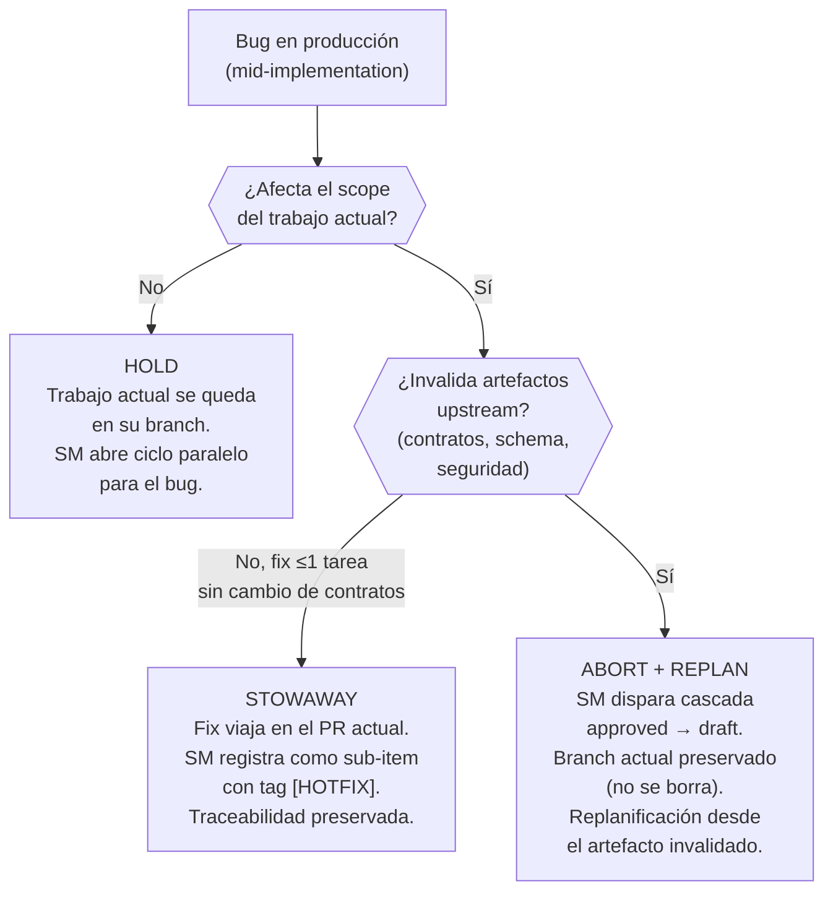
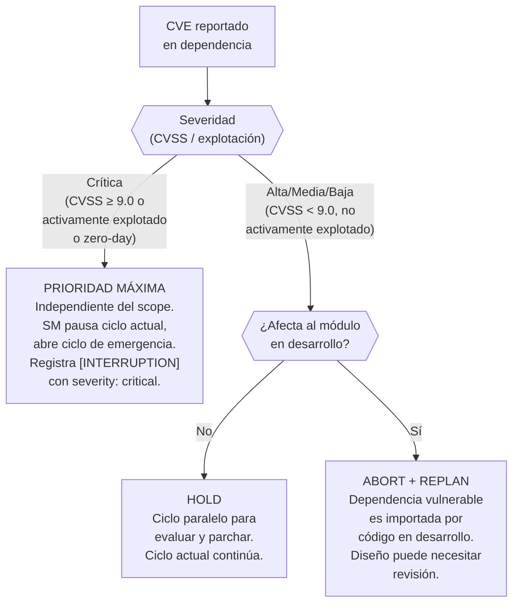
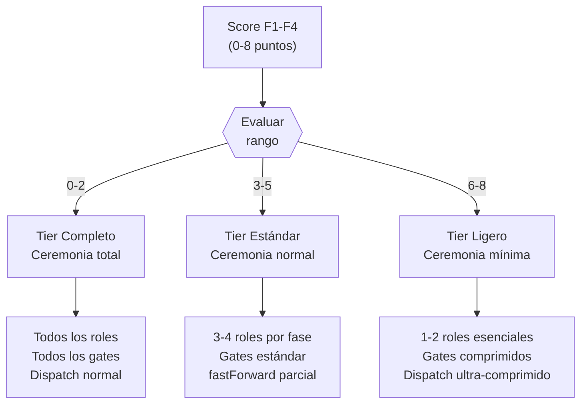

# fastForward y Tiers de Activación

← [Índice principal](../../README.md) | [Planning](../README.md) | [SM Behavior](README.md)

## fastForward Contextual — Gradiente de Certeza

El SM no avanza siempre una fase a la vez. Al recibir un input, evalúa
**qué tan determinista es la solución dado el contexto existente** y
avanza proporcionalmente:



### Reglas del gradiente

| Certeza | Criterio del SM | Hasta dónde avanza | Ejemplo |
|---------|-----------------|--------------------|---------|
| **Baja** | Dominio desconocido, requisitos ambiguos, no hay app existente | Idea + preguntas | "Hazme el uber de lanchas" |
| **Media** | Estándar conocido pero con decisiones pendientes | Idea + spec parcial + preguntas específicas | "Agrega auth con JWT" |
| **Alta** | Estándar abierto, app existente en el RAG, patrones bien definidos | Hasta handoff o ejecución directa | "Crea módulo OTEL" |

### Quién decide

**El SM decide autónomamente** usando un checklist de 4 factores.
No es el MIM quien dice "ve en fastForward" — el SM evalúa y decide.

### Checklist de certeza (obligatorio, auditable)

El SM evalúa 4 factores y asigna 0, 1, o 2 puntos a cada uno:

| Factor | 0 puntos | 1 punto | 2 puntos |
|--------|----------|---------|----------|
| **F1. Artefactos existentes** | RAG vacío | 1-2 artefactos upstream | spec + design + tasks aprobados |
| **F2. Estandarización** | Dominio custom sin estándar | Estándar con variantes (auth, API) | Estándar abierto puro (OTEL, i18n, linting) |
| **F3. Ambigüedad de dominio** | Infinitas interpretaciones ("uber de X") | Dominio acotado con decisiones pendientes | Dominio determinista (agregar módulo X a app existente) |
| **F4. Referencia existente** | Sin codebase ni precedentes | Codebase existe pero no cubre este dominio | Codebase con patrones/stack que aplican directamente |

> **Nota F1**: un artefacto que existe pero no está aprobado
> cuenta como 0.5 puntos. "No aprobado" = el TPM reporta que faltan
> secciones requeridas o que el artefacto está en borrador/en revisión.
> **Cap**: la suma de puntos de artefactos no aprobados tiene un techo
> de **1 punto** para F1, independientemente de cuántos existan. Esto
> previene que N borradores incompletos alcancen el mismo score (F1=2)
> que artefactos validados y aprobados. Para alcanzar F1=2, los
> artefactos upstream deben estar aprobados.

**Thresholds**:

| Score total | Certeza | Hasta dónde avanza |
|-------------|---------|-------------------|
| 0–2 | **Baja** | Idea + preguntas al MIM |
| 3–5 | **Media** | Idea + spec parcial + preguntas específicas |
| 6–8 | **Alta** | Hasta handoff o ejecución directa |

**El SM DEBE registrar el score en su reasoning** (no solo la
conclusión) para que la decisión sea auditable:

> *"F1=0 (RAG vacío), F2=1 (JWT es estándar con variantes), F3=1
> (auth es acotado pero hay decisiones), F4=2 (codebase existente
> con Express). Total: 4 → Media. Avanzo a idea + spec parcial."*

El SM instruye al TPM para persistir el score F1-F4 y el reasoning en
`idea.md` sección "Decisiones tomadas" como entrada con formato:
`[FASTFORWARD] F1={n}, F2={n}, F3={n}, F4={n}. Total={n} → {certeza}.
Razón: {resumen}.` Esto garantiza auditabilidad cross-session.

### Ejemplos resueltos de frontera

| Input | F1 | F2 | F3 | F4 | Total | Certeza | Acción |
|-------|----|----|----|----|-------|---------|--------|
| "Hazme el uber de lanchas" | 0 | 0 | 0 | 0 | 0 | Baja | Idea + preguntas |
| "Agrega auth con JWT" (sin codebase) | 0 | 1 | 1 | 0 | 2 | Baja | Idea + preguntas |
| "Agrega auth con JWT" (codebase Express existente) | 0 | 1 | 1 | 2 | 4 | Media | Idea + spec parcial |
| "Crea módulo OTEL" (codebase con NestJS) | 0 | 2 | 2 | 2 | 6 | Alta | Hasta handoff |
| "Epic X ya groomeado" (spec+design+tasks en RAG) | 2 | 2 | 2 | 2 | 8 | Alta | fastForward a ejecución |
| "Implementa pagos con Stripe" (sin codebase) | 0 | 1 | 1 | 0 | 2 | Baja | F2=1: Stripe es estándar PERO tiene variantes (checkout, elements, custom). F3=1: pagos es acotado pero requiere decisiones (moneda, suscripciones, webhooks). |
| "Agrega logging con Winston" (codebase Node existente) | 0 | 2 | 2 | 2 | 6 | Alta | F2=2: Winston es estándar abierto sin variantes significativas. F3=2: logging es determinista — configuración, transports, formato. |
| "Migra de REST a GraphQL" (API existente) | 1 | 1 | 0 | 2 | 4 | Media | F2=1: GraphQL es estándar PERO cada migración es diferente. F3=0: infinitas interpretaciones — qué endpoints migrar, schema design, N+1. |
| "Agrega autenticación OAuth" (codebase Python/FastAPI existente) | 0 | 1 | 1 | 2 | 4 | Media | Idea + spec parcial |
| "Refactoriza el módulo de reportes" (codebase Go con patrones definidos) | 1 | 2 | 2 | 2 | 7 | Alta | Hasta handoff |

> **Nota de agnosticismo de stack**: los ejemplos de esta tabla usan
> stacks específicos (Express, NestJS, Winston, FastAPI, Go) solo para
> ilustrar el razonamiento con contexto concreto. El scoring F1-F4 y las
> reglas del gradiente de certeza son agnósticos de stack — aplican
> igual a cualquier lenguaje, framework o ecosistema.

Vista alternativa: el quadrant chart ubica cada ejemplo según cuánto
contexto existe (eje X) y cuán determinista es el dominio (eje Y) — los
casos en el cuadrante superior derecho son los candidatos naturales a
fastForward completo.



### fastForward también aplica MID-CYCLE

No solo al inicio. Ejemplos:

- **Bug en producción** → MIM dice "esto tronó" → SM orquesta:
  reproduce → diagnostica → fix → promueve al ambiente apropiado.
  No pasa por Idea → Spec → Design.
- **Epic ya groomeado** → todo en el RAG → SM detecta artefactos
  aprobados → fastForward directo a ejecución.

> **Contrato de entrada para bug fastForward**: execution
> requiere `handoff.md` como contrato de entrada estándar. Para bug fixes
> escalados desde operation o detectados mid-cycle, el contexto diagnóstico
> (descripción del bug, pasos de reproducción, área afectada) actúa como
> contrato de entrada a execution en lugar de un `handoff.md` formal.

---

## Protocolo de Interrupción (mid-implementation)

`fastForward` MID-CYCLE resuelve cómo el SM prioriza un evento externo
(bug en producción, CVE, cambio de contrato) que llega mientras un ciclo
ya está en ejecución. Pero priorizar no es lo mismo que decidir qué pasa
con el trabajo en curso. Esta sección define el árbol de decisión del SM
para esa interrupción.



### Estrategias de interrupción

| Estrategia | Condiciones | Riesgo | Acción del SM |
|------------|-------------|--------|----------------|
| **Hold** | Bug independiente del scope actual | Branch actual envejece si el bug tarda | Abrir ciclo paralelo. Registrar `[INTERRUPTION]` en `idea.md`/`plan.md` del ciclo actual |
| **Stowaway** | Bug en mismo dominio AND fix ≤1 tarea AND no cambia contratos | Contamina scope del PR; `verifyConsistency` debe detectar drift | Registrar sub-item con `[HOTFIX]` en el handoff. El fix pasa por el echo del ciclo actual |
| **Abort + Replan** | Bug invalida suposiciones (schema, contratos, seguridad) | Trabajo potencialmente perdido | Cascada `approved → draft` en artefactos afectados. Branch preservado para cherry-pick post-replan |

### Gate obligatorio: registro [INTERRUPTION]

El SM DEBE registrar la decisión de interrupción y su razonamiento como
entrada `[INTERRUPTION]` en el `idea.md` o `plan.md` del ciclo actual,
con el mismo criterio de auditabilidad cross-session que aplica al score
`[FASTFORWARD]`. Formato:

`[INTERRUPTION] Estrategia: {hold|stowaway|abort}. Razón: {resumen}.`

Sin este registro, la interrupción no queda trazada y `verifyConsistency`
no puede reconstruir por qué el ciclo cambió de forma.

### Casos especiales de interrupción

#### CVE en dependencia (supply chain comprometido)

Un CVE (Common Vulnerabilities and Exposures) reportado en una
dependencia del proyecto mientras un ciclo está en ejecución es un caso
de supply chain comprometido. La respuesta del SM depende de dos ejes:
**severidad** y **scope**.



| Severidad | Scope | Estrategia |
|-----------|-------|------------|
| **Crítica** (CVSS ≥ 9.0 o activamente explotado o zero-day) | Cualquiera | Prioridad máxima. SM pausa el ciclo actual y abre ciclo de emergencia. No aplica la evaluación de scope — un RCE activamente explotado en cualquier dependencia es una emergencia independientemente de si el módulo afectado es el que se está implementando. |
| Alta/Media/Baja (CVSS < 9.0) | No afecta módulo actual | **Hold**. Ciclo paralelo para evaluar y parchar. |
| Alta/Media/Baja (CVSS < 9.0) | Sí afecta módulo actual | **Abort + Replan**. El trabajo en curso puede estar construido sobre una superficie insegura. |

La actualización de la dependencia puede además requerir cambios de
contrato si la API del paquete cambió entre la versión vulnerable y la
versión parcheada. En ese caso, el SM trata el cambio de contrato como
`semanticDrift` (ver [detección de semanticDrift](../artifacts/state-machine.md#detección-de-semanticdrift))
sobre `design.md`, independientemente de la estrategia elegida.

---

## Tiers de Activación

El SM determina el **tier de ceremonia** al inicio de cada ciclo usando el
score de fastForward (F1-F4). El tier define cuánta ceremonia se aplica,
no qué artefactos se producen — los artefactos son universales.



### Tabla de tiers

| Tier | Score | Ceremonia | Roles | Dispatch | Ideal para |
|------|-------|-----------|-------|----------|------------|
| **Ligero** | 6-8 | Mínima. SM puede comprimir múltiples fases en una sola delegación. | 1-2 roles (los estrictamente necesarios para la fase) | Comprimido o ultra-comprimido | Bugs, epics ya groomeados, estándar abierto puro |
| **Estándar** | 3-5 | Normal. Fases secuenciales con fastForward parcial posible. | 3-4 roles según fase | Normal | Features nuevos, dominio acotado con decisiones pendientes |
| **Completo** | 0-2 | Total. Toda fase ejecutada, todo rol convocado, todo gate enforced. | Todos los roles default + posibles ad-hoc | Normal (sin compresión) | Productos nuevos, alta ambigüedad, regulados, misión crítica |

### Qué cambia por tier

| Aspecto | Ligero (6-8) | Estándar (3-5) | Completo (0-2) |
|---------|--------------|----------------|----------------|
| **Roles por fase** | 1-2 esenciales | 3-4 según fase | Todos + ad-hoc |
| **Gates** | Comprimidos (SM valida inline) | Estándar (PDC completo) | Estrictos (PDC + validación cruzada) |
| **Dispatch** | Ultra-comprimido: múltiples fases en una delegación | Normal: una fase por delegación | Normal: una fase por delegación, sin omisiones |
| **Smoke test handoff** | Omisible si el contexto es determinista | Requerido | Requerido + revisión adversarial |

### Reglas de escalación

- El SM determina el tier al INICIO del ciclo, basado en el score F1-F4.
- El tier puede **escalar** mid-cycle (Ligero → Estándar, Estándar →
  Completo) si la complejidad descubierta lo justifica.
- El tier **NUNCA** de-escala mid-cycle. La complejidad descubierta no se
  puede des-descubrir.
- **Triggers de escalación**:
  1. Tasa de fallo PDC > 50% en el tier actual (más de la mitad de las
     delegaciones retornan FAILED o PARTIAL sin progreso).
  2. El MIM solicita explícitamente más ceremonia.

#### Ejemplo concreto de escalación

> El SM inicia un ciclo en **Tier Ligero** (score 7: módulo OTEL en app
> NestJS existente). Durante la fase de diseño, el Dev Lead descubre que
> la integración requiere un custom exporter con lógica de retry no
> trivial. Dos delegaciones consecutivas retornan PARTIAL. El SM evalúa:
> 2/3 delegaciones con problemas → tasa > 50%. Escala a **Tier Estándar**:
> convoca QA para validar testeabilidad y DevSecOps para revisar el
> surface del exporter. El ciclo continúa con ceremonia normal desde este
> punto.

### Nota sobre artefactos

Los tiers afectan principalmente la **ceremonia** (roles convocados, gates
aplicados, patrón de dispatch). En Tiers Estándar y Completo, el ciclo
produce los mismos artefactos (`idea.md`, `spec.md`, `design.md`,
`tasks.md`, `handoff.md`). En **Tier Ligero**, los artefactos pueden
comprimirse en un documento único (`plan.md`) que contiene las secciones
esenciales en formato abreviado — el alineamiento ISO se mantiene, pero
el conteo físico se reduce. Lo que siempre cambia es cuántos ojos los
revisan y cuántos checkpoints se aplican.

### Formato de plan.md (Tier Ligero)

Cuando el SM opera en Tier Ligero, los 5 artefactos universales
(idea.md, spec.md, design.md, tasks.md, handoff.md) se comprimen en un
solo documento `plan.md`. Cada sección mapea 1:1 a su artefacto
completo y se expande a artefactos separados si el tier escala.

```markdown
# plan.md — {nombre del cambio}

## Idea
Qué problema resolvemos y para quién. 1-2 párrafos.
Score fastForward: F1={n}, F2={n}, F3={n}, F4={n}. Total={n}.

## Spec
ACs en formato given/when/then. Solo los críticos para el scope.

- AC-1: Given ... When ... Then ...
- AC-2: Given ... When ... Then ...

## Design
Decisiones técnicas: stack, patterns, constraints.
ADRs inline (decisión + alternativa rechazada + por qué).
Sin diagramas salvo que el dominio los exija.

## Tasks
Lista ordenada de tareas. Sin DAG, sin lanes.
Orden de ejecución implícito por posición.

- [ ] Tarea 1
- [ ] Tarea 2
- [ ] Tarea 3

## Handoff
Scope: {descripción del alcance}.
Echo compliance: {qué pasos del echo aplican}.
Restricciones: {constraints operativas}.
```

**Reglas del plan.md**:

| Regla | Detalle |
|-------|---------|
| **Mínimo viable** | Idea + Spec + Tasks son obligatorios. Design y Handoff pueden omitirse si el score es 7-8 (alta certeza, contexto determinista) |
| **ACs** | Mínimo 1 AC en formato given/when/then. Sin ACs no hay definición de "terminado" |
| **Expansión** | Si el tier escala mid-cycle, el SM expande plan.md en artefactos separados. La información ya escrita se redistribuye, no se reescribe |
| **Echo** | plan.md NO exime del echo. El echo corre con el scope que aplique al tier |
| **Persistencia** | plan.md vive en el artifactStore igual que cualquier artefacto. Transiciona por la misma state machine (draft → review → approved) |
