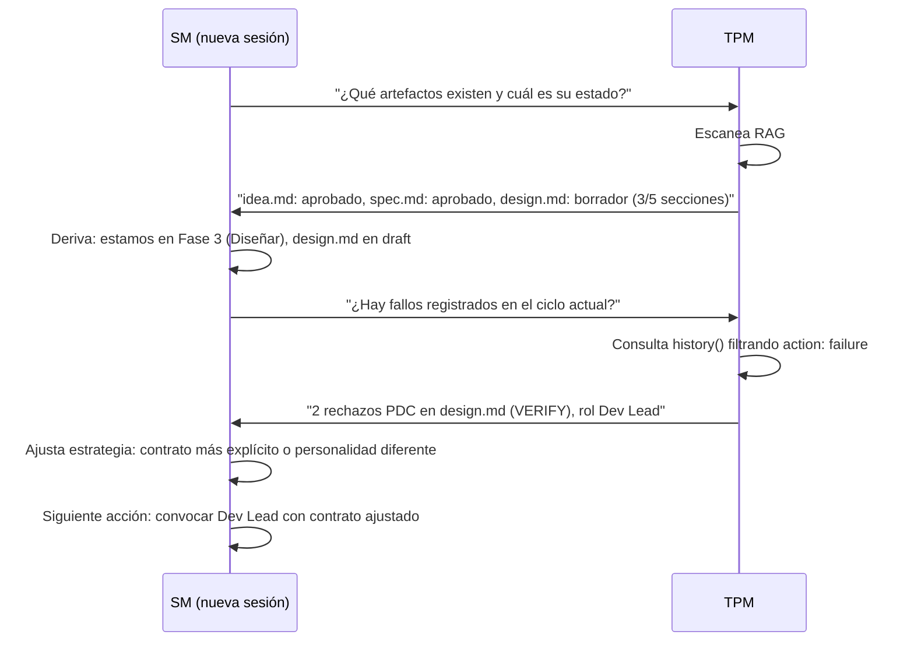
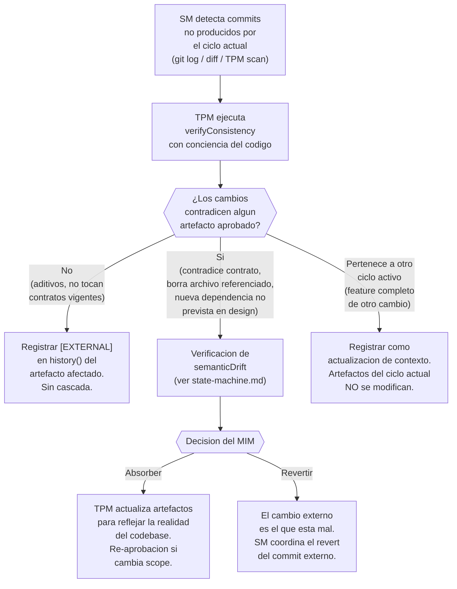

# Protocolo de Recuperación

← [Índice principal](../../README.md) | [Planning](../README.md) | [SM Behavior](README.md)

## Recovery protocol (inicio de sesión)



---

## Historial de Fallos

El circuitBreaker protege intra-sesion, pero los fallos tambien se
registran cross-session en `history()` del artefacto afectado (ver
[TPM y universalInterface](../artifacts/tpm-adapter.md#historyartifact)).
Esto permite al SM aprender
de fallos anteriores al recuperar estado.

**Que se registra**: cada fallo se almacena como entrada en `history()`
con `action: "failure"` y metadata especifica del tipo:

| Tipo | Campos adicionales | Ejemplo |
|------|-------------------|---------|
| `pdc_rejection` | `step` (ECHO/VERIFY/MARK/DECIDE), `role`, `reason` | Rechazo en VERIFY: output no cubre ACs |
| `circuit_breaker` | `role`, `consecutive` | 3 fallos consecutivos del rol QA |
| `escalation` | `role`, `description`, `resolution` | Gap en diseno de auth, MIM proveyo ADR |
| `redelegation` | `role`, `reason`, `contract_delta` | Scope demasiado amplio, acotado a ACs 1-3 |

Formato de registro (todos comparten campos base `action: "failure"`,
`phase`, `timestamp`):

```yaml
# Ejemplo: rechazo PDC
{ action: "failure", type: "pdc_rejection", step: "VERIFY",
  role: "Dev Lead", reason: "output no cubre 2 de 5 ACs", phase: 3 }

# Ejemplo: circuitBreaker
{ action: "failure", type: "circuit_breaker",
  role: "QA", consecutive: 3, phase: 6 }
```

**Como el SM usa el historial en recovery**:

1. Despues de derivar la fase actual, el SM pregunta al TPM:
   "Hay fallos registrados en el ciclo actual?"
2. El TPM consulta `history()` de los artefactos en progreso filtrando
   `action: "failure"`.
3. Si existen fallos, el SM ajusta la estrategia antes de re-delegar:
   - **Rechazo PDC recurrente** — contrato mas explicito, personalidad
     del rol ajustada, scope mas acotado.
   - **circuitBreaker previo** — cambiar enfoque del rol o escalar
     tier desde el inicio.
   - **Escalacion resuelta** — inyectar la resolucion del MIM como
     contexto explicito en el nuevo contrato.
   - **Re-delegacion previa** — aplicar el `contract_delta` que
     funciono como baseline del nuevo contrato.

---

## Reconciliación tras Cambios Externos

Cuando otro agente, un colaborador humano, o un pipeline de CI
modifica el codebase por fuera del flujo de Virgil, el SM necesita
detectar la divergencia entre artefactos (fuente de verdad del QUÉ) y
código (fuente de verdad del CÓMO) antes de continuar el ciclo actual.

**Disparador**: el SM detecta, al inicio de sesión o durante recovery,
uno o más commits que no fueron producidos por el ciclo actual (no
llevan tag `[IMPERATIVE]`/`[HOTFIX]` ni corresponden a ninguna tarea
`claimed` del `executionState` en curso). La detección se apoya en
`git log`/`git diff` sobre el scope de archivos del artefacto, o en un
scan del TPM.

### Detección y clasificación



La clasificación en tres caminos evita tratar todo cambio externo como
incidente: solo el camino "contradictorio" dispara verificación de
drift y decisión del MIM. Los otros dos caminos son de bajo costo
(registro) y no bloquean el ciclo.

### Protocolo, paso a paso

| Paso | Responsable | Acción |
|------|-------------|--------|
| **1. Detección** | SM | Identifica commits sin origen en el ciclo actual, comparando `git log` contra el `executionState` del handoff en curso |
| **2. verifyConsistency con conciencia del código** | TPM | Extiende la verificación de [state-machine.md](../artifacts/state-machine.md) al par artefacto↔código: no solo compara artefactos entre sí, también compara un artefacto contra el estado real de los archivos que declara como su scope |
| **3. Registro `[EXTERNAL]`** | TPM | Persiste el hallazgo en `history()` del artefacto afectado (ver formato abajo) |
| **4. Verificación de semantic drift** | TPM | Solo si la clasificación es "contradictorio". Aplica el mismo flujo de [Detección de semanticDrift](../artifacts/state-machine.md#detección-de-semanticdrift), comparando el código actual contra el artefacto en vez de downstream contra upstream |
| **5. Decisión del MIM** | SM | Presenta el drift al MIM con las dos alternativas: absorber (el código gana, artefactos se actualizan) o revertir (el artefacto gana, se revierte el commit externo) |

**Gate obligatorio**: si la clasificación es "contradictorio", el SM
NO continúa el ciclo sobre el artefacto afectado hasta que el MIM
decida. El artefacto queda en hold — mismo espíritu que el estado Hold
de una interrupción mid-implementation (ver
[Protocolo de Interrupción](fast-forward.md#protocolo-de-interrupción-mid-implementation)),
pero disparado por código en vez de por un evento externo priorizado.

### Registro de cambios externos

Cada cambio externo detectado se almacena en `history()` del artefacto
afectado con `action: "external_change"` y metadata específica:

| Campo | Descripción | Ejemplo |
|-------|-------------|---------|
| `classification` | `additive` \| `contradicting` \| `other_cycle` | `contradicting` |
| `commit` | Hash del commit externo | `a3f21c9` |
| `files` | Archivos que intersectan el scope del artefacto | `["src/auth/middleware.ts"]` |
| `resolution` | Solo si `classification: contradicting`. `absorbed` \| `reverted` \| `pending` | `absorbed` |

```yaml
# Ejemplo: cambio externo contradictorio, absorbido por decision del MIM
{ action: "external_change", classification: "contradicting",
  commit: "a3f21c9", files: ["src/auth/middleware.ts"],
  resolution: "absorbed", phase: 4 }
```

**Formato de registro legible** (complementa la entrada estructurada
en `history()`, mismo criterio de auditabilidad que `[INTERRUPTION]` y
`[HOTFIX]`):

```text
[EXTERNAL] Commit: {hash}. Clasificación: {additive|contradicting|other_cycle}. Resolución: {pending|absorbed|reverted}.
```

### lastVerifiedAt — evitar re-verificación innecesaria

Ejecutar `verifyConsistency` con conciencia del código en cada turno
de sesión sería costoso. Por eso el TPM mantiene un campo
`lastVerifiedAt` (timestamp) por artefacto, actualizado cada vez que
`verifyConsistency` corre exitosamente sobre ese artefacto.

**Regla de invalidación**: al inicio de sesión (ver Recovery protocol
arriba), el SM pregunta al TPM si el `lastVerifiedAt` de cada artefacto
en progreso es anterior al último commit que toca su scope de
archivos. Si es así, el TPM marca el artefacto como `stale` para
re-verificación antes de que el SM continúe el ciclo sobre él.

| Campo | Vive en | Se actualiza cuando | Invalida cuando |
|-------|---------|----------------------|-------------------|
| `lastVerifiedAt` | metadata del artefacto (TPM) | `verifyConsistency` corre exitosamente sobre el artefacto | Existe un commit posterior al timestamp que toca archivos del scope del artefacto |

> **Nota**: `lastVerifiedAt` no reemplaza el Recovery protocol de la
> sección anterior — lo complementa. El Recovery protocol deriva la
> fase actual del ciclo; `lastVerifiedAt` determina si esa fase sigue
> siendo válida frente al estado real del código.
