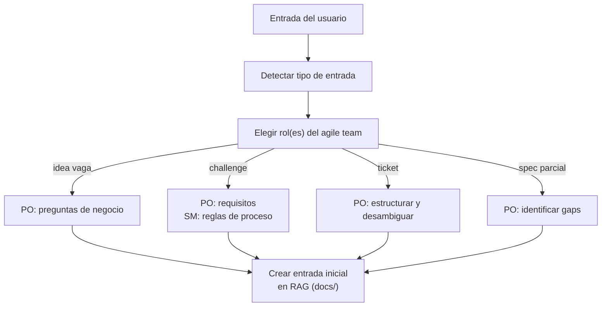
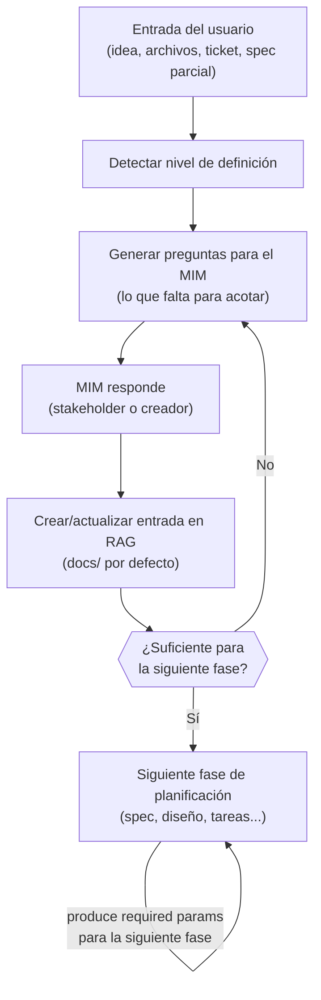
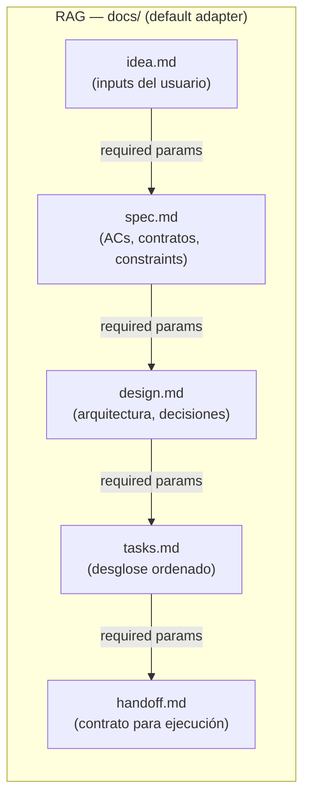
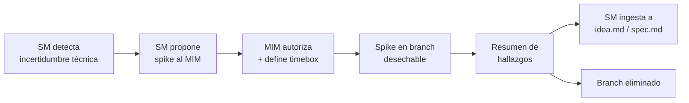
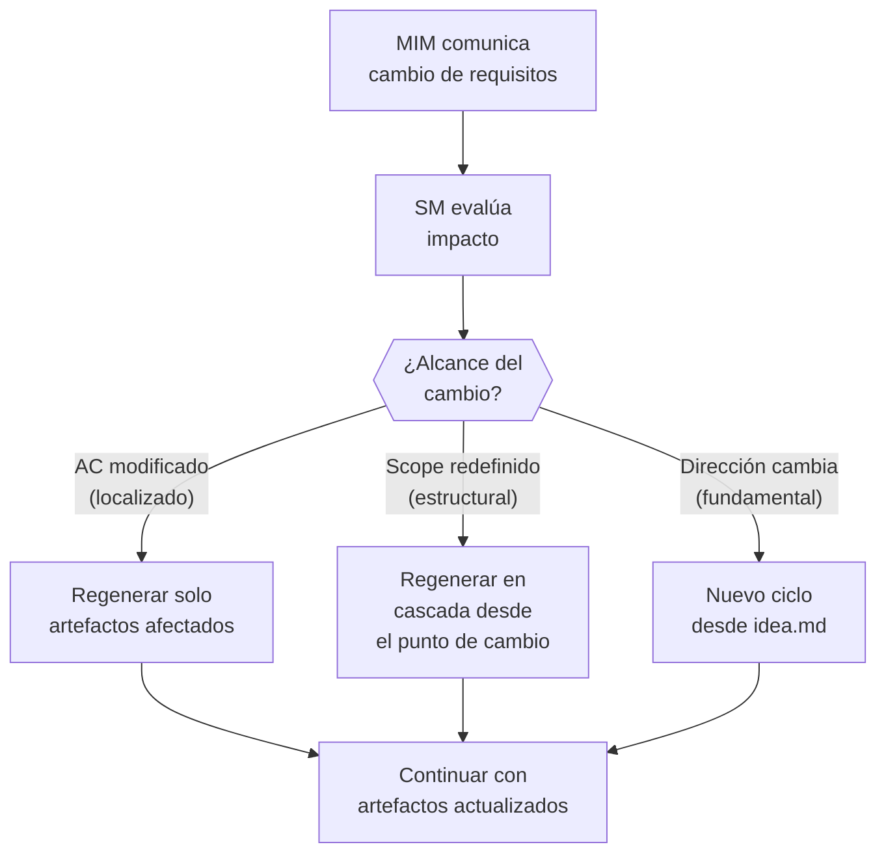
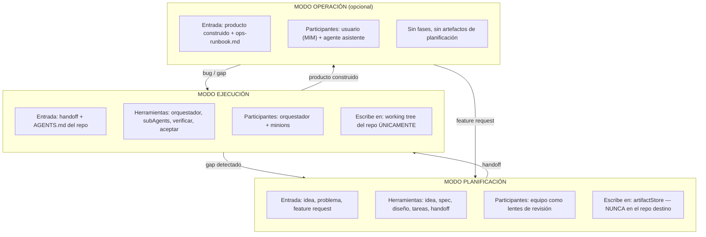

# Diseño del Modelo Operativo — idea-to-mvp

← [Índice principal](../README.md) | [Planning](README.md)

> Objetivo: definir CÓMO opera el framework antes de decidir CÓMO
> implementarlo (skills, agentes, paquetes, etc.).
>
> **Scope del framework**: Optimizado para el caso "1 humano (MIM) + N
> agentes IA." Para equipos humanos, las fases y artefactos son
> reutilizables pero el modelo de delegación (contratos rígidos, SM como
> único punto de interacción) debe adaptarse.

---

## Contenido

- [El Problema](#el-problema)
- [Comportamiento Global](#comportamiento-global)
- [Modelo de Ownership y Contexto](#modelo-de-ownership-y-contexto)
- [Modos del Framework](#modos-del-framework)
- [Spike — Exploración Time-Boxed](#spike--exploración-time-boxed)
- [Pivot — Cambios de Requisitos como Operación Normal](#pivot--cambios-de-requisitos-como-operación-normal)
- [Límites](#límites)
- [El Handoff como Contrato](#el-handoff-como-contrato)
- [Qué Vive DÓNDE](#qué-vive-dónde)
- [Adapters del artifactStore](#adapters-del-artifactstore)
- [Equipo — Cuándo y Cómo](#equipo-cuándo-y-cómo)
- [Qué Permanece en AGENTS.md (gobernanza por repo)](#qué-permanece-en-agentsmd-gobernanza-por-repo)
- [Qué NO Va en AGENTS.md](#qué-no-va-en-agentsmd)
- [Estrategia de Delegación Multi-Modelo](#estrategia-de-delegación-multi-modelo)
- [Preguntas Abiertas](#preguntas-abiertas)

---

## El Problema

El framework actualmente mezcla tres concerns en un solo repositorio:

1. **Reglas de gobernanza** — axiomas de AGENTS.md, compactRules, fases del
   pipeline. Estas SÍ PERTENECEN a cada repo que adopta el framework.
2. **Tooling de planificación** — fases del ciclo (idea, spec, diseño,
   tareas, handoff), roles del equipo, persistencia de artefactos
   (engram, local, híbrido). Son OPERACIONALES y no deben contaminar los
   repos adoptantes.
3. **Tooling de ejecución** — patrón orquestador-minion, delegación a
   subAgents, inyección de personalidad/contexto, resolución de skills.
   Son de RUNTIME y no deben estar acoplados a las reglas de gobernanza.

Resultado: los repos adoptantes acumulan archivos `.tmp-*`, directorios
`openspec/`, documentos de feedback y estado del ciclo de planificacion que no tienen nada que ver
con su codebase.

Cada repo tiene derecho a su propio AGENTS.md. El tooling que ayuda a CREAR
y HACER CUMPLIR ese AGENTS.md debe vivir en otro lugar.

[↑ Contenido](#contenido)

---

## Comportamiento Global

Ver [comportamiento SM](behavior/README.md) —
el SM actúa como router de fases, convoca roles, valida gates, y bloquea
avances prematuros.

[↑ Contenido](#contenido)

---

## Modelo de Ownership y Contexto

El framework opera con dos niveles de ownership sobre el contexto del proyecto:

### SM — Ownership total, carga bajo demanda

El SM es el único actor con el mapa completo del proyecto: conoce todos los
topic keys, artifact slugs, estados de la state machine, contratos de fase,
y roles disponibles. Pero NO carga todo en su contexto — lo consulta via
RAG cuando lo necesita. El SM sabe que todo existe y DONDE esta; solo trae
a su ventana de contexto lo que la decision actual requiere.

### subAgents — Ownership acotado por delegationContract

Los subAgents (roles del equipo, TPM, agentes ad-hoc) reciben
UNICAMENTE lo que su rol y fase requieren, definido en el delegationContract.
No saben que existe el resto del contexto, ni necesitan saberlo.
Su scope es el contrato — nada mas.

### Principio operativo

Ningun actor carga lo que no necesita. El SM tiene acceso total pero lazy;
los subAgents tienen acceso parcial pero suficiente. Un subAgent que
intenta cargar todo el contexto del proyecto esta violando este principio —
el delegationContract ES el limite de scope.

Esto aplica tanto a humanos como a agentes: el `{repo}/docs/` es accesible
para todos, pero cada actor consulta solo los artefactos relevantes a su
tarea actual.

[↑ Contenido](#contenido)

---

## Modos del Framework

Este documento detalla planning en profundidad. execution se resume aquí
y se detalla en [Modelo de Ejecución](../execution/README.md). operation
se resume aquí y se detalla en [Modelo de Operación](../operation/README.md).

### Planning (idea → handoffs)

**Propósito**: producir fuentes de verdad y planes. Sin ejecución de código.

**Quién participa**: el equipo (PO, Dev Lead, SM, UX, QA, DevSecOps)
como lentes de revisión — no como agentes que escriben código.

#### Entradas aceptadas

El modo planificación arranca desde cualquier nivel de definición.
**En esta etapa NO se detecta stack, arquitectura ni tecnologías.** Lo
único que ocurre es: crear la entrada inicial del proyecto en el RAG.

El sistema detecta el tipo de entrada y elige qué rol del agile team
la procesa:

| Nivel de entrada | Ejemplo | Rol asignado | Acción |
|-----------------|---------|-------------|--------|
| Idea vaga | "Haz el Uber de las lanchas" | PO | Formula preguntas de negocio al MIM para acotar alcance y valor |
| Archivos de un challenge | README.md + seeds + schema de un tech challenge | PO + SM | PO extrae requisitos y constraints. SM delega a subAgent smProcess la extraccion de reglas del proceso (timebox, evaluacion, restricciones) |
| Ticket externo | Link a Jira, Linear, Confluence, GitHub Issue | PO | Lee, estructura, identifica ambigüedades (vía adapter TBD) |
| Especificación parcial | "API REST con auth JWT y CRUD de productos" | PO | Identifica gaps en los requisitos y pregunta solo lo faltante |



El punto es: **no importa qué tan vago o preciso sea el input**. El sistema
detecta el nivel de definición, elige el rol correcto, y produce UNA cosa:
la entrada inicial del proyecto en el RAG (`idea.md`). Nada más.

Las decisiones técnicas (stack, arquitectura, patrones) NO pertenecen a
esta etapa. Llegan después, cuando el Dev Lead y DevSecOps entran en las
fases de diseño.

#### Flujo: de idea a handoff



#### El RAG como fuente de verdad progresiva

El artifactStore NO es solo persistencia — es un **RAG** que los agentes
consultan para obtener contexto ACOTADO sin crawlear el codebase.

Principio fundamental: **cada fase consume el output de la anterior y
produce los required params de la siguiente**. Ningún agente necesita leer
"todo" — solo el slice que le corresponde.



Evolución del contexto en cada fase:

| Fase | Consume del RAG | Produce al RAG | Quién consulta después |
|------|----------------|---------------|----------------------|
| Definir idea | Nada (input fresco del usuario) | `idea.md` — el problema, alcance, restricciones | Fase de spec |
| Especificar | `idea.md` | `spec.md` — ACs, contratos, constraints | Fase de diseño |
| Diseñar | `idea.md` + `spec.md` | `design.md` — arquitectura, patrones, tradeoffs | Fase de tareas |
| Desglosar tareas | `spec.md` + `design.md` | `tasks.md` — tareas ordenadas con dependencias | Fase de handoff |
| Generar handoff | `spec.md` + `design.md` + `tasks.md` | `handoff.md` — contrato autocontenido | Modo ejecución |

**Clave**: cuando un agente de ejecución necesita contexto, no lee 15
archivos del repo — hace fetch al RAG y obtiene exactamente el slice que
necesita. Al principio (definir idea) el RAG solo contiene los inputs del
usuario. Al final (handoff) contiene toda la cadena de decisiones.

#### Guía al MIM (generación de preguntas)

El sistema no espera que el MIM sepa qué preguntar. Según el nivel de
entrada detectado, genera preguntas dirigidas:

Para una **idea vaga** ("Uber de lanchas"):

- ¿Quién es el usuario final? (pasajeros, lancheros, ambos)
- ¿Cuál es el flujo core? (reservar, pagar, rastrear)
- ¿Qué plataforma? (web, mobile, ambos)
- ¿Hay restricciones técnicas? (stack, hosting, presupuesto)
- ¿MVP o producto completo? ¿Deadline?

Para un **tech challenge** (archivos del repo):

- ¿Cuál es el timebox?
- ¿Hay restricciones de stack no documentadas?
- ¿Qué se evalúa? (código, proceso, arquitectura, todo)
- ¿Se puede usar tooling de AI? ¿Con qué restricciones?

Para un **ticket externo**:

- ¿Los ACs están completos o hay ambigüedad?
- ¿Hay dependencias bloqueantes?
- ¿Quién aprueba el resultado?

Las preguntas se adaptan: si el MIM ES el stakeholder/creador, las responde
directamente. Si no lo es, las usa como guía para obtener las respuestas.

#### Adapter por defecto: archivos locales como RAG

- Path por defecto (ruta configurable): `~/.idea-to-mvp/projects/{nombre}/docs/`
  — **fuera** del repo destino (garantiza que el modo planificación nunca
  contamine el working tree)
- Formato: archivos markdown, uno por artefacto
- Legible por humanos, opcionalmente versionable con git
- Los agentes hacen fetch de archivos específicos, no crawl completo
- Adapters adicionales (engram, Jira, Confluence, etc.): TBD

**Restricción clave**: el modo planificación NUNCA toca el working tree del
repo destino. Lee el codebase para informar decisiones, pero toda la salida
va al artifactStore — no a archivos `.tmp-*` dispersos en el repo.

#### Equipo en este modo

Cada rol es un LENTE que revisa artefactos de planificación desde su
perspectiva. PO valida alcance contra valor de usuario. QA valida
testeabilidad. DevSecOps valida superficie de seguridad. Producen
veredictos de revisión, no código.

Los lentes se activan DESPUÉS de que una fase produce su artefacto —
revisan lo producido, no participan en la generación. Si un lente
encuentra un gap, el sistema regresa al ciclo de preguntas para esa fase.

---

### Execution (handoffs → código funcional)

**Propósito**: implementar lo que la planificación produjo. Se escribe código.

**Entrada**: documentos de handoff de planning, AGENTS.md del repo destino,
compactRules resueltas.

**Salida**: código implementado, probado, refactorizado y certificado por QA
en el working tree del repo destino.

**Restricción clave**: el modo ejecución SOLO escribe en el working tree del
repo destino. NO crea artefactos de planificación, documentos de feedback ni
archivos de estado del proceso en el repo.

Para la definición completa de execution (fases, roles, ciclo iterativo,
modelo de delegación del orquestador, y conexión con planning), ver
[Modelo de Ejecución](../execution/README.md).

---

### Operation (producto → uso)

**Propósito**: el MIM usa el producto construido; el agente asiste como
operador. Modo opcional y reactivo — sin fases, sin equipo.

**Patrón facade/plugin**: Operation NO es una fase obligatoria del
ciclo. Es un **facade** — cada proyecto decide si la activa según si
tiene una superficie post-entrega que operar. Un script de una sola
corrida o una prueba de concepto no necesita Operation; un servicio
desplegado o una CLI distribuida sí. La decisión de activarla se toma
en `idea.md` (sección "roles activos") y no bloquea el cierre del ciclo
de planning si el proyecto no la requiere.

**Adapter por tipo de proyecto**: el artefacto que produce esta fase
varía según qué tipo de superficie expone el proyecto:

| Tipo de proyecto | Adapter de Operation | Qué documenta |
|-------------------|----------------------|----------------|
| Servicio (API, backend desplegado) | `ops-runbook.md` | Deploy/rollback, monitoreo, alertas, troubleshooting (ver `artifacts/schemas.md` → `ops-runbook.md`) |
| CLI | Guía de uso (`usage-guide.md`) | Flags, comandos, exit codes, ejemplos de invocación |
| Librería / paquete | Referencia de API (`api-reference.md`) | Superficie pública, guía de migración, changelog |

Cada adapter reutiliza la misma infraestructura (TPM, artifactStore,
gate de Accept) — lo que cambia es el contenido y el estándar de
respaldo (ITIL 4 / Google SRE PRR para runbook, IEEE 1063 para
documentación de usuario en CLI y librerías).

**Entrada**: producto construido (salida de execution), el artefacto
del adapter correspondiente (si existe), documentación del proyecto.

**Restricción clave**: no hay artefactos de planificación ni ceremonia.
Si la operación revela un gap, escala de vuelta a planning o execution.

Para la definición completa (cuándo se activa, tipos de operación, flujo),
ver [Modelo de Operación](../operation/README.md).

---

### Spike — Exploración Time-Boxed

Un spike es una exploración time-boxed que produce código desechable para
informar decisiones de planificación. Es el mecanismo que usa el framework
cuando la incertidumbre es demasiado alta para planificar directamente.

**Cuándo aplica**: el SM detecta que no puede avanzar en planificación
porque hay preguntas que solo se responden escribiendo código (viabilidad
técnica, rendimiento de una API, compatibilidad de librerías).

**Reglas del spike**:

| Aspecto | Regla |
|---------|-------|
| **Autorización** | Solo el MIM autoriza un spike. El SM lo propone, no lo inicia |
| **Timebox** | Máximo definido al autorizar (ej: "2 horas", "1 sesión"). El SM reporta al MIM al vencer |
| **Branch** | Branch desechable (`spike/{nombre}`). Se elimina después de extraer conclusiones |
| **Output** | NO es código productivo. El output es conocimiento que alimenta `idea.md` o `spec.md` |
| **Artefactos** | No genera los 5 artefactos universales. Produce un resumen de hallazgos que el SM ingesta al artifactStore |
| **Echo** | Reducido: solo Setup + Build. No se requieren tests, linting, ni cobertura |



**Spike vs. prototipo**: un spike no es un prototipo. El prototipo busca
validar UX o flujo; el spike busca responder una pregunta técnica concreta.
El código del spike NUNCA se promueve a producción — se reescribe con el
conocimiento adquirido.

[↑ Contenido](#contenido)

---

### Pivot — Cambios de Requisitos como Operación Normal

Un pivot es un cambio de requisitos que altera el scope, la dirección o
los criterios de aceptación de un trabajo en curso. El framework trata los
pivots como operaciones legítimas, no como errores ni excepciones.

**Principio**: los requisitos cambian porque el contexto cambia (feedback
del mercado, descubrimiento técnico, decisión del stakeholder). El
framework debe absorber ese cambio sin requerir que se reinicie todo el
ciclo desde cero.

**Flujo del pivot**:



**Categorías de pivot**:

| Categoría | Ejemplo | Impacto en artefactos |
|-----------|---------|----------------------|
| **Localizado** | "El AC-3 ahora requiere paginación" | Solo `spec.md` y `tasks.md` se actualizan. `idea.md` y `design.md` intactos |
| **Estructural** | "Ya no es REST, va a ser GraphQL" | `design.md` se regenera. `tasks.md` y `handoff.md` se regeneran en cascada. `idea.md` y `spec.md` pueden mantenerse |
| **Fundamental** | "El producto no es para consumidores, es B2B" | Ciclo nuevo desde `idea.md`. Artefactos anteriores se archivan como referencia |

**Reglas del pivot**:

1. El SM NO descarta artefactos — los marca como superseded con referencia
   al motivo del pivot.
2. La regeneración es selectiva: el SM evalúa qué artefactos downstream
   son invalidados por el cambio y regenera solo esos.
3. El score fastForward se recalcula post-pivot. Un pivot puede escalar o
   de-escalar el tier.
4. Si el pivot ocurre durante execution, el SM detiene la ejecución y
   regresa a planning para regenerar los artefactos afectados antes de
   continuar.

[↑ Contenido](#contenido)

---

### Punto de entrada: Takeover de codebase

Para codebases heredados o existentes que se incorporan al framework, el
SM ejecuta una fase de **descubrimiento (arqueología)** antes de evaluar
el scoring fastForward:

#### Fase de descubrimiento

El SM audita el estado real del codebase antes de asignar puntos:

| Dimensión | Qué busca | Dónde lo encuentra |
|-----------|-----------|-------------------|
| **Documentación** | README, ADRs, specs, wikis | Raíz, `/docs`, `/adr`, wiki del repo |
| **Tests** | Suite existente, cobertura, tipos de test | `/tests`, `/spec`, `/__tests__`, CI config |
| **CI/CD** | Pipeline, gates, checks automatizados | `.github/workflows`, `.gitlab-ci.yml`, `Jenkinsfile` |
| **Arquitectura** | Patrones, estructura, stack | Estructura de directorios, `package.json`, imports |
| **Deuda técnica** | TODOs, hacks, workarounds documentados | Comentarios en código, issues abiertos, backlog |

#### Scoring override para brownfield

El scoring F1-F4 estándar mide certeza sobre trabajo FUTURO. En takeover,
la situación es distinta: hay alta certeza sobre lo que EXISTE pero baja
certeza sobre lo que se quiere CAMBIAR. El SM aplica un override:

| Factor | Scoring estándar (greenfield) | Override takeover |
|--------|-------------------------------|-------------------|
| **F1. Artefactos** | ¿Existen artefactos en el RAG? | ¿Existen equivalentes funcionales? (README ≈ idea.md, tests ≈ spec.md parcial) |
| **F2. Estandarización** | ¿El dominio es estándar? | ¿El codebase sigue estándares reconocibles? |
| **F3. Ambigüedad** | ¿Cuántas interpretaciones posibles? | ¿Se entiende qué hace el sistema? (no qué se quiere cambiar) |
| **F4. Referencia** | ¿Hay codebase con patrones? | Siempre 2 — el codebase ES la referencia |

**Consecuencia**: F4=2 siempre en takeover. Esto eleva el score base y
evita que un codebase bien documentado con tests caiga en Tier Completo
(el paradox del fastForward).

#### Bootstrap incremental del echo

En takeover, el echo no se activa de golpe. Se bootstrappea por capas:

| Semana | Echo paso | Qué se activa | Umbral |
|--------|-----------|---------------|--------|
| 1 | Setup | Dependencias resuelven, proyecto compila | Build pasa |
| 2 | Static analysis | Linter configurado, 0 errores nuevos | Baseline establecido |
| 3 | Build + Static | Los dos anteriores más formatting | CI verde |
| 4+ | Dynamic | Tests existentes pasan, cobertura baseline medida | No regression |
| Mes 2+ | Full echo | Los 5 pasos, E2E si aplica | Thresholds del proyecto |

Cada capa se activa solo cuando la anterior es estable. El SM NO exige
echo completo desde el día 1 en un takeover.

#### Tabla de puntos de entrada (expandida)

| Situación | Descubrimiento | Punto de entrada | Tier probable |
|-----------|---------------|-----------------|---------------|
| Codebase heredado, sin cambios planificados | Arqueología ligera | operation — operar y aprender | N/A (no hay planning) |
| Codebase heredado, cambios planificados, bien documentado | Arqueología completa | fastForward — docs existentes cuentan como artefactos parciales | Ligero o Estándar |
| Codebase heredado, cambios planificados, sin documentación | Arqueología completa | planning — generar artefactos faltantes | Estándar o Completo |
| Codebase heredado con deuda técnica crítica | Arqueología + spike(s) | planning con spike(s) para evaluar viabilidad, luego fastForward | Depende del spike |
| Codebase abandonado (sin mantenedores activos) | Arqueología profunda | planning desde idea.md — tratar como producto nuevo con contexto heredado | Completo |

El SM no exige recrear artefactos que ya existen en forma equivalente (un
README detallado puede cumplir la función de `idea.md`, una suite de tests
existente informa `spec.md`).

[↑ Contenido](#contenido)

---

## Límites



[↑ Contenido](#contenido)

---

## El Handoff como Contrato

El documento de handoff es la interfaz entre modos. Debe ser:

- **Autocontenido**: un ejecutor que nunca vio la conversación de
  planificación puede actuar sin hacer preguntas.
- **Portable**: funciona independientemente del adapter que lo produjo.
- **Acotado**: dice exactamente qué hacer, qué NO hacer, y cómo se ve el
  éxito.

El handoff NO es un archivo en el repo destino. Vive en el artifactStore
y es LEÍDO por el modo ejecución.

[↑ Contenido](#contenido)

---

## Qué Vive DÓNDE

| Artefacto | Dónde vive | Por qué |
|-----------|-----------|---------|
| AGENTS.md | Repo destino (raíz) | La gobernanza es por repo. Cada proyecto posee sus reglas. |
| Artefactos de planificación (propuestas, specs, diseños, tareas) | artifactStore (depende del adapter) | Informan el trabajo, no son el trabajo. |
| Documentos de handoff | artifactStore | Contrato entre planificación y ejecución. |
| Estado del ciclo (tracking de fases, DAG) | artifactStore | Estado operacional, no estado del proyecto. |
| Feedback de adoptantes | artifactStore (etiquetado al framework fuente) | Input para evolución del framework, no contenido del repo. |
| Código, pruebas, configs | Repo destino | El entregable real. |
| Archivos `.tmp-*` | EN NINGÚN LUGAR del repo destino | Eliminados. Los artefactos de planificación van al store. |

[↑ Contenido](#contenido)

---

## Adapters del artifactStore

El framework necesita una capa de persistencia pluggable. Cada adapter
implementa la misma universalInterface (ver `artifacts/README.md` →
"Adapters de Persistencia" para la definición completa de las 9
operaciones: `ingest`, `save`, `read`, `search`, `list`,
`verifyConsistency`, `delete`, `history`, `transition`). Todas las
operaciones de escritura son mediadas por el TPM (ver `artifacts/README.md`
→ "TPM como DBMS"); las lecturas pueden ser directas vía patternB.
La gestión de estado de artefactos usa `transition` exclusivamente
(la anterior `markComplete` fue absorbida por `transition`).

### Adapter local (por defecto)

- Almacena artefactos como archivos markdown en
  `~/.idea-to-mvp/projects/{nombre}/docs/` (ruta configurable, por defecto
  la indicada)
- **Fuera** del repositorio destino — el modo planificación nunca toca el working tree del repo
- Ventajas: cero dependencias, legible por humanos, opcionalmente versionable
- Desventaja: sin acceso cross-machine, sin búsqueda semántica

### Adapter engram

- Almacena artefactos como observaciones engram con topic keys estructurados.
- Ventajas: cross-session, buscable, sobrevive compaction.
- Desventaja: requiere servidor MCP de engram, contenido puede truncarse en
  resultados de búsqueda (se necesita `mem_get_observation` para contenido
  completo).

### Adapter híbrido

- Escribe en ambos: local y engram.
- Ventajas: lo mejor de ambos — legibilidad local + persistencia
  cross-session.
- Desventaja: mayor costo de tokens por operación.

[↑ Contenido](#contenido)

---

## Equipo — Cuándo y Cómo

El equipo de planificación es una herramienta de PLANIFICACIÓN, no de ejecución.

| Rol | Cuándo se activa | Qué hace | Qué NO hace |
|-----|-----------------|----------|-------------|
| PO | Idea, Spec, Verificar, Aceptar, Retro | Valida alcance, prioriza, define ACs, acepta entregables | Escribir código, revisar PRs |
| Dev Lead | Diseño, Tareas, Verificar, Aceptar, Retro | Valida arquitectura, estima, secuencia, revisa calidad técnica | Ejecutar tareas (eso es modo ejecución) |
| SM | Todas las fases | Facilita, remueve bloqueos, valida proceso, orquesta gates | Producir contenido, leer archivos |
| UX | Spec, Diseño, Verificar, Aceptar, Retro | Valida decisiones que afectan al usuario | Implementar UI |
| QA | Spec, Tareas(cond), Verificar, Aceptar, Retro | Valida testeabilidad, define estrategia de pruebas, verifica cobertura | Escribir código de producción |
| DevSecOps | Diseño, Tareas(cond), Verificar, Aceptar, Retro | Valida superficie de seguridad, decisiones de infra, postura de seguridad | Desplegar |
| *Ad-hoc* | Cualquier fase, segun contrato | Expertise especializado fuera del equipo default (DBA, Performance Engineer, Domain Expert, etc.). El SM los define y convoca con contrato completo. | Depende del contrato |

> **Nota**: los 5 roles productivos de arriba (más el SM como
> infraestructura) forman el equipo **default**. El SM puede extender el
> equipo con roles ad-hoc cuando el proyecto requiere expertise que ningun
> rol default cubre. Ver `roles/README.md` seccion "Roles Ad-Hoc".

**Durante ejecucion**, el equipo esta en silencio. El orquestador y los
subAgents hacen el trabajo. Si la ejecución revela un gap de planificación,
el orquestador puede escalar DE VUELTA al modo planificación.

**Post-ejecución** (Verificar, Aceptar, Retrospectiva), el equipo se
RE-ACTIVA como panel de revisión. Estas fases son parte del modo
planificación — operan sobre los resultados de la ejecución, no sobre
código directamente. Ver `behavior/README.md` Fases 6-8 y
`roles/README.md` para los delegationContracts de cada rol en estas
fases.

[↑ Contenido](#contenido)

---

## Qué Permanece en AGENTS.md (gobernanza por repo)

Estas son las cosas que cada repo adoptante recibe:

- Axiomas (principios no negociables)
- Fases del pipeline (la secuencia de trabajo)
- Gates de fase (DOR, DOD, checkpoints MIM)
- compactRules (estándares de código específicos del proyecto)
- Definiciones de roles (qué valida cada rol en los gates)
- Tiers de activación (cuánta ceremonia según la madurez del proyecto)

Estas son REGLAS, no HERRAMIENTAS. Dicen qué debe ser verdad, no cómo
hacerlo verdad.

[↑ Contenido](#contenido)

---

## Qué NO Va en AGENTS.md

- Definiciones de fases del ciclo de planificación (idea, spec, diseño, etc.)
- Configuración del artifactStore
- Patrones de delegación del orquestador
- Templates de personalidad de subAgents
- Formatos de topic key de engram
- Protocolos de resolución de skills
- Tablas de asignación de modelos

Estos son OPERACIONALES. Pertenecen a la capa de tooling, no a la capa de
gobernanza.

[↑ Contenido](#contenido)

---

## Estrategia de Delegación Multi-Modelo

El SM selecciona el tier de modelo por tarea usando un criterio simple:
**¿La salida correcta es derivable de reglas/templates, o requiere juicio?**

> En escenarios de operación con múltiples agentes simultáneos, el
> protocolo de delegación del PDC (ver `delegation-pdc.md`) define niveles
> de autonomía basados en riesgo para evitar que el MIM se convierta en
> cuello de botella.

| Tier | Runtime | Criterio de selección | Costo |
|------|---------|----------------------|-------|
| **Local** (modelo on-premise) | Modelo local (e.g., Docker, Ollama), cero costo por token | La salida es determinista o template-driven. No requiere razonamiento complejo. | Cero (solo compute local) |
| **Cloud** (modelo vía API) | API remota (e.g., Claude, Codex), costo por token | Requiere síntesis, juicio, creatividad, o razonamiento sobre contexto ambiguo. | Proporcional al uso |

### Asignación por componente

| Componente | Tier | Justificación |
|-----------|------|---------------|
| **TPM** (validar formato, verificar schema, generar markdown, batch writes, slug) | Local | Operaciones mecánicas con reglas bien definidas |
| **Echo Protocol** — checks estructurales (completitud, formato, campos requeridos) | Local | Verificable con reglas |
| **Echo Protocol** — checks semánticos (coherencia, contradicciones, calidad) | Cloud | Requiere comprensión del contenido |
| **SM** (coordinación, decisiones de routing, gate evaluation) | Cloud | Requiere juicio sobre contexto |
| **PO** (spec desde input ambiguo, priorización, ACs) | Cloud | Síntesis y juicio |
| **Dev Lead** (diseño arquitectónico, estimación, secuenciación) | Cloud | Razonamiento técnico profundo |
| **QA** (adversarial review, estrategia de pruebas, verificación) | Cloud | Juicio y creatividad adversarial |
| **DevSecOps** (threat model, surface analysis) | Cloud | Razonamiento de seguridad |
| **UX** (validación de decisiones de usuario) | Cloud | Empatía y juicio de producto |
| **Retro** (síntesis stop/start/continue, agreements) | Cloud | Síntesis de múltiples perspectivas |

### Regla de decisión

```plaintext
if (output == template_con_slots && sin_ambiguedad)
  → Local
else
  → Cloud
```

El SM no necesita un scoring complejo. Si puede escribir el template y los
slots de antemano, la tarea es mecánica. Si necesita que el agente **piense**,
es cloud.

### Nota de implementación

La selección de modelo es una decisión de **tooling**, no de gobernanza.
Cada proyecto puede configurar qué modelo local usar (llama3, mistral,
phi, etc.) y qué proveedor cloud preferir. El framework define el CRITERIO
de selección, no el modelo específico.

[↑ Contenido](#contenido)

---

## Preguntas Abiertas

1. **¿Dónde vive el tooling?**
   Opciones: skills de Claude Code (instalables), un paquete distribuible
   (npm, pip, cargo, etc.), una convención de dotfiles (`~/.idea-to-mvp/`),
   o una combinación.

2. **¿Cómo hace un repo "opt in" al framework?**
   Actualmente: copiar AGENTS.md. ¿Debería existir un comando bootstrap
   (`/sdd-init` o equivalente) que configure la capa de tooling sin
   contaminar el repo?

3. **¿Cómo fluye el feedback de vuelta al framework?**
   fullstack-base produjo feedback para idea-to-mvp. ¿Dónde vive ese
   feedback? ¿Cómo se rastrea? Actualmente es un archivo `.tmp-*` en el
   repo del framework — que es la misma contaminación que queremos eliminar.

4. **¿Debería estandarizarse el formato del handoff?**
   Si el handoff es el contrato entre modos, su estructura importa.
   ¿Un schema? ¿Un template? ¿Campos mínimos requeridos?

5. ~~**¿Cómo afectan los tiers de activación a la separación de modos?**~~
   **RESUELTO**: los tiers de activación (Ligero, Estándar, Completo)
   están definidos en `behavior/README.md` → sección
   "Tiers de Activación". El SM determina el tier al inicio del ciclo
   usando el score F1-F4 de fastForward. Los tiers escalan ceremonia
   (roles, gates, dispatch), no artefactos.

6. ~~**¿Verificación en modo ejecución — quién la hace?**~~
   **RESUELTO**: Verify (Fase 6) y Accept (Fase 7) son fases
   POST-ejecución del modo planificación. El equipo se reactiva
   como panel de revisión. Retro (Fase 8) cierra el ciclo y alimenta
   el siguiente. Ver `behavior/README.md` Fases 6-8.

7. ~~**¿Deben comprimirse los artefactos de planificación para cambios
   pequeños (Tier Ligero), o se produce siempre el set completo
   (idea/spec/design/tasks/handoff)?**~~
   **RESUELTO**: En Tier Ligero, los artefactos de planificación PUEDEN
   comprimirse en un documento único (`plan.md`) que contiene las
   secciones esenciales de idea + spec + design + tasks en formato
   abreviado. El alineamiento ISO se mantiene (las secciones de contenido
   existen), pero el conteo físico de artefactos se reduce. Para
   hot-fixes vía fastForward mid-cycle, el mínimo requerido es: (1)
   descripción del problema, (2) test de reproducción, (3) fix, (4)
   verificación.

[↑ Contenido](#contenido)
