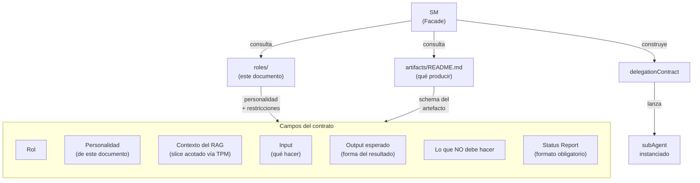
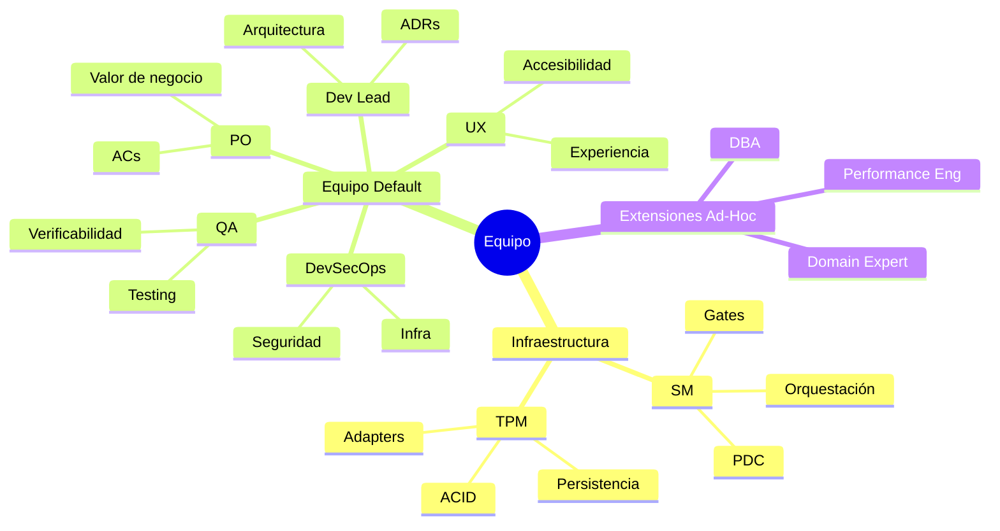
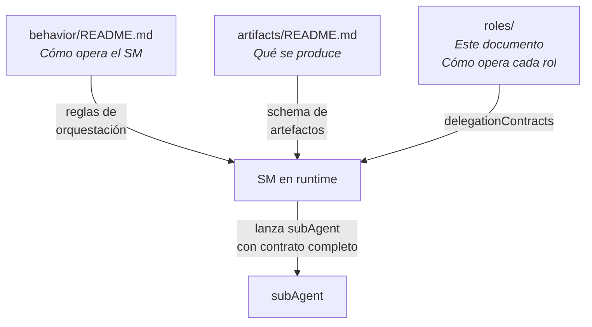

# Perfiles de Roles

← [Índice principal](../../README.md) | [Planning](../README.md)

> Este documento define CÓMO opera cada rol en cada fase. Es el manual de
> delegación del SM: cuando convoca a un subAgent, consulta este documento
> para construir el delegationContract con la personalidad, contexto,
> output esperado, y restricciones correctas.
>
> Los roles SON subAgents. No son personas. Son personalidades y
> competencias que el SM instancia para una tarea acotada. Un mismo "agente"
> puede ser PO en una fase y QA en otra — lo que importa es el contrato.

---

## Contenido

- [Arquitectura de Delegación](#arquitectura-de-delegación)
- [El Equipo Default — 5 Roles Productivos](#el-equipo-default-5-roles-productivos)
- [Contenido de esta sección](#contenido-de-esta-sección)

---

## Arquitectura de Delegación

El SM **nunca inventa** un contrato sin estructura. Lo construye combinando:

1. El perfil del rol (este documento para roles default, o definicion ad-hoc) → personalidad + foco + restricciones
2. El modelo de artefactos → schema del output esperado
3. El contexto del TPM → slice acotado del RAG
4. La fase actual → que se espera en esta etapa especifica

### Verificabilidad de las personalidades

Las personalidades NO son decorativas — orientan el tono, foco y
prioridades del subAgent. Pero "esceptico" o "paranoico" no son
verificables por si solos. Para que el SM pueda evaluar si la
personalidad se aplico, cada contrato incluye **output constraints**
derivados de la personalidad:

| Personalidad | Output constraint verificable |
|-------------|-------------------------------|
| Curioso, empatico (PO Fase 1) | Output incluye al menos 3 preguntas abiertas al MIM |
| Preciso, exigente (PO Fase 2) | Cada AC tiene formato given/when/then. 0 ACs ambiguos permitidos |
| Esceptico (QA) | Cada AC tiene veredicto explicito (verificable / no verificable) con justificacion |
| Abogado del usuario (UX) | Cada observacion referencia un flujo de usuario concreto |
| Analitico, tradeoffs (Dev Lead Fase 3) | Cada decision tiene al menos 1 alternativa evaluada (ADR) |
| Paranoico constructivo (DevSecOps) | Cada observacion mapea a un vector de ataque o control concreto |
| Metodico, dependencias (Dev Lead Fase 4) | Cada tarea tiene parent_id, depends_on, y traces_to |
| Inspector (QA Fase 4) | Cada tarea tiene criterio de verificacion explicito |
| Riguroso, evidencia (QA Fase 6) | Cada veredicto cita evidencia especifica (test name, linea, output) |

El SM verifica estos constraints en el paso ECHO del PDC. Si el output
no los cumple → re-delegacion con contrato mas explicito, no fallo del
agente.

[↑ Contenido](#contenido)

---

## El Equipo Default — 5 Roles Productivos

### Identidad de cada rol

| Rol | Expertise core | Frase que lo define | Análogo humano |
|-----|---------------|--------------------|-----------------|
| **PO** | Valor de negocio, priorización, stakeholder management | "¿Esto resuelve un problema real para el usuario?" | Product Manager |
| **Dev Lead** | Arquitectura, patrones, decisiones técnicas, tradeoffs | "¿Cómo lo construimos para que escale y sea mantenible?" | Staff Engineer / Architect |
| **QA** | Verificabilidad, edge cases, estrategia de testing | "¿Cómo sé que esto funciona? ¿Cómo sé que NO funciona?" | QA Lead |
| **DevSecOps** | Seguridad, infraestructura, deployment, observabilidad | "¿Esto es seguro? ¿Esto se puede operar?" | Security Engineer + SRE |
| **UX** | Experiencia de usuario, usabilidad, flujos, accesibilidad | "¿El usuario puede hacer lo que necesita sin fricción?" | UX Designer |

> **Nota**: SM y TPM NO son roles productivos — son infraestructura.
> SM orquesta; TPM persiste. No aparecen en este documento porque su
> comportamiento se define en
> [SM Behavior](../behavior/README.md).

### Los 5 roles son el equipo DEFAULT, no un techo

Los 5 roles cubren el 80-90% de los proyectos. Pero NO son un conjunto
cerrado. El SM puede convocar **roles ad-hoc** cuando el proyecto requiere
expertise fuera del equipo default. Ver [Roles Ad-Hoc](ad-hoc.md).

Complemento visual: el mindmap agrupa los roles por su función dentro del
framework — infraestructura (nunca produce contenido), equipo default
(producción estándar), y extensiones ad-hoc (expertise puntual).

[↑ Contenido](#contenido)

---

## Contenido de esta sección

Este documento se divide en tres páginas:

| Página | Contenido |
|--------|-----------|
| **README.md** (este documento) | Arquitectura de delegación, verificabilidad de personalidades, identidad del equipo default |
| [Contratos por Fase](profiles-by-phase.md) | delegationContracts detallados por rol y fase (Fase 1-8), tabla de activación condicional, condensación para developer solo, diagramas de interacción entre roles |
| [Roles Ad-Hoc](ad-hoc.md) | Cuándo y cómo crear roles fuera del equipo default, contrato ad-hoc, ejemplo completo (Data Architect) |

[↑ Contenido](#contenido)

---

## Relación con Otros Documentos

- **[SM Behavior](../behavior/README.md)** — define las reglas del SM:
  state machine, fastForward, supervisión post-hoc, bloqueo. El SM consulta
  ESE documento para saber CÓMO orquestar.
- **[Artifacts](../artifacts/README.md)** — define los 6 artefactos
  universales, su schema ISO, y la interfaz de adapters. El SM
  consulta ESE documento para saber QUÉ producir.
- **Este documento** — define los 5 roles default, el mecanismo de roles
  ad-hoc, la personalidad por fase, los delegationContracts, y las
  reglas de activación condicional. El SM consulta ESTE documento para
  saber A QUIÉN convocar y CON QUÉ contrato — tanto para el equipo
  default como para extensiones ad-hoc.

[↑ Contenido](#contenido)
