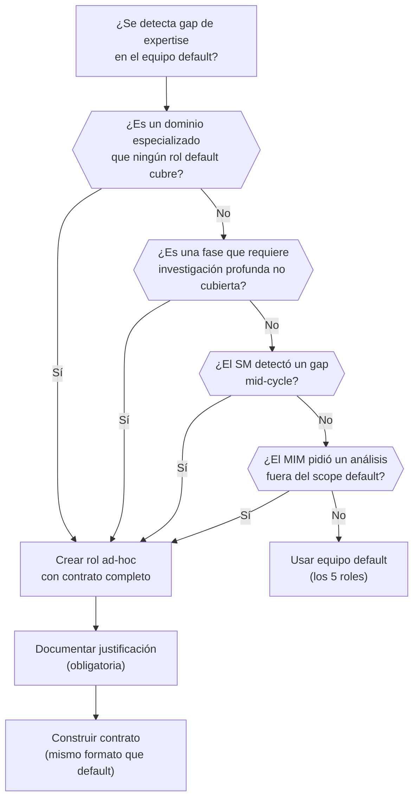

# Roles Ad-Hoc

← [Índice principal](../../README.md) | [Planning](../README.md) | [Roles](README.md)

El SM tiene autoridad para definir y convocar roles que no existen en la
tabla default. El principio: si el proyecto necesita un experto que
ninguno de los 5 roles cubre adecuadamente, el SM lo crea en lugar de
forzar a un rol existente fuera de su competencia.

---

## Contenido

- [Cuándo crear un rol ad-hoc](#cuándo-crear-un-rol-ad-hoc)
- [Contrato de un rol ad-hoc](#contrato-de-un-rol-ad-hoc)
- [Ejemplo: rol ad-hoc `Data Architect`](#ejemplo-rol-ad-hoc-data-architect)
- [Restricciones de roles ad-hoc](#restricciones-de-roles-ad-hoc)
- [Ejemplos de roles ad-hoc frecuentes](#ejemplos-de-roles-ad-hoc-frecuentes)

---

## Cuándo crear un rol ad-hoc

| Señal | Ejemplo |
|-------|---------|
| El dominio del proyecto requiere expertise especializado que ningún rol default cubre | Proyecto médico → `Regulatory Specialist` para normativa HIPAA/GDPR |
| Una fase necesita investigación profunda en un área no cubierta | Migración a nueva plataforma → `Platform Researcher` para evaluar opciones |
| El SM detecta un gap de expertise mid-cycle | Requisito de accesibilidad WCAG AAA → `Accessibility Specialist` |
| El MIM solicita un tipo de análisis fuera del scope de los roles default | Análisis de performance → `Performance Engineer` |

### Flujo de decisión



[↑ Contenido](#contenido)

---

## Contrato de un rol ad-hoc

El rol ad-hoc usa el **mismo formato de contrato** que los roles default.
El SM lo construye en el momento, definiendo cada campo:

| Campo | Obligatorio | Descripción |
|-------|-------------|-------------|
| **Rol** | Sí | Nombre descriptivo del expertise (`DBA`, `Performance Engineer`, `Legal Analyst`, etc.) |
| **Justificación** | Sí | Por qué los roles default no cubren esta necesidad. Una oración, auditable. |
| **Expertise core** | Sí | Dominio de conocimiento y competencia |
| **Frase que lo define** | Sí | La pregunta que este rol se hace ante cada decisión |
| **Personalidad** | Sí | Tono, enfoque, prioridades para la fase actual |
| **Contexto del RAG** | Sí | Qué información recibe (topic_keys) |
| **Input** | Sí | Qué se le pide que haga |
| **Output esperado** | Sí | Forma del resultado |
| **NO hace** | Sí | Restricciones de scope — qué está fuera de su jurisdicción |
| **Escalación upstream** | Sí | Si descubre un gap en un artefacto de fases anteriores, DEBE reportarlo al SM para re-evaluación. No puede resolver gaps upstream por su cuenta. |
| **Status Report** | Sí | Formato obligatorio (mismo que roles default) |
| **Gate** | Sí | Criterio de completitud para su entregable |
| **Fases activas** | Sí | En qué fases participa este rol |
| **Voto en Fase 7** | No | Si tiene poder de voto en aceptación (default: NO — advisory only) |

[↑ Contenido](#contenido)

---

## Ejemplo: rol ad-hoc `Data Architect`

```plaintext
delegationContract (ad-hoc):
─────────────────────────────────────────────
Rol:            Data Architect (ad-hoc)
Justificación:  El proyecto maneja 12 entidades con relaciones complejas
                y requisitos de consistencia transaccional. El Dev Lead
                cubre arquitectura de aplicación, no modelado de datos.
Expertise:      Modelado relacional, normalización, índices, query
                optimization, migraciones
Frase:          "¿El modelo de datos soporta las queries que el
                negocio necesita sin degradar?"
Personalidad:   Metódico, orientado a integridad referencial. Lee los
                ACs pensando en qué queries generan y si el modelo
                las resuelve sin N+1 ni full scans.
Contexto:       topic_keys: sdd/{project}/spec + sdd/{project}/design
Input:          Diseñar el modelo de datos que soporte los ACs.
Output:         ERD (Mermaid), justificación de decisiones de
                normalización/denormalización, índices recomendados,
                migration strategy.
NO hace:        NO elige ORM ni framework. NO implementa migraciones.
                NO modifica la arquitectura de aplicación.
Status Report:  Obligatorio (Status/Progress/Blocker/Artifacts).
Gate:           Modelo cubre todos los ACs. Sin inconsistencias.
Fases activas:  Diseño, Tareas (validación), Verificar
Voto Fase 7:    SÍ — puede BLOCK por inconsistencia de datos
─────────────────────────────────────────────
```

[↑ Contenido](#contenido)

---

## Restricciones de roles ad-hoc

1. **Mismo contrato, misma supervisión**: el rol ad-hoc se somete al PDC
   (Post-Delegation Checkpoint) y al circuitBreaker igual que cualquier
   rol default. Sin excepciones.
2. **Justificación obligatoria**: el SM DEBE documentar por qué el equipo
   default no cubre la necesidad. Sin justificación → no se crea el rol.
3. **Registro en `idea.md`**: los roles ad-hoc se listan en la sección
   "roles activos para este proyecto" junto con los roles default, con
   su justificación.
4. **Scope acotado**: el SM define "NO hace" con la misma disciplina que
   los roles default. Un rol ad-hoc sin restricciones es un riesgo de
   scope creep.
5. **Voto en Fase 7**: por default, los roles ad-hoc son **advisory** en
   Fase 7 (emiten opinión, no voto). El SM puede promoverlos a voting
   member si su expertise es crítico para la aceptación — pero debe
   declararlo en el contrato.
6. **No duplican roles default**: si el expertise del rol ad-hoc se
   solapa con un rol default, el SM debe justificar por qué el default
   no es suficiente. No se crean roles redundantes.
7. **Lifecycle**: un rol ad-hoc vive hasta el cierre del ciclo actual.
   Si se necesita en el siguiente ciclo, el SM lo re-evalúa — puede
   promoverlo a "recurrente" en `idea.md` o descartarlo.

[↑ Contenido](#contenido)

---

## Ejemplos de roles ad-hoc frecuentes

| Rol ad-hoc | Cuándo convocarlo | Fases típicas |
|------------|-------------------|----------------|
| `Performance Engineer` | Requisitos de latencia < 100ms, throughput > 10k rps, optimización crítica | Design, Verify |
| `DBA / Data Architect` | Modelo de datos complejo, migraciones, requisitos de consistencia | Design, Tasks, Verify |
| `Accessibility Specialist` | WCAG AA/AAA obligatorio, auditoría de accesibilidad | Spec, Design, Verify, Accept |
| `Domain Expert` (médico, legal, financiero) | Dominio regulado con restricciones normativas | Idea, Spec, Verify |
| `Technical Writer` | Documentación pública, API docs, onboarding docs como entregable | Tasks, Verify |
| `Researcher / Investigator` | Tecnología desconocida que requiere exploración antes de decidir | pre-Design (investigación acotada) |
| `i18n Specialist` | Requisitos de internacionalización complejos (RTL, pluralización, formatos) | Spec, Design, Verify |

> **Nota**: esta tabla es orientativa. El SM puede crear CUALQUIER rol que
> el proyecto requiera, siempre que cumpla las restricciones de arriba.
> La creatividad está en definir el contrato correcto, no en limitarse a
> una lista.

[↑ Contenido](#contenido)
