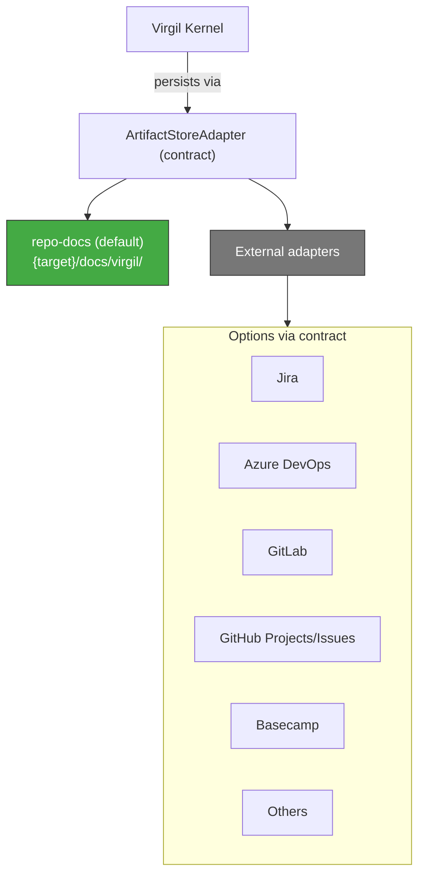
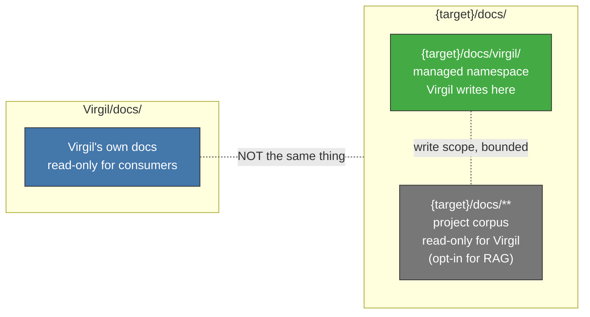

# Building Adapters

Guide for developers building `ArtifactStoreAdapter` plugins (Jira, GitLab,
Azure DevOps, GitHub Projects, Basecamp, or any other PM backend). This
document is self-contained — you should be able to start building an adapter
without reading the full `principia/constitution.md`.

## What Is an Adapter

An `ArtifactStoreAdapter` is the contract through which the Virgil Kernel
persists and retrieves deliverables (idea, requirement, design, tasks,
handoff). The Kernel never talks to a storage backend directly — it always
goes through this contract.

External adapters are first-class extension points, not provisional
functionality. Whether an adapter is implemented today is a status marker,
not a statement about strategic priority — anything that satisfies the
adapter contract connects, regardless of how many adapters exist today.

## The Default Adapter

`repo-docs` is the adapter that ships with Virgil and requires no external
dependencies. It persists deliverables as markdown files under
`{target}/docs/virgil/` in the consumer project — local, git-versioned, and
RAG-friendly by default.

Use `repo-docs` as your reference implementation. Every method your adapter
must implement, it already implements against real files. `internal/repodocs`
(recoverable from `main` via `git checkout main -- internal/repodocs/`)
currently exposes this as package-level functions (`Init`, `Write`,
`Transition`) against `protocol.OperationRequest`. Part of formalizing the
adapter contract is extracting those functions behind a proper
`ArtifactStoreAdapter` interface — following the same pattern already
established by `internal/agents/adapter.go`'s `Adapter interface` (identity,
detection, capabilities, operations) — before any external adapter lands.

## Contract Interface

Derived from what `repo-docs` does today, plus the invariants in
`AGENTS.md`, an `ArtifactStoreAdapter` must support:

| Capability | Description |
|------------|--------------|
| Persist | Write a deliverable with its revision and provenance attached |
| Retrieve | Read the current state of one deliverable or an inventoried set |
| Transition | Execute a lifecycle transition, validating the corresponding gate before it commits |
| Inventory | Report existence and state of deliverables without requiring full content read (supports tiered visibility) |
| Frontmatter management | Track revision metadata, content digest, and lifecycle status per deliverable |
| Namespace isolation | Keep Virgil-managed content separate from consumer-owned content (see Namespace Rules below) |

None of these are prescriptive about storage technology. `repo-docs` answers
them with markdown files and frontmatter blocks; a Jira adapter answers the
same questions with API calls against issue fields and transitions. The
contract is the interface, not the implementation.

Design your adapter around Open/Closed: each new backend is an additional
implementation of the same interface, never a conditional branch inside
existing code.

## Namespace Rules

Two directories share the name `docs` but do not share identity, ownership,
or write policy. Do not conflate them.

For your adapter, the practical rule is: your write scope is exactly the
managed namespace you own (for `repo-docs`, that is `{target}/docs/virgil/`;
for a Jira adapter, that is the project/board you were configured against).
Everything else in the consumer's environment — their own docs, their own
Jira projects unrelated to Virgil — is read-only or entirely out of scope.
Never write outside your declared namespace.

## RAG Integration

Deliverables your adapter persists must be discoverable by the
`consumerRag` — the retrieval projection that lets agents query instead of
reading full files. Two implications for adapter authors:

- Whatever your adapter persists must be exposable in a form the RAG can
  index: plain text or structured fields with a stable identifier per
  deliverable.
- The RAG and your adapter each carry a **watermark** — the revision they
  were last synchronized against. Certification is blocked if the code's
  `sourceRevision` is not reachable from the RAG's watermark. If your
  backend is not git-based (most PM tools aren't), your adapter needs a way
  to expose an equivalent revision marker so re-sync and drift detection
  still work.
- `repo-docs` gets this for free because the backend is the git repository
  itself. An external adapter (Jira, GitLab issues) must define what
  "revision" means in its own domain — typically the ticket's last-updated
  timestamp or a version field the PM tool exposes.

## Example: Jira Adapter

A sketch of how Virgil's deliverable concepts map onto Jira issue types.
This is not a spec — it's a starting point for someone building the plugin.

| Virgil concept | Jira mapping |
|-----------------|---------------|
| idea | Epic |
| requirement | Story |
| design | Story (or a linked Confluence page, if the adapter also bridges Confluence) |
| task | Sub-task |
| Handoff | Story transitioned to "Ready for Development" |
| Lifecycle transition | Jira workflow transition (e.g., "To Do" -> "In Progress") |
| Revision/provenance | Jira issue history entry + `updated` timestamp |
| Namespace | A specific Jira project key (or board) configured at adapter init |

Concretely, the adapter's `Persist` method would create or update an Epic or
Story via the Jira REST API; `Transition` would call the workflow-transition
endpoint and validate that the target status is a legal move from the
current one; `Inventory` would run a JQL query scoped to the configured
project key rather than fetching every issue's full description.

The hard part is not the API calls — it's making Jira's five-state (or
custom) workflow honor the same lifecycle gates the Kernel enforces (see
`docs/architecture.md`, State Machine section). Your adapter's `Transition`
method is where that reconciliation happens: it should reject a transition
request that violates the Virgil state machine, even if Jira's own workflow
would technically allow it.
