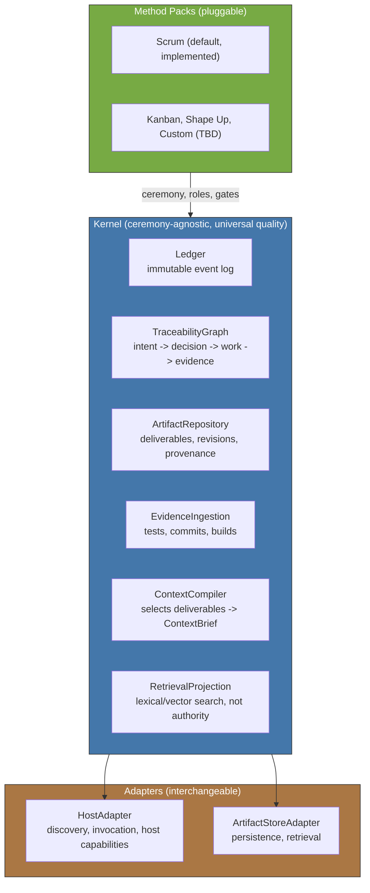
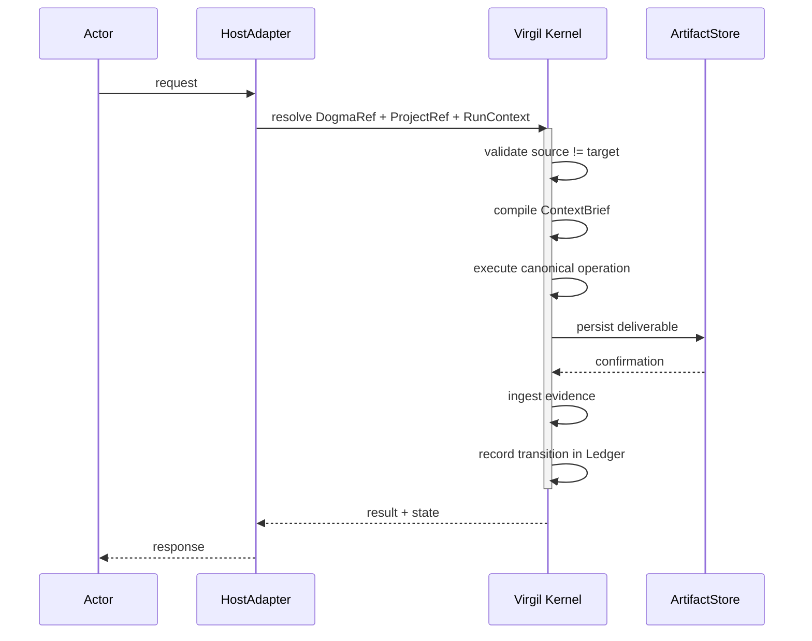
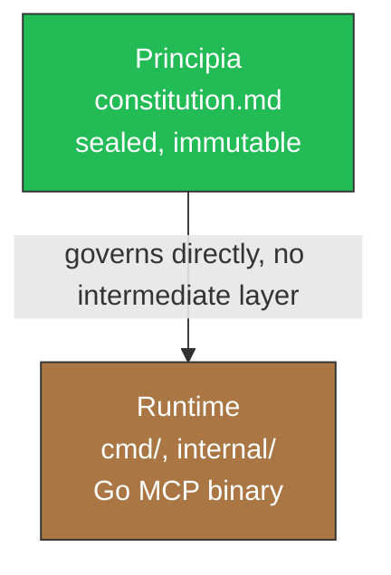

# How Virgil Works

Practical architecture guide for contributors implementing Virgil. This document
translates `principia/constitution.md` into what you need to understand before
writing Go code. It is not a philosophy essay — read the Principia for the "why."

## System Overview

Virgil is a knowledge/control plane, distributed as an independent MCP server
(Go binary). It has three structural pieces: a ceremony-agnostic Kernel, a pair
of adapter interfaces, and pluggable Method Packs.



The Kernel owns invariants that apply regardless of methodology: the Echo
System, Red/Green/Refactor gating, the Ledger, and evidence ingestion. A
Method Pack owns ceremony — how many roles participate, which planning gates
compress, how iteration happens. **Quality is the Kernel's job; ceremony is
the Pack's job.** A Pack may add quality mechanisms on top of the Kernel
minimum, but it can never lower that minimum.

## Invocation Flow

Every call into Virgil follows the same canonical path, whether it originates
from a human-directed agent (Modo Desarrollo) or an external implementer
(Modo Consumo).



Two kinds of steps happen here. **Deterministic** steps (persist, ingest
evidence, record transition, mechanical certification gates) are binary —
pass or fail, no subjectivity. **Judgment-mediated** steps (ContextBrief
compilation, escalation decisions, architectural alignment checks) involve
agent reasoning and must leave traceable evidence, because they carry an
inherent surface for omission or drift.

The three identities resolved by the HostAdapter at the start of every
invocation — `DogmaRef`, `ProjectRef`, `RunContext` — are named here but their
field-level contract belongs to the protocol layer, not this document.

**Atomicity note**: if the process fails between persist and Ledger-record,
the recovery mechanism (see State Machine below) reconciles state by deriving
the current phase from existing deliverables, not from a stored pointer. The
Ledger is idempotent — recording an already-recorded transition is a no-op.

## State Machine

Every project (and every feature within it) moves through six lifecycle
states. Progress is not linear — each phase loops until its deliverable
converges, then hands off.

```mermaid
stateDiagram-v2
    [*] --> Idea

    state Planning {
        Idea --> Requirements : consolidated
        Requirements --> Design : complete
        Design --> Tasks : approved
        Tasks --> Handoff : refined

        Idea --> Idea : question, refine
        Requirements --> Requirements : iterate with MIM
        Requirements --> Idea : gap detected
        Design --> Requirements : gap detected
        Tasks --> Design : gap detected
    }

    Handoff --> Execution : handoff approved

    state Execution {
        Execution --> Verify : candidate implementation
    }

    Verify --> Deliver : certified
    Deliver --> Operation : if applicable

    note right of Planning : Virgil ENFORCES mechanical\nconvergence via the state machine.\nSM ORCHESTRATES delegations.\nMIM DIRECTS product decisions.
    note right of Execution : Virgil OBSERVES.\nEmits PlanningGapDetected on gaps.
    note right of Operation : Virgil ASSISTS.\nReactive, optional.
```

`virgil_status` reports which phase a feature (and the project overall) is
in. A feature does not advance until its deliverable is consolidated.

**PlanningGapDetected**: if execution discovers that an approved deliverable
is ambiguous, contradictory, or insufficient, it emits this signal, blocks
only the affected scope, and returns control to planning. Execution never
rewrites an approved deliverable.

**FastForward**: the orchestrating agent (SM) does not always run every
phase with full ceremony. It scores certainty on observable, verifiable
state (FF-1 through FF-4) and compresses planning ceremony proportionally —
from full deliberation (score 0-2) to direct execution (score 6-8).
FastForward compresses planning ceremony, never Kernel quality gates:
Red/Green/Refactor, mutation testing, and fitness functions run in full at
every FastForward level.

## Two-Layer Architecture

Virgil has two layers, not three. There is no intermediate "Dogma" layer
between the Principia and the Runtime.



**What this means for implementation:**

- `principia/constitution.md` is the sole normative authority. It is sealed —
  read-only, never edited to fit code convenience.
- Any design document you write (architecture notes, protocol specs, slice
  plans) is Runtime-adjacent reference material derived FROM the Principia.
  It does not sit between the Principia and the code, and it does not carry
  independent authority.
- If code contradicts the Principia, the code is wrong. There is no
  intermediate document that can excuse the divergence.
- `docs/` in this repository (the one you are reading now) is practical
  documentation for contributors and consumers — not a normative Dogma
  layer. In a consumer project, `{target}/docs/virgil/` plays a different
  role entirely: it is the default `ArtifactStoreAdapter` storage location
  (see `docs/adapter-contract.md`).

## Component Responsibilities

| Component | Owner | Responsibility |
|-----------|-------|-----------------|
| Ledger | Kernel | Immutable log of events, transitions, history |
| TraceabilityGraph | Kernel | Derived projection: intent -> decision -> work -> evidence |
| ArtifactRepository | Kernel | Deliverables, revisions, provenance (internal, not the external adapter) |
| EvidenceIngestion | Kernel | Ingests test results, commits, builds, human decisions |
| ContextCompiler | Kernel | Selects deliverables into a scoped, traceable ContextBrief |
| RetrievalProjection (RAG) | Kernel | Lexical/vector search over deliverables; never authoritative |
| HostAdapter | Adapter | Discovery, invocation, capability negotiation per agent host |
| ArtifactStoreAdapter | Adapter | Persistence and retrieval against a PM backend (repo-docs, Jira, etc.) |
| Method Pack | Pack | Ceremony, roles, additional gates (Scrum is the only implemented pack) |
| SM (Session Manager) | Agent role, injected by the Pack | Orchestrates delegation, compiles context, runs PDC |
| TPM (Task Progress Monitor) | Agent role | Scans deliverable state and reports to SM; never mutates deliverables |
| MIM | Human | Final decision authority — approves, rejects, breaks ties |

Two invariants govern how these parts interact:

- **Global ownership, not global injection.** Virgil knows what exists, who
  owns it, and what state it's in — it does not load all content into every
  prompt. Sub-agents receive scoped context (`topic_key` references or a
  compiled `ContextBrief`), never the full inventory.
- **Host and Store are independent concerns.** A HostAdapter is agnostic of
  which ArtifactStoreAdapter backs it; a given ArtifactStoreAdapter can serve
  multiple hosts. Adding a new consuming agent means writing a new
  HostAdapter — it requires zero changes to the Kernel or to any
  ArtifactStoreAdapter.
