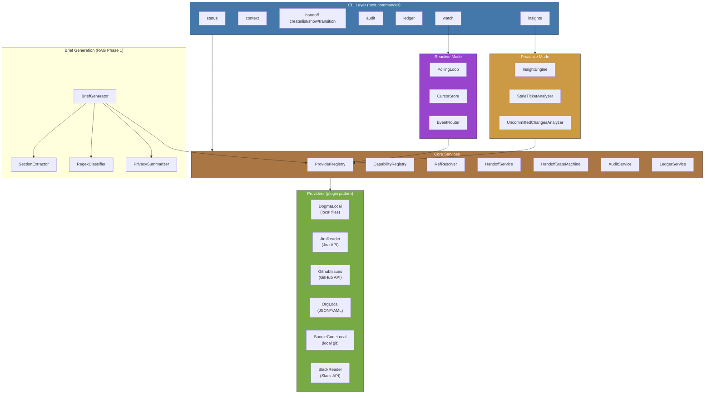
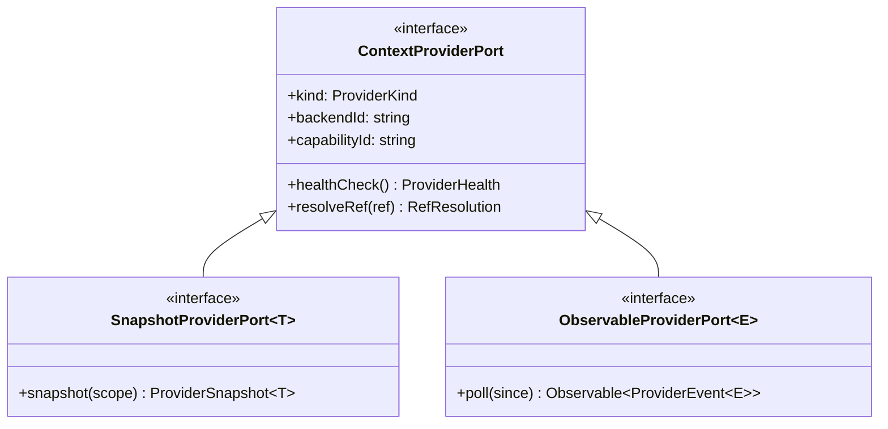
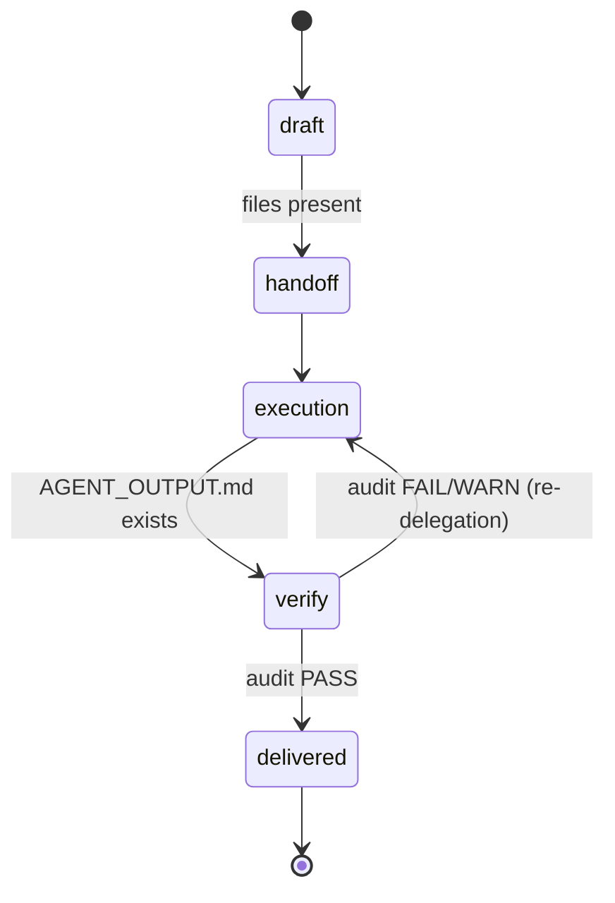
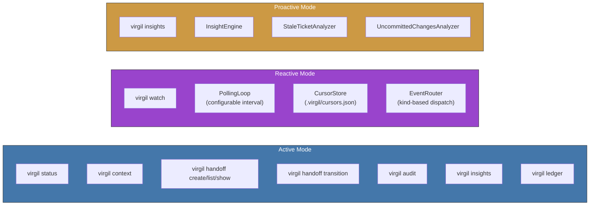
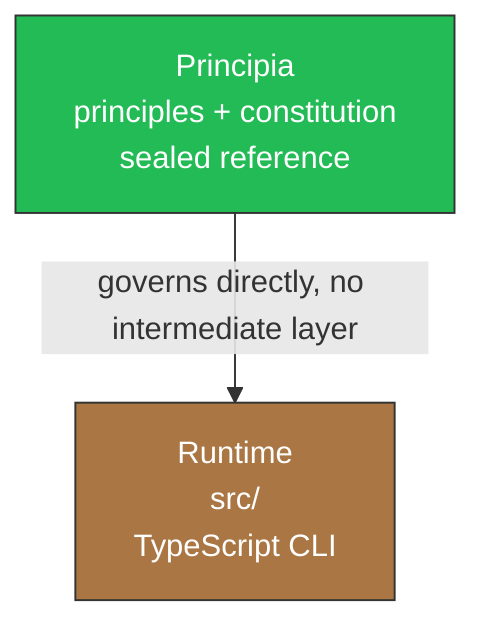

# Architecture

Practical architecture guide for contributors. Virgil is a TypeScript CLI
built on NestJS standalone + nest-commander. It consolidates project context
from multiple enterprise sources via interchangeable providers and generates
structured handoffs for AI agents.

## System Overview

Tech stack: TypeScript, NestJS (`@nestjs/common` + `@nestjs/core`),
nest-commander, RxJS, Zod, fast-glob, picomatch, js-yaml. Tests: Vitest.

## Provider Plugin Pattern

The central extensibility mechanism. Every external data source is a provider
that implements a port interface and self-registers via NestJS `OnModuleInit`.

### Port Hierarchy

- `ContextProviderPort` -- base contract: kind, backendId, health check, ref resolution.
- `SnapshotProviderPort<T>` -- adds `snapshot(scope)` for point-in-time reads.
- `ObservableProviderPort<E>` -- adds `poll(since)` returning an RxJS Observable for event streaming.

A provider can implement both (e.g., `SourceCodeLocalService` implements
`SnapshotProviderPort<SourceCodeSnapshot>` AND `ObservableProviderPort<VirgilEvent>`).

### Self-Registration

Each provider module uses `registerIfConfigured()` -- a static method that
returns the module only when its environment variables are set. On bootstrap:

1. NestJS instantiates the module if config is present.
2. `OnModuleInit` fires: the provider registers itself in both the
   `CapabilityRegistry` (status tracking) and the `ProviderRegistry`
   (runtime lookup).
3. Health check runs immediately. Status transitions to `available` or
   `degraded`.

If config is absent, the module is skipped entirely -- no error, no degraded
entry. This is the graceful degradation pattern.

### Implemented Providers

| Provider | Kind | Backend | Port | Data Source |
|----------|------|---------|------|-------------|
| `DogmaLocalService` | `dogma` | `local` | Snapshot | Local filesystem (md, txt, json, yaml) |
| `JiraReaderService` | `ticket` | `jira` | Snapshot | Jira REST API (boards, sprints, issues) |
| `OrgLocalService` | `org` | `local` | Snapshot | Local JSON/YAML (team members, roles) |
| `SourceCodeLocalService` | `sourcecode` | `local` | Snapshot + Observable | Local git repos (branch, commits, status) |
| `GithubIssuesReaderService` | `ticket` | `github` | Snapshot | GitHub REST API (issues, labels, milestones) |
| `GithubWikiService` | `dogma` | `github-wiki` | Snapshot | GitHub Wiki (git clone of `.wiki.git`) |
| `SlackReaderService` | `chat` | `slack` | Snapshot | Slack API (channels, messages) |

### ProviderRegistry and CapabilityRegistry

Two registries, two concerns:

- **ProviderRegistry** -- runtime lookup by `kind` or `capabilityId`. Used by
  `HandoffService`, `RefResolverService`, and `PollingLoopService` to query
  providers at execution time.
- **CapabilityRegistry** -- status tracking (`configured-unverified` ->
  `available` | `degraded`). Used by `status` command to report what is
  connected and what is not.

## Semantic Refs

URI scheme: `{kind}://{backend}/{id}`

Examples:
- `dogma://local/architecture.md`
- `dogma://github-wiki/Getting-Started.md`
- `ticket://jira/PROJ-123`
- `ticket://github/42`
- `org://local/Jane Doe`
- `sourcecode://local/my-repo`
- `chat://slack/C04ABC123/1234567890.123456`

Five valid kinds: `dogma`, `ticket`, `org`, `sourcecode`, `chat`.

`parseRef()` validates and destructures. `buildRef()` constructs.
`RefResolverService` resolves a ref by dispatching to all providers of the
matching kind -- first successful resolution wins.

## Handoff System

A handoff is a directory under `.virgil/handoffs/{id}/` containing 6 files
that consolidate context from all providers into a structured package for an
AI agent:

| File | Written By | Purpose |
|------|-----------|---------|
| `TASK.md` | `HandoffService.create()` | Objective, scope, guardrails, FF level |
| `CONTEXT.md` | `HandoffService.create()` | Ticket summary, dogma excerpts, repo baseline |
| `ACCEPTANCE_CHECKLIST.md` | `HandoffService.create()` | Completion criteria derived from guardrails |
| `META.json` | `HandoffService.create()` | Machine-readable metadata: id, state, guardrails, repos |
| `AGENT_OUTPUT.md` | Agent (external) | Agent writes this after execution |
| `AUDIT_REPORT.json` | `AuditService.audit()` | Automated audit results |

`META.json` carries the guardrails contract:
- `allowedPaths` / `forbiddenPaths` (glob patterns)
- `maxFilesChanged` / `maxLinesChanged`
- `ffLevel` (1-4, FastForward ceremony compression)
- `repos` (baseline commit SHAs for diff comparison)

## Lifecycle State Machine

Five states, five valid transitions, preconditions enforced by
`HandoffStateMachine`:

### Transition Preconditions

| From | To | Precondition |
|------|----|-------------|
| `draft` | `handoff` | `TASK.md`, `CONTEXT.md`, `ACCEPTANCE_CHECKLIST.md`, `META.json` must exist |
| `execution` | `verify` | `AGENT_OUTPUT.md` must exist |
| `verify` | `delivered` | `AUDIT_REPORT.json` must exist AND verdict must be `PASS` |
| `verify` | `execution` | `AUDIT_REPORT.json` must exist AND verdict must NOT be `PASS` |

All other transitions in the `VALID_TRANSITIONS` map have no preconditions
(e.g., `handoff` -> `execution` is unconditional).

## Audit System

`AuditService` runs 6 automated checks against the guardrails defined in
`META.json`:

| Check | What It Validates | Gap Type on Failure |
|-------|-------------------|---------------------|
| `scope` | Changed files match `allowedPaths` globs | `IMPLEMENTATION` |
| `forbidden` | No changes to `forbiddenPaths` globs | `IMPLEMENTATION` |
| `file-count` | Changed file count within `maxFilesChanged` | `IMPLEMENTATION` |
| `line-count` | Total insertions+deletions within `maxLinesChanged` | `IMPLEMENTATION` |
| `conflict-markers` | No `<<<<<<<` / `>>>>>>>` in changed files | `CONTRACT` |
| `agent-output` | `AGENT_OUTPUT.md` exists | `COMPLIANCE` |

### Verdict Logic

- **PASS** -- all checks pass.
- **WARN** -- only `agent-output` failed (missing doc, not a code issue).
- **FAIL** -- any non-agent-output check failed.

### Gap Classification and Recommendation Routing

Four gap types: `IMPLEMENTATION`, `TESTING`, `CONTRACT`, `COMPLIANCE`.

Recommendations based on gap type:
- `CONTRACT` -> "Manual intervention required -- resolve conflict markers"
- `IMPLEMENTATION` -> "Re-delegate with tighter scope constraints"
- `COMPLIANCE` only -> "Agent must write AGENT_OUTPUT.md -- re-execute"

Audit writes `AUDIT_REPORT.json` (machine) and `FEEDBACK.md` (human-readable)
to the handoff directory.

## Break-Glass

Override mechanism for blocked transitions. When `breakGlass: true` is passed
to `HandoffStateMachine.transition()`:

1. Precondition checks are skipped entirely.
2. A `break-glass` event is recorded in the ledger with the reason.
3. `META.json` gets a `breakGlass` field:
   - `activatedAt` -- timestamp
   - `reason` -- human-provided justification
   - `certificationDeadline` -- 72 hours from activation

The 72h deadline is a certification window: the override must be reviewed and
certified within that period. The ledger trail ensures accountability.

## Ledger

Append-only JSONL file at `.virgil/ledger.jsonl`. Records four event types:

| Event | When |
|-------|------|
| `created` | Handoff created |
| `transition` | State changed |
| `audit` | Audit completed (with verdict) |
| `break-glass` | Break-glass override activated |

Each entry: `timestamp`, `handoffId`, `event`, `actor` (`virgil-cli`), plus
optional `from`/`to` states, `reason`, and `data`.

`LedgerService.getEntries(handoffId?)` reads all or filters by handoff.

## Three Operation Modes

### Active Mode

Direct CLI commands. User runs a command, gets a result. Commands:
`status`, `context`, `handoff` (with subcommands `create`, `list`, `show`,
`transition`), `audit`, `insights`, `ledger`.

### Reactive Mode

`virgil watch` starts the `PollingLoopService` (default 30s interval). Each
tick:

1. Iterates all registered providers.
2. Filters to those implementing `ObservableProviderPort` (have a `poll` method).
3. Reads cursor from `CursorStoreService` (`.virgil/cursors.json`). If no
   cursor, defaults to 24h ago.
4. Calls `provider.poll(since)`, collecting `ProviderEvent` emissions.
5. Routes each event through `EventRouterService` (kind-based handler dispatch).
6. Updates cursor to the latest event timestamp.

Currently `SourceCodeLocalService` is the only provider implementing
`ObservableProviderPort`, emitting `commit-pushed` events.

Event kinds defined: `ticket-updated`, `ticket-created`, `commit-pushed`,
`doc-changed`, `member-changed`.

### Proactive Mode

`virgil insights` runs the `InsightEngineService`. Two analyzers registered:

- **StaleTicketAnalyzer** -- detects tickets that have not been updated within
  a configured threshold.
- **UncommittedChangesAnalyzer** -- detects repos with uncommitted working
  directory changes.

Each analyzer implements `InsightAnalyzerPort` (name + `analyze()` returning
`Insight[]`). Insights are sorted by severity: `critical` > `warning` > `info`.

## Brief Generation Pipeline (RAG Phase 1)

Deterministic extraction + classification pipeline over dogma provider snapshots.
Zero LLM, zero embeddings. Produces a structured brief for agent consumption.

Pipeline: `DogmaSnapshot` -> `extractSections()` -> `classifySection()` ->
`summarizeSection()` -> `Brief`

### Components

- **SectionExtractor** -- splits markdown documents on headings (`#{1,6}`).
  Falls back to paragraph splitting on `\n{2,}` for headingless content.
- **RegexClassifier** -- cascade of regex patterns maps each section to one of
  6 `BriefKind` values: `risk` > `constraint` > `decision` > `glossary` >
  `open-question` > `principle` (default).
- **PrivacyAwareSummarizer** -- cascade of privacy-sensitive regex patterns.
  Matches for credentials, PII, or sensitive data produce pre-authored safe
  summary strings. Non-sensitive content gets truncated to 200 chars.

### Output

- `.virgil/brief.json` -- machine-readable: schemaVersion, watermark, items,
  stats (byKind, totalDocuments, totalItems, durationMs).
- `.virgil/brief.md` -- human-readable: items sorted by kind (risk first).
- Watermark tracks the git commit SHA at generation time for drift detection.

### BriefItem Identity

Deterministic hashing: `"brief-" + SHA-256("{sourceRef}:{title}:{index}")[0:12]`.
Same input always produces the same ID across runs.

## Two-Layer Architecture

- `principia/` is the sealed normative reference. Read-only. Provides
  guidelines and constitutional principles.
- `src/` is the runtime implementation. Derives its design from the Principia.
- No intermediate layer between them. If code contradicts the Principia,
  the code is wrong.

## Testing

App-level integration tests under `src/__tests__/`. Zero mocks -- tests
bootstrap the full NestJS application with real service wiring.

| Test Suite | Scenarios | Scope |
|------------|-----------|-------|
| `provider-registry.test.ts` | 5 | Registry operations, health checks |
| `context-flow.test.ts` | 3 | End-to-end context resolution |
| `handoff-lifecycle.test.ts` | 17 | State machine, transitions, preconditions, break-glass |
| `audit-checks.test.ts` | 26 | All 6 audit checks, verdicts, gap classification |
| `reactive-events.test.ts` | 6 | Polling loop, cursors, event routing |
| `proactive-insights.test.ts` | 4 | Insight engine, analyzer registration |
| `github-issues-provider.test.ts` | 8 | GitHub config states, health, snapshots, refs |
| `brief-generation.test.ts` | 6 | Classification, privacy summarization, persistence |
| `github-wiki-provider.test.ts` | 16 | Config states, snapshots, special file filtering, refs, health |

77 test scenarios total. Filterable by test name via Vitest.

## Module Wiring

`AppModule` imports in this order:

1. `AppConfigModule.forRoot([...configs])` -- loads all provider configs from env
2. `CapabilityRegistryModule` (global) -- status tracking
3. `ProviderRegistryModule` (global) -- runtime provider lookup
4. Provider modules (`DogmaLocal`, `GithubWiki`, `Jira`, `GithubIssues`, `OrgLocal`, `SourceCodeLocal`, `Slack`) -- each via `registerIfConfigured()`
5. `RefResolverModule` -- cross-provider ref resolution
6. `LedgerModule` -- append-only event log
7. `HandoffModule` -- handoff creation + state machine
8. `AuditModule` -- guardrail verification
9. `ReactiveModule` -- polling loop + cursors + event router
10. `ProactiveModule` -- insight engine + analyzers
11. `BriefModule` -- brief generation pipeline

CLI commands (`StatusCommand`, `ContextCommand`, `HandoffCommand`,
`AuditCommand`, `LedgerCommand`, `WatchCommand`, `InsightsCommand`,
`BriefCommand`) are registered as providers in `AppModule` directly.
