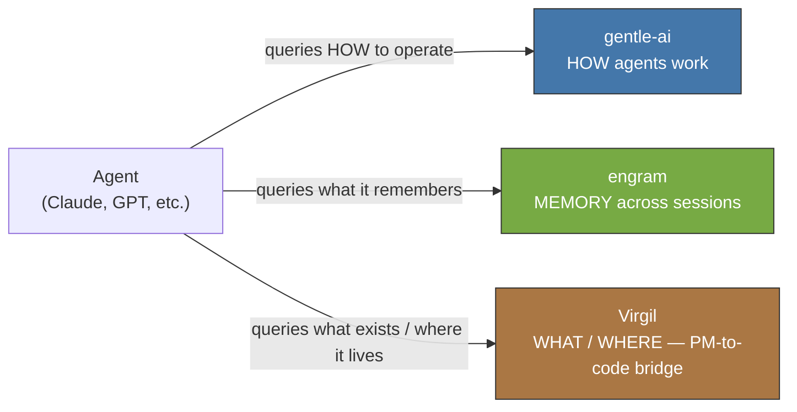
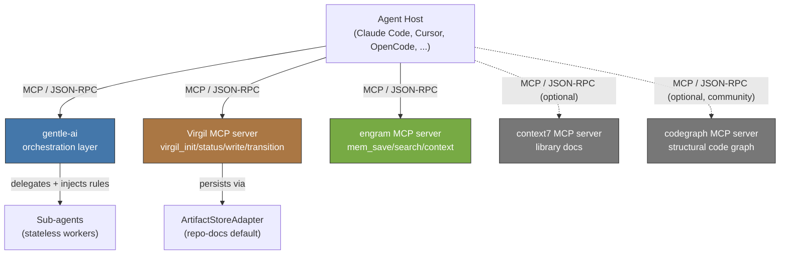

# Ecosystem Integration

The Principia defines capabilities as contracts and interfaces — `ArtifactStoreAdapter`,
`HostAdapter`, `codebaseMemory`, `devRag`/`consumerRag`, persistent memory across sessions.
It never names a specific product. This document is the practical bridge: it maps each
capability to the concrete tool that satisfies it today in the gentle-ai ecosystem. If a
tool gets replaced tomorrow, update this document and the adapter that implements the
contract — never the Principia. The contract stays valid regardless of which tool
implements it.

## The Three Pillars

Virgil operates as one of three complementary pillars (Principia CC-3, `AGENTS.md`
Ecosystem section). None replaces the other two.



- **gentle-ai** answers HOW agents work: orchestration patterns, delegation, review
  ceremony, receipt-driven development. It also bundles or wires up several MCP tools
  (engram, context7, and optionally the community tool codegraph) as installable
  components.
- **engram** answers WHAT agents remember: persistent, cross-session memory that
  survives compaction. Distributed as its own MCP server; gentle-ai provisions and
  health-checks it as a managed component.
- **Virgil** answers WHAT exists and WHERE it lives: the PM-to-codebase bridge, with
  verifiable traceability from intent to evidence.

## Capability-to-Tool Mapping

| Principia Capability | Principia Section | Tool | Role | Status |
|---|---|---|---|---|
| Persistent memory across sessions/compactions | CC-3 (ecosystem positioning) | engram (MCP server) | Cross-session memory; gentle-ai provisions and health-checks the binary | Implemented, external |
| ArtifactStoreAdapter — deliverable persistence | 8a, CC-2 | `repo-docs` (Virgil's own adapter) | Default adapter; writes markdown under `{target}/docs/virgil/` | Implemented (Virgil) |
| ArtifactStoreAdapter — PM backend plugins | 8a, CC-2 | Jira, Azure DevOps, GitLab, GitHub Projects, Basecamp | Alternative backends via the same adapter contract | Contract defined, plugin TBD |
| HostAdapter — agent discovery/invocation | 5, CC-4 | Claude Code, Cursor, Windsurf, Kiro, OpenCode, gentle-ai orchestrator | Any MCP-compatible host consumes Virgil's four tools identically | Implemented (protocol-level) |
| codebaseMemory — structural code graph | 8f | codegraph (community tool, upstream) | AST-derived structural graph; optional, gentle-ai-wired MCP server (`codegraph serve --mcp`) | Available, optional integration — unverified as a Virgil-native adapter |
| Library/API documentation lookup (adjacent to devRag/consumerRag) | 8c (dual RAG, sibling need not itself named by the Principia) | context7 (MCP server, `@upstash/context7-mcp`) | Live framework/library documentation on demand | Available via gentle-ai, external to Virgil |
| devRag — Virgil's own dev-mode documentary DBMS | 8c | None yet | Query layer over `./principia/` + `./docs/` | Not implemented (Virgil) |
| consumerRag — consuming project's documentary DBMS | 8c | None yet (default storage is `{target}/docs/`) | Query layer over Virgil dogma + the project's own RAG | Not implemented (Virgil) |
| ContextBrief / delegationContract — compiled, bounded context | 9a, 9c | gentle-ai orchestrator-minion pattern | Injects rules as text, bounds sub-agent scope, enforces PDC | Implemented (pattern), external |
| Review / receipt-driven development | GP-4, 7e | gentle-ai review system | Evidence-backed acceptance gates, adversarial judgment | Implemented, external |
| Ledger / TraceabilityGraph | 5, 8e | None (Virgil-internal) | Immutable event log; derived projections | Not yet re-derived (Virgil, see roadmap) |
| Planning-to-codebase bridge with traceability | CC-5 | Virgil (this project) | Connects PM intent to code evidence via the TraceabilityGraph chain | Core Virgil responsibility |

Rows marked "unverified" or "TBD" describe capability gaps, not commitments — do not
treat this table as a roadmap.

## Integration Architecture



All four MCP servers register independently at the host level. gentle-ai does not proxy
their protocol traffic — it orchestrates delegation and injects pre-digested rules into
sub-agent briefings; sub-agents call the tools directly when a delegation contract grants
them access.

## Configuration

Register Virgil alongside engram and, optionally, context7 and codegraph, in the same
MCP host configuration (example: Claude Code `settings.json` or project-scoped
equivalent):

```json
{
  "mcpServers": {
    "virgil": {
      "command": "/path/to/virgil",
      "args": ["serve"]
    },
    "engram": {
      "command": "engram",
      "args": ["mcp"]
    },
    "context7": {
      "command": "npx",
      "args": ["-y", "--package=@upstash/context7-mcp@latest", "--", "context7-mcp"]
    },
    "codegraph": {
      "command": "codegraph",
      "args": ["serve", "--mcp"]
    }
  }
}
```

Notes:

- `virgil` and `engram` command paths depend on how each binary was installed
  (`gentle-ai install` provisions and health-checks `engram`; Virgil is installed
  independently per its own release process).
- `context7` can run either as a local `npx`-spawned process or as a remote HTTP MCP
  server (`https://mcp.context7.com/mcp`), depending on host support — see gentle-ai's
  per-host overlays for the exact shape.
- `codegraph` is a third-party community tool with an optional, gentle-ai-owned
  integration. Do not assume it is present; verify with `gentle-ai --component
  codegraph` status or equivalent before depending on `codebaseMemory`-equivalent
  queries.
- gentle-ai does not require these servers to be registered through it — it can install
  and manage some of them (engram, context7, codegraph), but Virgil is always registered
  directly at the host level.

## Version Compatibility

| Virgil version | Minimum gentle-ai version | Minimum engram version |
|---|---|---|
| v0.3.0-rc.x (current, pre-release; zero runtime code on this branch) | TBD | TBD |

Known current versions in the ecosystem at time of writing: gentle-ai `v2.4.0` (latest
stable tag; `v2.5.0-rc.1` in release candidate), engram latest (version pinned per
gentle-ai's `versions` package, not independently tracked here). This table will gain
real floor versions once Virgil ships a runtime and an integration test confirms
protocol compatibility — do not infer compatibility from proximity in release dates.

## When Tools Change

The Principia defines capabilities, not vendors. `persistent memory`, `codebaseMemory`,
and `ArtifactStoreAdapter` are contracts; engram, codegraph, and repo-docs are today's
implementations of those contracts. When a tool is replaced — engram superseded by
another memory server, codegraph superseded by another structural-graph tool, a new
`ArtifactStoreAdapter` plugin shipped — the update protocol is:

1. Update this document's mapping table and the Integration Architecture diagram.
2. Update or add the adapter/integration code that satisfies the Principia's contract
   (for `ArtifactStoreAdapter`, follow `docs/adapter-contract.md`; for `HostAdapter`,
   the equivalent host-adapter contract).
3. Leave `principia/constitution.md` untouched. The capability it names — "persistent
   memory," "structural code graph," "adapter-mediated persistence" — remains valid
   regardless of which concrete tool implements it today.

If a change would require editing the Principia to accommodate a new tool, that is a
signal the tool does not actually satisfy the existing contract — not a signal that the
contract should bend to the tool. See the Principia's Interpretive Anti-Drift Rule
(section 1a) for the general form of this constraint.
