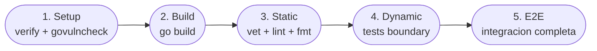
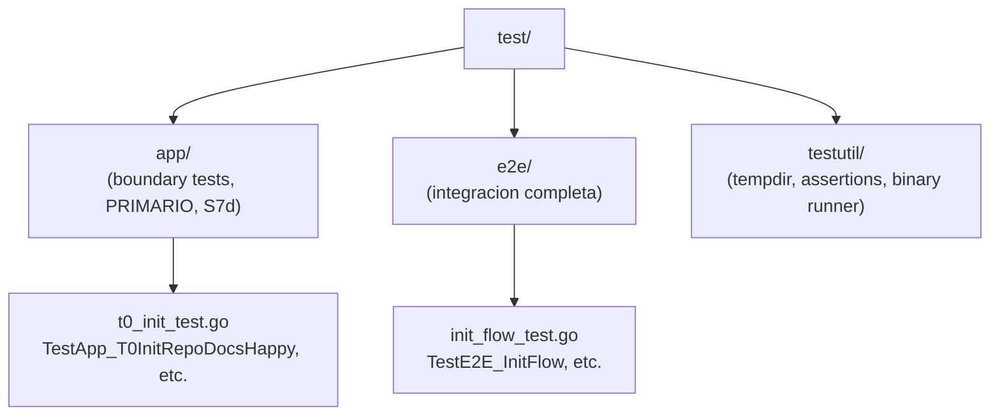

# Echo System Go

[← docs/](../README.md) · [← implementation/](./README.md)

Instanciacion concreta del Echo System constitucional (principia S7a) para el runtime Go de Virgil. Los 5 pasos abstractos se materializan en comandos, herramientas y estructura de directorios especificos.

Fuente: `principia/constitution.md`, Secciones 7a, 7d, 7h.

## Mapeo constitucional a Go

| Paso | Constitucional | Comando Go | Artefacto |
|---|---|---|---|
| 1 | Setup: dependencias + audit | `go mod download && go mod verify && govulncheck ./...` | `go.sum` verificado, audit limpio |
| 2 | Build: compilar | `go build ./...` | Binario en `dist/` |
| 3 | Static: lint/format | `go vet ./... && golangci-lint run && gofmt -l .` | Reporte de lint |
| 4 | Dynamic: tests boundary | `go test ./test/app/... -coverprofile=dist/coverage.out` | Coverage profile |
| 5 | E2E: integracion completa | `go test ./test/e2e/... -tags=e2e` | Reporte E2E |

El orden es constitucional y no se reordena (principia S7a). Si un paso falla, los posteriores no se ejecutan.



## Paso 1: Setup

```bash
go mod download
go mod verify
govulncheck ./...
```

- `go mod download`: descarga dependencias declaradas en `go.mod`.
- `go mod verify`: confirma que los modulos descargados coinciden con los checksums de `go.sum` (principia S7h: versionPinning).
- `govulncheck`: gate de seguridad (principia S7h: securityAudit). En CI/CD es blocking (cero vulnerabilidades altas/criticas para avanzar a Build). En Dev (pre-push hook) alerta sin bloquear.

`govulncheck` se instala como herramienta de desarrollo, no como dependencia del modulo.

## Paso 2: Build

```bash
CGO_ENABLED=0 go build -o dist/virgil ./cmd/virgil
```

Produce el binario estatico. Si la compilacion falla, no hay artefacto que validar.

## Paso 3: Static

```bash
go vet ./...
golangci-lint run
test -z "$(gofmt -l .)"
```

- `go vet`: analisis estatico de la stdlib (shadow, printf, etc.).
- `golangci-lint`: linters configurados en `.golangci.yml` (errcheck, staticcheck, gosimple, govet, ineffassign, unused como minimo).
- `gofmt -l .`: verifica formato canonico. Si la lista no esta vacia, falla.

## Paso 4: Dynamic (tests boundary)

```bash
go test ./test/app/... -coverprofile=dist/coverage.out -count=1
```

Los tests de este paso son boundary tests a nivel de aplicacion (principia S7d: tier primario). Ejecutan el binario compilado contra targets aislados y observan efectos externos.

**Selector canonico**: `TestApp_*` en `test/app/`.

Coverage se mide sobre archivos con logica real (cobertura selectiva, principia S7f).

## Paso 5: E2E (integracion completa)

```bash
go test ./test/e2e/... -tags=e2e -count=1
```

Tests de solucion completa: multi-proceso, filesystem real, cero mocks. Validan el flujo end-to-end incluyendo recovery, idempotencia y escenarios adversariales.

**Selector canonico**: `TestE2E_*` en `test/e2e/`.

## Estructura de directorios de test



### Regla critica: NO tests dentro de internal

No existen archivos `*_test.go` dentro de `internal/`. Los file-level unit tests con mocks internos estan prohibidos (principia S7d: tests de tipo File/Unit tienen valor cero). Toda validacion se hace desde el exterior del binario, observando comportamiento publico.

Si se necesitan tests de funciones puras (parsers, reducers, guards) para diagnostico rapido, viven en `test/` con el prefijo `TestUnit_` y no participan en las gates de certificacion.

## Contextos de ejecucion

| Contexto | Pasos que ejecuta | Trigger | Notas |
|---|---|---|---|
| Dev | 2 (Static) | Pre-commit hook | Feedback rapido: lint y formato |
| Dev | 0-3 (Setup a Dynamic) | Pre-push hook | Verificacion completa sin E2E |
| CI | 0-4 (todos) | Push, PR | Pipeline completo, gate blocking |
| CD | 0-4 (todos) | Tag, merge a main | Confianza absoluta antes de release |

Los triggers son adapters y pueden cambiar; el contrato Echo no cambia (principia S7a).

## Invariantes del pipeline

- **Orden fijo**: Setup antes de Build, Build antes de Static, etc. No se reordena.
- **Prerrequisitos**: cada paso requiere el exito del anterior para ejecutarse.
- **Determinismo**: mismos inputs producen mismos outputs. Clock controlado en T0.
- **Artefactos identificados**: cada `buildArtifactSet` queda ligado a un `EchoRun` y `sourceRevision` (principia S7b).
- **Reproducibilidad**: `go.sum` + `toolchain` + `CGO_ENABLED=0` garantizan builds reproducibles.

---

← Anterior: [Go Runtime](./go-runtime.md) · [↑ implementation](./README.md) · [↑↑ docs](../README.md) · Siguiente: [Artefactos](./artifacts.md) →
