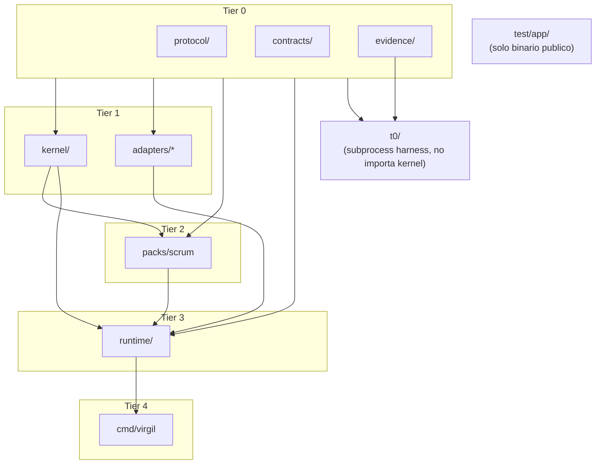
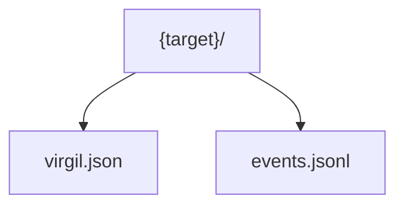
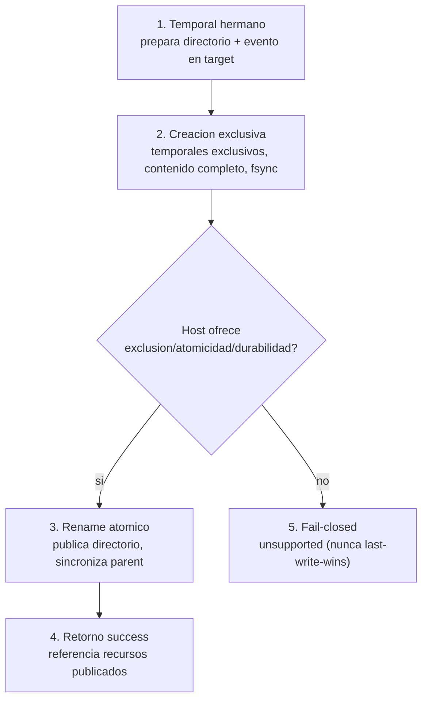

# Go Runtime

[← docs/](../README.md) · [← implementation/](./README.md)

Decisiones concretas sobre el runtime Go de Virgil: version, dependencias, estructura de paquetes, build y modelo de proceso.

Fuente: `principia/constitution.md`, Secciones 5, 7h, 3b.

## Version de Go

**Decision**: Go 1.24+ (ultima estable). Se fija mediante la directiva `toolchain` en `go.mod`.

Razon: Go 1.24 es la ultima version estable a la fecha de este documento. La directiva `toolchain` garantiza que todos los ambientes usen la misma version del compilador, eliminando drift entre dev/CI/CD (principia S7h: versionPinning).

```text
go 1.24
toolchain go1.24.0
```

> **Nota**: el `go.mod` actual del repositorio declara Go 1.26.5 porque el desarrollo arranco con una version RC disponible. Si la version estable publicada difiere, se ajusta `go.mod` al release final. El invariante es: version exacta, no rango.

## Dependencias

**Decision**: minimas y pineadas a version exacta. Go modules con `go.sum` como lock file versionado (principia S7h: versionPinning).

| Dependencia | Version | Justificacion |
|---|---|---|
| `github.com/spf13/cobra` | v1.10.2 | CLI framework. Aporta subcomandos, flags, ayuda y completions sin reinventar la rueda. |
| `github.com/santhosh-tekuri/jsonschema/v6` | v6.0.3 | JSON Schema Draft 2020-12. Necesario para validacion de contratos y fixtures. Loader bundled-only. |
| `github.com/gowebpki/jcs` | v1.0.1 | RFC 8785 (JSON Canonicalization Scheme). Necesario para identidad idempotente e integridad de digests. |

Tres dependencias directas. Cada dependencia adicional requiere revision explicita de este contrato y evaluacion de trade-off de supply chain (principia S7h).

**Prohibidas**: ORMs, web frameworks, loggers externos, UUID libraries, Docker SDK, clientes de red, YAML parsers. Virgil es un CLI local, no un servicio web.

## Paquetes internos

**Decision**: toda la logica vive bajo `internal/` para prevenir importacion externa. La separacion Kernel/Adapter/MethodPack del Principia (S5) se mapea asi:

```text
cmd/virgil/              -- punto de entrada, main()
internal/
  kernel/                -- Ledger, TraceabilityGraph, EvidenceIngestion, ContextCompiler
  protocol/              -- OperationRequest/Result, envelopes, wire format
  contracts/             -- JSON Schemas embebidos, validacion
  adapters/
    repodocs/            -- ArtifactStoreAdapter: repo-docs (default)
    host/                -- HostAdapter: discovery, invocacion MCP/JSON-RPC
  packs/
    scrum/               -- Method Pack Scrum (unico implementado)
  runtime/               -- orquestacion de invocacion, dispatch
  t0/                    -- harness T0, fixtures embebidas
  evidence/              -- EvidenceBundle, snapshots, diffs
```

### Reglas de importacion

| Paquete | Puede importar | No puede importar |
|---|---|---|
| `kernel/` | `protocol/`, `contracts/`, stdlib | adapters, packs, t0 |
| `adapters/*` | `protocol/`, `contracts/`, stdlib | kernel internals, packs, t0 |
| `packs/*` | `protocol/`, kernel interfaces | adapters directos, t0 |
| `runtime/` | `protocol/`, `contracts/`, kernel, adapters, packs | t0 |
| `t0/` | `protocol/`, `contracts/`, `evidence/`, `os/exec` | kernel, runtime, adapters |
| `test/app/` | binario publico unicamente | cualquier paquete internal |

La regla critica: `t0/` opera el binario como subprocess, nunca importa el kernel (principia S7d: boundary testing). `test/app/` tampoco importa paquetes internos.



## Build

**Decision**: `go build` produce un unico binario estatico autocontenido (principia S5).

```bash
go build -o dist/virgil ./cmd/virgil
```

### Cross-compilacion

| Target | GOOS | GOARCH | Notas |
|---|---|---|---|
| Linux x86_64 | linux | amd64 | CI/CD principal |
| Linux ARM64 | linux | arm64 | Servidores ARM |
| macOS x86_64 | darwin | amd64 | Dev Intel |
| macOS ARM64 | darwin | arm64 | Dev Apple Silicon |
| Windows x86_64 | windows | amd64 | Soporte CLI multiplataforma |

**CGO**: deshabilitado (`CGO_ENABLED=0`). Todas las dependencias actuales son Go puro. Si tree-sitter (codebaseMemory, principia S8f) se integra en el futuro, esta restriccion se re-evaluara: tree-sitter requiere CGO, lo cual impactaria cross-compilacion y el invariante de binario estatico.

## Modelo de proceso

**Decision**: fresh process per invocation (principia S3b). Virgil no es un daemon.

- Cada invocacion crea un proceso nuevo del binario.
- Comunicacion via MCP/JSON-RPC: JSON por `stdin`, JSON por `stdout`.
- `stdout` es exclusivo para respuestas JSON. Diagnosticos van a `stderr`.
- El exit code no es la autoridad del resultado; el `OperationResult` JSON lo es.
- Ninguna ejecucion infiere identidad desde cwd, variables globales ni memoria conversacional.

```mermaid
%% Fresh process per invocation: sin memoria compartida entre invocaciones
sequenceDiagram
    autonumber
    actor Actor
    participant OS as Sistema operativo
    participant PA as Proceso A (fresh)
    participant PB as Proceso B (fresh, retry)

    Actor->>OS: invoca virgil
    OS->>PA: exec.CommandContext (PID nuevo)
    PA->>PA: procesa envelope, bindings, clock
    PA-->>OS: OperationResult (stdout)
    OS-->>Actor: respuesta JSON

    Actor->>OS: invoca virgil (retry)
    OS->>PB: exec.CommandContext (PID distinto)
    Note over PB: sin memoria conversacional,<br/>solo recursos durablemente publicados
    PB->>PB: procesa envelope, bindings, clock
    PB-->>OS: OperationResult (stdout)
    OS-->>Actor: respuesta JSON
```

### Invariantes de proceso fresco

Cada `process_id` de un ActorScript corresponde a una invocacion nueva del mismo ejecutable con `exec.CommandContext`; no es un goroutine, un reset de struct ni una llamada interna. Cinco reglas concretas:

1. **Ambiente minimo allowlisted**: el runner inicia cada subprocess con variables de entorno explicitas y sin secrets heredados del proceso padre.
2. **Solo recibe su envelope**: cada proceso recibe unicamente el envelope, bindings y clock de su paso. No recibe el resultado completo del proceso anterior.
3. **Sin memoria conversacional**: nunca se transmite memoria conversacional ni estado oculto entre invocaciones. El proceso B solo puede recuperar desde los recursos durablemente publicados.
4. **Captura observable**: el runner captura PID real, limites, exit status, stdout y stderr redactado de cada subprocess.
5. **PIDs distintos verificables**: en la fixture de retry, el runner exige PIDs distintos entre `process-a` y `process-b` como evidencia de proceso fresco real.

### Assets embebidos

Los JSON Schemas y fixtures T0 se embeben en el binario via `go:embed`. El paquete `contracts/` es el unico propietario de la directiva `go:embed` para schemas. Los patrones de embed no pueden subir con `..`, por lo que la ubicacion del paquete determina que assets son accesibles.

## Init atomico

Para el alcance T0, `repo-docs` init publica exactamente dos recursos autoritativos:



Antes de cualquier efecto, el runtime valida schema, referencias cruzadas, digests, `method_source != target`, binding target, namespace, policy, capabilities e identidad idempotente. Una falla previa es fail-closed.

### Secuencia de publicacion (5 pasos)

1. **Temporal hermano**: prepara el directorio completo y su unico evento `project_initialized` en un temporal hermano dentro del `target` y del mismo filesystem.
2. **Creacion exclusiva**: crea temporales de forma exclusiva, escribe contenido completo, sincroniza archivos y directorio. Nunca sigue un path que escape del root.
3. **Rename atomico**: publica el directorio por rename atomico y sincroniza el parent.
4. **Retorno success**: solo entonces devuelve success y referencia los recursos publicados.
5. **Fail-closed**: si el host/filesystem no ofrece exclusion, atomicidad y durabilidad suficientes, devuelve `unsupported`. No cae a copy, overwrite ni last-write-wins.



### Contenido de `virgil.json`

`virgil.json` conserva como minimo: identidad del proyecto, referencias resueltas, policy/adapters efectivos, y el registro durable de la intencion idempotente (key, digest RFC 8785 y `request_id` original). Conserva ademas el `OperationRequest` original completo para recalculo de digest. `events.jsonl`, publicado junto a `virgil.json` en la raiz del target, contiene exactamente un evento `project_initialized` para el primer init.

### Idempotencia

Un retry en proceso fresco reconstruye el resultado leyendo unicamente el store:

- **Mismo digest** del request (RFC 8785, excluyendo solo `request_id`): replay semantico sin writes ni eventos duplicados, enlaza `replayed_from_request_id`.
- **Digest distinto**: produce `IDEMPOTENCY_CONFLICT` sin mutacion.

El namespace fuera de la policy se rechaza antes de escribir. El resultado es `blocked`, incluye `STORE_POLICY_VIOLATION`, registra un `EffectRecord` de write denegado con `occurred = false` y deja diff cero.

---

[↑ implementation](./README.md) · [↑↑ docs](../README.md) · Siguiente: [Echo System Go](./echo-system-go.md) →
