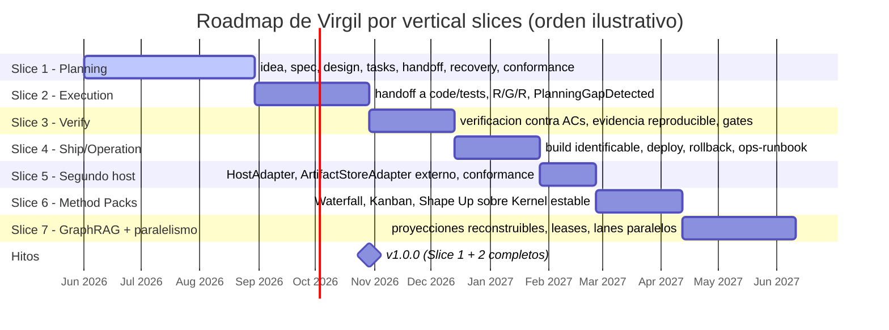

# Releases

[← docs/](../README.md) · [← implementation/](./README.md)

Estrategia de versionado, tagging, mantenimiento de dependencias y roadmap de slices. Las decisiones derivan de Supply Chain Integrity (principia S7h) y de la estrategia de entrega incremental (principia arquitectura principio 7).

Fuente: `principia/constitution.md`, Secciones 7h, 4b (principio 7).

## Versionado: Semantic Versioning 2.0.0

Virgil sigue [SemVer 2.0.0](https://semver.org/):

| Fase | Formato | Significado |
|---|---|---|
| Pre-release | `v0.x.y-rc.N` | Desarrollo activo, sin garantias de estabilidad en API |
| Estable | `v1.0.0+` | Planning + Execution slices completos, API publica estable |

### Convencion de pre-release

Durante `v0.x.y`, cambios breaking pueden ocurrir en cualquier minor. El sufijo `-rc.N` identifica release candidates para validacion antes de promover a release estable. Ejemplo: `v0.3.0-rc.1` precede a `v0.3.0`.

### Criterio para v1.0.0

La version `v1.0.0` se declara cuando los slices 1 (Planning) y 2 (Execution) esten completos, validados por conformance scenarios (ver [conformance.md](conformance.md)) y con al menos un ciclo de Challenge-A exitoso en un proyecto consumidor real.

Hasta entonces, `v0.x.y` no ofrece garantias de estabilidad en API ni en formato de artefactos.

## Tagging

Tags se crean exclusivamente sobre `main`, despues de merge del PR correspondiente:

```text
git tag -a v{version} -m "Release v{version}"
git push origin v{version}
```

El push del tag dispara el pipeline de CD (ver [ci-cd.md](ci-cd.md)).

### Release notes

Las notas de release se generan automaticamente desde conventional commits (ver [AGENTS.md](../../AGENTS.md) para la convencion). `gh release create` con `--generate-notes` produce un changelog agrupado por tipo de commit.

## Mantenimiento de dependencias

Implementa bumpDependencies (principia S7h): ciclo de 3 pasos, explicito, nunca automatico.

### Ciclo de actualizacion

| Paso | Comando | Proposito |
|---|---|---|
| 1. Security Fix | `govulncheck ./...` | Identificar vulnerabilidades en versiones actuales |
| 2. Update Check | `go get -u ./...` + pinear version exacta | Aplicar actualizaciones disponibles |
| 3. Security Fix | `govulncheck ./...` | Verificar que las actualizaciones no introdujeron vulnerabilidades |

Despues del ciclo: ejecutar Echo completo (5 pasos). Si alguna gate falla, revertir y diagnosticar.

### Cadencia

| Tipo | Frecuencia | Disparador |
|---|---|---|
| Auditoria de seguridad | Mensual | `govulncheck` sobre dependencias actuales |
| Revision de dependencias | Trimestral | Ciclo completo bumpDependencies |
| Pre-release | Cada RC | Ciclo completo obligatorio antes de tag |

La ejecucion siempre es explicita. Dependabot o herramientas automaticas pueden notificar, pero la actualizacion requiere decision humana y Echo completo.

### Restricciones de supply chain

- Toda dependencia con version exacta, sin rangos (versionPinning, S7h)
- `go.sum` commiteado como fuente de verdad del arbol de dependencias transitivas
- Version de Go pineada via directiva `toolchain` en `go.mod`
- Cada dependencia nueva requiere revision explicita del contrato `go-runtime.md`

## Roadmap por vertical slices

Adaptado de `docs.old/roadmap/vertical-slices.md`. Cada slice entrega un flujo vertical completo: identidad, estado recuperable, evidencia trazable.

| Slice | Nombre | Entrega | Estado |
|---|---|---|---|
| 1 | **Planning** | idea, spec, design, tasks, handoff, recovery, conformance | En curso |
| 2 | **Execution** | handoff a code/tests, R/G/R, PlanningGapDetected | Siguiente |
| 3 | **Verify** | verificacion contra ACs, evidencia reproducible, gates | Pendiente |
| 4 | **Ship/Operation** | build identificable, deploy, rollback, ops-runbook | Pendiente |
| 5 | **Segundo host** | HostAdapter, ArtifactStoreAdapter externo, conformance | Pendiente |
| 6 | **Method Packs** | Waterfall, Kanban, Shape Up sobre Kernel estable | Pendiente |
| 7 | **GraphRAG + paralelismo** | proyecciones reconstruibles, leases, lanes paralelos | Pendiente |

El diagrama siguiente ilustra el orden secuencial de los slices y no representa fechas comprometidas; el estado real de cada slice es el de la tabla anterior.



### Regla de avance

Un slice avanza cuando su flujo vertical funciona con identidades explicitas, estado recuperable y evidencia trazable. Una promesa documental sin adapter ni flujo demostrable permanece como objetivo del slice siguiente.

## Documentos relacionados

- [CI/CD](ci-cd.md) -- pipeline que ejecuta builds y releases
- [Go Runtime](go-runtime.md) -- dependencias exactas y version de Go
- [Supply Chain](../quality/supply-chain.md) -- los 3 invariantes que rigen dependencias
- [Conformance](conformance.md) -- scenarios de aceptacion por slice

---

← Anterior: [CI/CD](./ci-cd.md) · [↑ implementation](./README.md) · [↑↑ docs](../README.md) · Siguiente: [Conformance](./conformance.md) →
