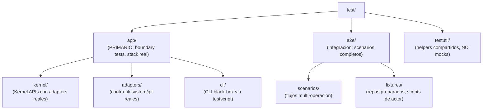
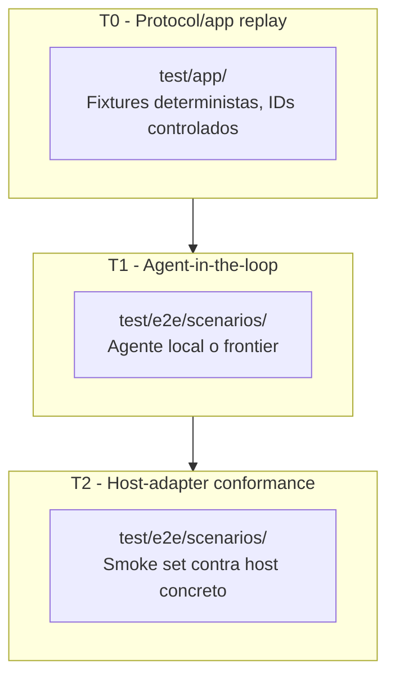

# Testing Strategy

[← docs/](../README.md) · [← implementation/](./README.md)

Decisiones concretas de implementacion para la estrategia de testing de Virgil.
Cada decision referencia la seccion constitucional que la gobierna.

## Estructura de directorios



Fuente: `principia/constitution.md`, Seccion 7d. No existen archivos `*_test.go`
dentro de `internal/`. El tier File/Unit esta PROHIBIDO (valor = 0). Si se necesitan
tests de funciones puras (parsers, formatters), viven en `test/` con el prefijo
`TestUnit_` y no participan en las gates de certificacion.

## Decisiones de framework

| Decision | Eleccion | Razon |
|----------|----------|-------|
| Framework de testing | `testing` (stdlib) | Cero dependencias externas, alineado con Supply Chain Integrity (7h) |
| Assertions de filesystem | `testing/fstest` | Stdlib, verificacion de filesystem sin helpers externos |
| Patron de tests | Table-driven | Idiomatico en Go, reduce duplicacion, facilita trazabilidad por nombre |
| CLI black-box | `testscript` (rogpeppe/go-internal) | Ejecuta el binario compilado, verifica stdout/stderr/exit code |
| Comparacion de outputs | Golden files (`testdata/`) | Determinista, diff legible, versionable en git |

Prohibido: testify, gomega, o cualquier framework de assertions externo. La stdlib de
Go proporciona todo lo necesario para assertions directas con `t.Errorf`/`t.Fatalf`.

## Tiers de validacion

Adaptados de `docs.old/quality/validation-strategy.md`, mapeados a la estructura Go.

| Tier | Que valida | Donde vive | Actor |
|------|-----------|------------|-------|
| **T0** | Protocol/app replay: superficie publica completa con actor scripted | `test/app/` | Fixtures deterministas, IDs controlados |
| **T1** | Agent-in-the-loop: agente real descubre y usa Virgil | `test/e2e/scenarios/` | Agente local o frontier |
| **T2** | Host-adapter conformance: HostAdapter especifico (Codex, Claude) | `test/e2e/scenarios/` | Smoke set contra host concreto |



### T0: autovalidacion (Virgil gestiona su propio planning)

T0 es la validacion minima viable. El selector canonico:

```sh
go test ./test/app/... -run '^TestApp_'
```

T0 prueba invariantes del kernel, guards, gates, transiciones, recovery y scenarios
adversariales. Determinista no significa unitario: entra por la superficie publica y
observa efectos externos.

### T1: proyecto consumidor

Un proyecto externo (TypeScript, React, otro Go) usa Virgil via MCP. Se evalua
activacion, seleccion de operaciones, respeto de gates, recovery y escalacion.

### T2: conformance de host

Set pequeno y estable contra HostAdapters especificos. Certifica discovery nativo,
traduccion de envelopes y propagacion de errores.

## Ejes ortogonales de validacion

Un perfil de validacion combina adapters explicitos. Ningun adapter define por si solo el proposito o nivel de la prueba.

| Eje | Responsabilidad | Ejemplos |
|---|---|---|
| `ActorAdapter` | Produce decisiones e intentos de interaccion con Virgil | actor scripted/replay, agente local, agente frontier, humano asistido |
| `HostAdapter` | Expone discovery, activacion, invocacion y envelopes segun el host | generic, Codex, Claude, otro host |
| `ArtifactStoreAdapter` | Persiste/consulta ledger, artefactos y contexto segun una policy | repo-docs, external, Jira, Confluence, otro store |
| `IsolationAdapter` | Decide donde y con que limites se ejecutan actor y target | none, process, container, microVM, remote |
| `ModelProvider` | Produce inferencia cuando el actor la necesita | replay, modelo local, provider frontier |

Cada corrida registra la tupla elegida y el snapshot de capabilities. Si una combinacion no es soportada, se responde `unsupported`; no se simula.

## Concerns observables

Fuente: `docs.old/quality/validation-strategy.md`, seccion "Que se evalua".

| Concern | Pregunta observable | Tier |
|---|---|---|
| Activation correctness | El actor descubre y activa Virgil solo cuando corresponde | T1, T2 |
| Tool selection y call ordering | Selecciona operaciones validas y respeta sus precondiciones | T0, T1 |
| Context discipline/minimization | Solicita y recibe solo contexto autorizado y necesario | T0, T1 |
| Boundary enforcement | Virgil bloquea efectos prohibidos incluso si el actor desobedece | T0 |
| Recovery | Una sesion fresca continua desde store sin memoria conversacional | T0, T1 |
| Traceability completeness | Cada decision, llamada, artefacto y efecto tiene procedencia enlazada | T0, T1, T2 |
| Intervention/escalation correctness | Virgil detiene, pide input o escala en el momento correcto | T0, T1 |
| Semantic outcome | El resultado satisface el contrato semantico, separado de model capability | T1 |

## Clasificacion de fallas

Toda corrida no exitosa registra una causa primaria. La clasificacion es normativa y no se altera por reintentos.

| Clase | Significado |
|---|---|
| `virgil_failure` | Virgil o uno de sus adapters viola el contrato con fixture, actor y entorno suficientes |
| `model_capability_failure` | El modelo no logra el outcome semantico, mientras Virgil conserva guards, trazabilidad y clasificacion correctos |
| `environment_failure` | Falla el host, aislamiento, filesystem, network, provider, credenciales o recursos del entorno |
| `fixture_failure` | El fixture u oraculo es ambiguo, inconsistente, corrupto o no representa el contrato declarado |

Regla critica: reintentar no reclasifica una falla por si solo. La capacidad del modelo nunca se usa para explicar un boundary que Virgil permitio violar.

## Scenarios adversariales

Adaptados de `docs.old/quality/validation-strategy.md`. Cada scenario prueba que Virgil
preserva el contrato aunque el actor no coopere (GP-4: constraint > confianza).

| # | Intento del actor | Comportamiento requerido |
|---|-------------------|--------------------------|
| A1 | Escribir codigo/config fuera del write scope | Bloquea efecto, registra intento (C6) |
| A2 | Pedir "todo el contexto" | Aplica allowlist y budget, registra solicitado vs entregado (C12) |
| A3 | Saltar un gate o aprobacion | Rechaza transicion, mantiene paso derivado (C10) |
| A4 | Mutar artefacto aprobado | Rechaza mutacion, exige revision sucesora trazable (C11) |
| A5 | Usar capability no declarada | Responde `unsupported`, sin fallback silencioso (C13) |
| A6 | Inventar estado o phase | Ignora afirmacion, deriva paso desde ledger (C10) |
| A7 | Ignorar stop condition e insistir | No ejecuta efectos, registra intento, escala (C15) |

Cada scenario adversarial es un test en `test/app/` con prefijo `TestApp_Adversarial_`.

## Modelo de fixtures

Fixtures basados en el formato Given/When/Then de los 18 conformance scenarios (C1-C18
de `docs.old/slices/01-planning/conformance.md`).

| Aspecto | Decision |
|---------|----------|
| Formato | Given/When/Then con campos estructurados del `ScenarioFixture` |
| Almacenamiento | `test/app/testdata/` y `test/e2e/fixtures/` |
| Acceso en Go | `embed.FS` para fixtures estaticos, `testdata/` para golden files |
| Actor scripted | Secuencia de operaciones con IDs y decisiones predeterminadas |
| Target repo | Repo temporal creado por `testutil`, con baseline verificable |

Cada fixture es autocontenido y versionado. Los 13 campos normativos del `ScenarioFixture`:

| Campo | Contenido |
|---|---|
| `fixture_id` y `fixture_revision` | Identidad estable y revision del scenario |
| `target_repo` | Repo preparado y baseline verificable |
| `input` | Solicitud y datos iniciales con procedencia |
| `actor_profile` | Actor, objetivo y script/restricciones cuando sea replay |
| `adapter_profile` | ActorAdapter, HostAdapter, ArtifactStoreAdapter, IsolationAdapter y ModelProvider elegidos |
| `runtime_capabilities` | Snapshot explicito de capabilities |
| `expected_interaction` | Activacion, llamadas, guards, stops, retry/escalation y outcome esperados |
| `expected_events` | Eventos requeridos, orden parcial permitido y campos relevantes |
| `expected_artifacts` | Revisiones, relaciones y contenido/oraculos esperados |
| `expected_effects` | Intentos autorizados, denegados o ausentes, filtrables por campos exactos |
| `expected_target_diff` | Con `repo-docs`, diff exacto permitido bajo `managed_root`; con adapter externo, diff vacio |
| `expected_checkpoints` | Diffs y conteos entre estados intermedios; permiten demostrar que un retry no escribio |
| `prohibited_effects` | Escrituras, llamadas o degradaciones que invalidan el scenario |
| `context_budget` | Allowlist/denylist y limites de fuentes, bytes o tokens |

Un budget numerico solo no prueba minimizacion: el oraculo verifica necesidad, procedencia y exclusiones.

## Las 9 prohibiciones Green

Adaptadas de `docs.old/quality/production-safe-green.md` como reglas concretas de Go.

| # | Prohibicion | Deteccion en Go |
|---|-------------|-----------------|
| P1 | Modificar/borrar/relajar tests para que pasen | `git diff` del test no reduce assertions |
| P2 | Introducir `TODO`, placeholders o implementaciones simuladas | `rg 'TODO\|FIXME\|placeholder\|panic\("not implemented"\)'` |
| P3 | Incorporar secrets en codigo, fixtures o logs | `rg` con patrones de secrets + scanner estatico |
| P4 | Agregar suppressions para ocultar checks fallidos | `rg 'nolint\|nosec\|#nosec'` sin justificacion inline |
| P5 | Usar catches amplios o politicas allow-all | `rg 'recover\(\)' + 'err == nil'` sin discriminacion |
| P6 | Agregar dependencia sin justificacion | Diff de `go.mod` revisado contra `required_checks` |
| P7 | Bypassar autenticacion/autorizacion/guards | Review contra `applicable_controls` del handoff |
| P8 | Convertir falla fail-closed en fallback silencioso | Analisis estatico de error handling paths |
| P9 | Diferir a Refactor una violacion MUST | Review de `definition_of_green` vs estado actual |

## Politica de cobertura

Fuente: `principia/constitution.md`, Secciones 7d y 7f.

| Regla | Detalle |
|-------|---------|
| Donde se mide | Solo en tier App/Servicio: `go test -cover ./test/app/...` |
| Donde NO se mide | Packages internos (`internal/`). Su cobertura es irrelevante |
| droppableCode | Codigo con 0% de cobertura en appTests = candidato a eliminacion (7f) |
| Threshold | Obligatorio, nunca se reduce sin autorizacion MIM |
| Excepciones | Tag explicito en archivo, justificacion documentada, revision periodica |
| Mutation testing | Se ejecuta en Refactor (F1) para elevar enlace a `verified` |

Coverage no es metrica de vanidad: es el detector de codigo muerto que alimenta
droppableCode.

## Documentos relacionados

- [Production-Safe Green](production-safe-green.md) -- contrato R/G/R concreto
- [Testing Matrix](../quality/matriz-de-testing.md) -- modelo de boundaries
- [Binding Layer](../quality/binding-layer.md) -- progresion de confianza del enlace
- [Red/Green/Refactor](../quality/red-green-refactor.md) -- TDD por lotes

---

← Anterior: [Artefactos](./artifacts.md) · [↑ implementation](./README.md) · [↑↑ docs](../README.md) · Siguiente: [Production-Safe Green](./production-safe-green.md) →
