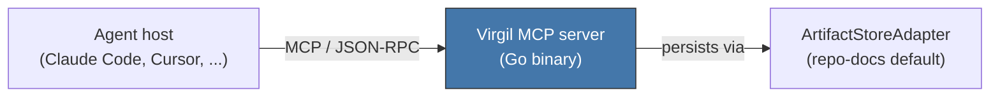

# MCP Tools Reference

Reference for agent consumers — Claude Code, Cursor, or any other MCP-compatible
agent host — using Virgil's tools. This document is self-contained; you do not
need to read `principia/constitution.md` to configure and use Virgil.

## Overview

Virgil is distributed as an independent MCP server binary. It exposes its
capabilities via **Model Context Protocol (MCP) / JSON-RPC**, under the Open
Agentic Standard. Any MCP-compatible agent can discover and invoke Virgil's
tools without provider-specific coupling — Claude, GPT, Gemini, OpenCode,
Cursor, Windsurf, Kiro, or any future agent that speaks the protocol.



Virgil does not adopt a ceremonial role — it is not a Scrum Master and does
not execute code on your behalf. It knows what deliverables exist, who owns
them, and what state they're in, and it enforces the lifecycle state machine
mechanically. It also publishes an `AGENTS.md` into the consumer project as a
discoverability convention, carrying operational guidance for whichever agent
is working there.

## Tool Reference

Virgil exposes four core tools. Every invocation resolves three identities
first — `DogmaRef`, `ProjectRef`, `RunContext` — then executes a canonical
operation: validate, compile context, act, persist, ingest evidence, record
the transition in the Ledger.

### virgil_init

Initializes Virgil in a project.

- Creates `virgil.json` (project configuration) and bootstraps initial state.
- Detects or confirms which `ArtifactStoreAdapter` the project will use
  (defaults to `repo-docs`, writing under `{target}/docs/virgil/`).
- Publishes `AGENTS.md` into the consumer project as the discoverability
  entry point for any agent working there afterward.
- Idempotent: re-running on an already-initialized project reports current
  state rather than overwriting it.

Call this once, before any other Virgil tool, in a new project.

### virgil_status

Reports the current project state. Read-only — never mutates anything.

- Reports the lifecycle phase per feature and for the project overall (see
  the state machine in `docs/architecture.md`): Planning (Idea, Requirements,
  Design, Tasks) -> Handoff -> Execution -> Verify -> Deliver -> Operation.
- Reports the active change/feature and any deliverable pending a decision.
- Reports pending transitions — states blocked on an MIM decision, a failed
  gate, or a detected `PlanningGapDetected` signal.
- Safe to call at any time, including after a crash or session compaction:
  state is derived from consolidated deliverable revisions and the Ledger,
  not from a cached pointer, so it always reflects reality even after an
  interruption.

Call this first in any session to recover context before acting.

### virgil_write

Creates or updates a planning artifact: idea, requirement, design, or task.

- Manages frontmatter (revision, content digest, lifecycle status) on the
  deliverable automatically — callers provide content, not metadata.
- Persists through the configured `ArtifactStoreAdapter`; with `repo-docs`
  this means a markdown file under `{target}/docs/virgil/`.
- Tracks revisions: each write produces a new revision with provenance,
  never a silent overwrite of history.
- Follows the MIM principle: this tool executes what the human directs.
  Nothing gets written to a project's planning record without explicit
  human direction driving the call.

### virgil_transition

Changes the lifecycle status of an artifact or of the project phase.

- Enforces the state machine mechanically: a transition request that skips
  a required gate (e.g., moving Design to Tasks before Design has an
  approved deliverable) is rejected, not silently allowed.
- Validates the corresponding gate before committing (Requirements needs
  consolidation, Design needs approval, Tasks need refinement, Handoff needs
  approval — see the Planning loop in `docs/architecture.md`).
- Records the transition in the Ledger. Ledger writes are idempotent —
  recording an already-recorded transition is a no-op, so retries are safe.
- If execution discovers that an approved deliverable was ambiguous,
  contradictory, or insufficient, the tooling around this transition can
  emit `PlanningGapDetected` and route the affected scope back to Planning
  instead of forcing an invalid transition forward.

## Configuration

`virgil.json`, created by `virgil_init`, is the project-level configuration
file. At minimum it declares:

| Field (conceptual) | Controls |
|----------------------|-----------|
| Artifact store adapter | Which `ArtifactStoreAdapter` backs persistence (`repo-docs` by default; `jira`, `azure-devops`, etc. once implemented) |
| Adapter-specific config | Backend connection details (e.g., namespace/board for `repo-docs`, project key + credentials reference for an external adapter) |
| Method Pack | Which ceremony pack governs roles and additional gates (Scrum is the only one implemented today) |
| Compliance profile | Whether the project declares a regulated profile (HIPAA, PCI DSS, GDPR), which activates blocking human review gates on authorization and domain logic |

Treat the exact schema as evolving with the runtime — this table describes
the concepts the config governs, not a frozen field list. Check
`virgil_status` output or the `virgil.json` file itself in a given project
for the authoritative current shape.

## Integration Examples

### Claude Code

Register Virgil as an MCP server in your Claude Code settings (project or
user scope), pointing at the Virgil binary:

```json
{
  "mcpServers": {
    "virgil": {
      "command": "/path/to/virgil",
      "args": ["serve"]
    }
  }
}
```

Once registered, Claude Code discovers `virgil_init`, `virgil_status`,
`virgil_write`, and `virgil_transition` automatically, alongside any
matching skills that wrap them (`/virgil-init`, `/virgil-status`,
`/virgil-write`, `/virgil-transition`).

### gentle-ai

Virgil is one of three complementary pillars in the AI-assisted development
ecosystem: gentle-ai governs HOW agents work (orchestration, delegation,
review ceremony), engram governs MEMORY (persistent context across
sessions), and Virgil governs WHAT exists and WHERE it lives (the PM-to-
codebase bridge, with traceability). To consume Virgil from a gentle-ai
orchestrated session, register the same MCP server entry as above at the
orchestrator level; sub-agents delegated by gentle-ai's SM role can then
call `virgil_status` or `virgil_write` directly when a delegation contract
grants them that tool.

### Other MCP-compatible agents

Any agent host that implements MCP client discovery (Cursor, Windsurf, Kiro,
OpenCode) uses the same binary and the same four tools — no Virgil-side
changes are required. Point the host's MCP server configuration at the
Virgil binary the same way you would for Claude Code; tool names and schemas
are identical across hosts because the HostAdapter layer absorbs
host-specific translation inside Virgil itself.
