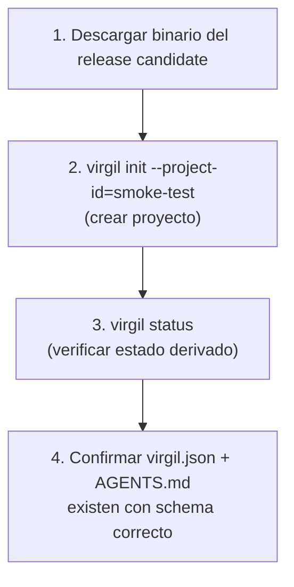
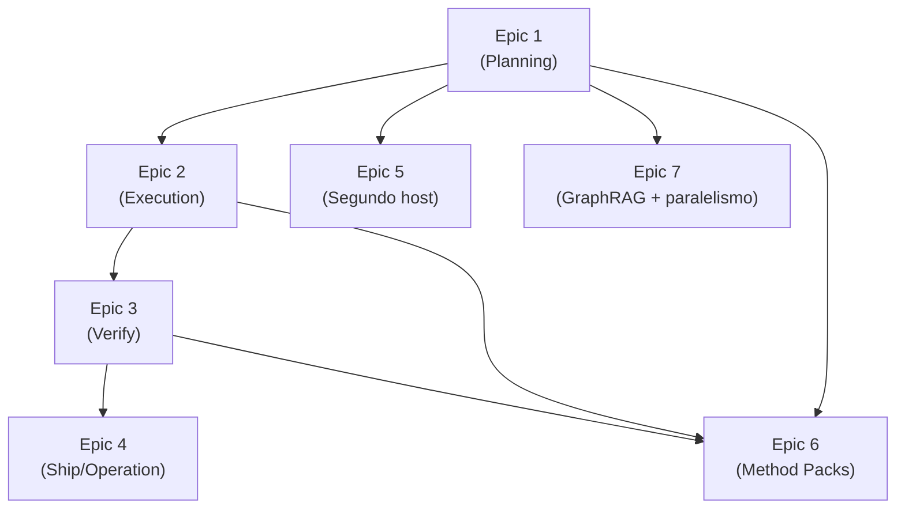
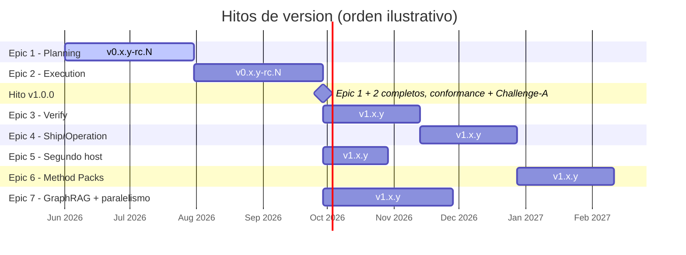

# Plan de Releases

[← docs/](../README.md) · [← planning/](./README.md)

Plan de versionado y avance entre epics, derivado de la estrategia SemVer 2.0.0 y del roadmap de
vertical slices definidos en [releases.md](../implementation/releases.md).

Fuente: `principia/constitution.md`, Secciones 7h, 4b (principio 7).

## Milestones por version

| Version | Epic (slice) | Estado |
|---|---|---|
| `v0.x.y-rc.N` | 1 -- Planning | En curso |
| `v0.x.y-rc.N` | 2 -- Execution | Siguiente |
| `v1.0.0` | 1 + 2 completos, validados por conformance y un ciclo de Challenge-A exitoso | Objetivo |
| `v1.x.y` | 3 -- Verify | Pendiente |
| `v1.x.y` | 4 -- Ship/Operation | Pendiente |
| `v1.x.y` | 5 -- Segundo host | Pendiente |
| `v1.x.y` | 6 -- Method Packs | Pendiente |
| `v1.x.y` | 7 -- GraphRAG + paralelismo | Pendiente |

Durante `v0.x.y`, cambios breaking pueden ocurrir en cualquier minor: no hay garantia de
estabilidad en API ni en formato de artefactos hasta `v1.0.0`.

## Criterio para v1.0.0

`v1.0.0` se declara cuando se cumplen las tres condiciones siguientes, sin excepcion:

1. Epic 1 (Planning) y Epic 2 (Execution) completos segun su definicion en
   [epics.md](epics.md)
2. Los 18 conformance scenarios (C1-C18) pasan en tier T0 (self-hosted, `go test ./test/app/...`)
3. Al menos un ciclo de Challenge-A exitoso contra un proyecto consumidor TypeScript real (T1)

Hasta que las tres condiciones se cumplan, cualquier tag es pre-release (`-rc.N`).

## Validacion pre-release

Cada release candidate pasa por dos validaciones antes de promover a release estable, adaptadas
de `docs.old/validation/challenge-a-expectations.md`:

### 1. Smoke test automatizado

### 2. Challenge-A: proyecto consumidor real

Un proyecto TypeScript consume el binario como usuario final, ejecutando el flujo completo de
Planning (idea a handoff) contra `managed_root = docs/virgil/`. Valida MCP discovery, calidad del
handoff y ausencia de efectos fuera de `managed_root` (conformance C3-C6).

Si cualquiera de las dos validaciones falla, el RC no se promueve: se corrige y se emite un nuevo
`-rc.N`.

## Cadena de dependencias entre epics

Epic 1 es la unica dependencia comun a todos los epics posteriores. Epics 5 y 7 no dependen del
pipeline de Execution/Verify/Ship porque validan superficies distintas (adapters, proyecciones);
Epic 6 si depende de que el Kernel este estable en Planning, Execution y Verify.

El diagrama siguiente ilustra el orden secuencial de los milestones y no representa fechas
comprometidas; el estado real de cada uno es el de la tabla "Milestones por version".

## Regla de avance

Un epic avanza cuando su flujo vertical cumple, sin excepcion, con:

- **Identidades explicitas**: ProjectRef, ChangeRef y demas identidades resueltas sin ambiguedad
- **Estado recuperable**: una sesion nueva sin historial reconstruye el mismo resultado desde el
  ArtifactStore (ver conformance C7)
- **Evidencia trazable**: cada efecto queda respaldado por eventos o artefactos auditables (ver
  conformance C14)

Una promesa documental sin adapter ni flujo demostrable no cuenta como avance; permanece como
objetivo del epic siguiente hasta demostrarse con evidencia.

## Documentos relacionados

- [Releases](../implementation/releases.md) -- estrategia de versionado, tagging y roadmap
  detallado
- [Conformance](../implementation/conformance.md) -- scenarios C1-C18 citados en el criterio de
  v1.0.0
- [Epics](epics.md) -- definicion completa de cada epic

---

← Anterior: [Handoff](./slice-1-handoff.md) · [↑ planning](./README.md) ·
[↑↑ docs](../README.md)
