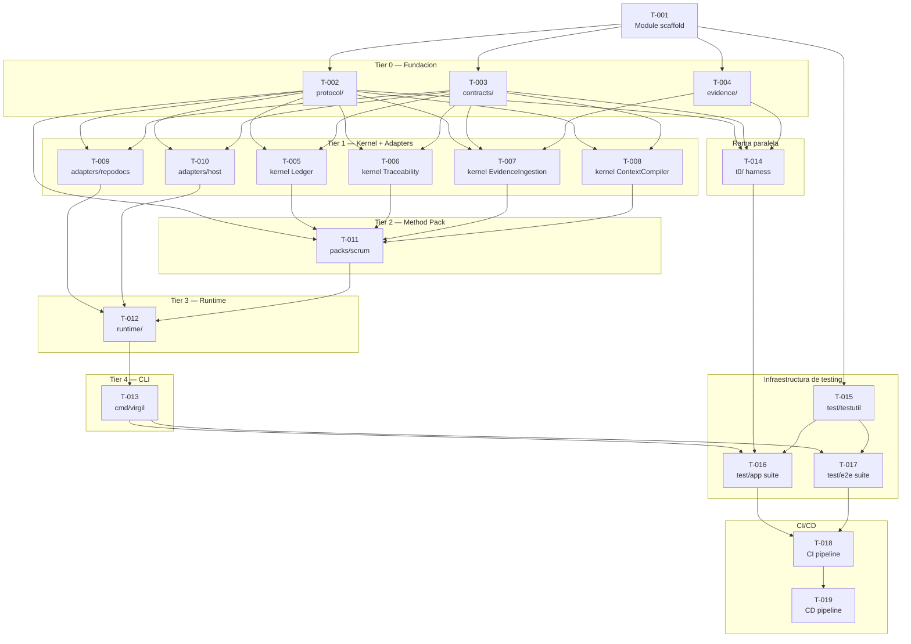

# Tareas — Slice 1

[← docs/](../README.md) · [← planning/](./README.md)

Desglose ordenado de tareas para implementar Slice 1 (Planning). El orden sigue el DAG
estructural de paquetes definido en [Go Runtime](../implementation/go-runtime.md), seccion
"Reglas de importacion". Cada tarea referencia las historias que satisface, los conformance
scenarios (C1-C18) de [Conformance](../implementation/conformance.md) y adversariales
(A1-A7) de [Testing Strategy](../implementation/testing-strategy.md)
que la validan.

## DAG visual

## Tareas por tier

### Tier 0 — Fundacion (sin dependencias internas)

#### T-001: Module scaffold + toolchain pin

**Paquete(s)**: raiz del repo, `go.mod`
**Depende de**: ninguna
**Implementa**: `go.mod` con directiva `toolchain` fijada a Go 1.24+, layout de directorios de `cmd/` e `internal/`
**Historias**: transversal (infraestructura)
**Validacion**: `go build ./...` compila sin paquetes
**Criterio de completitud**: `go.mod`/`go.sum` presentes, version exacta pineada (no rango)

#### T-002: protocol/ — envelopes y tipos de wire format

**Paquete(s)**: `internal/protocol/`
**Depende de**: T-001
**Implementa**: `OperationRequest`/`OperationResult`, envelopes JSON, tipos de error normativos
**Historias**: H-PROTO1, H-REQ1, H-RES1, H-EFF1, H-ENV1
**Validacion**: fixtures de envelope contra JSON Schema; soporta C15, C16
**Criterio de completitud**: tipos serializan/deserializan sin perdida de campos requeridos

#### T-003: contracts/ — JSON Schemas embebidos

**Paquete(s)**: `internal/contracts/`
**Depende de**: T-001
**Implementa**: `go:embed` de schemas Draft 2020-12, validador de requests/artefactos
**Historias**: H-SCHEMA1
**Validacion**: valida fixtures validos e invalidos; soporta C1, C15, C17
**Criterio de completitud**: unico propietario de `go:embed` para schemas, sin patrones `..`

#### T-004: evidence/ — EvidenceBundle

**Paquete(s)**: `internal/evidence/`
**Depende de**: T-001
**Implementa**: `EvidenceBundle`, snapshots, diffs, digests RFC 8785
**Historias**: H-EFF1
**Validacion**: digests deterministicos y reproducibles; soporta C16, C18
**Criterio de completitud**: mismo input produce mismo digest en corridas distintas

### Tier 1 — Kernel + Adapters (paralelos entre si)

#### T-005: kernel/ Ledger

**Paquete(s)**: `internal/kernel/`
**Depende de**: T-002, T-003
**Implementa**: eventos, transiciones, derivacion de estado sin campo `phase` persistido
**Historias**: H-STATE1
**Validacion**: soporta C7 (recovery), C8/C9 (idempotencia), C10/C11 (derivacion, inmutabilidad)
**Criterio de completitud**: dos lecturas concurrentes derivan el mismo paso desde el mismo ledger

#### T-006: kernel/ TraceabilityGraph

**Paquete(s)**: `internal/kernel/`
**Depende de**: T-002, T-003
**Implementa**: grafo de procedencia entre decisiones, llamadas, artefactos y efectos
**Historias**: H-EFF1
**Validacion**: soporta C14 (adapter/policy/efectos auditados)
**Criterio de completitud**: cada nodo del grafo resuelve a un `EffectRecord` trazable

#### T-007: kernel/ EvidenceIngestion

**Paquete(s)**: `internal/kernel/`
**Depende de**: T-002, T-003, T-004
**Implementa**: ingestion y clasificacion de `EvidenceBundle` producido por corridas
**Historias**: H-SCHEMA2
**Validacion**: soporta C16, C17, C18
**Criterio de completitud**: bundle incompleto o con digest incorrecto nunca certifica `passed`

#### T-008: kernel/ ContextCompiler

**Paquete(s)**: `internal/kernel/`
**Depende de**: T-002, T-003
**Implementa**: compilacion del `ContextBrief` con read allowlist y budget
**Historias**: H-CTX1
**Validacion**: soporta C12 (minimizacion), A2 (adversarial "todo el contexto")
**Criterio de completitud**: brief compilado excluye datos de otros cambios/proyectos

#### T-009: adapters/repodocs/ — ArtifactStoreAdapter

**Paquete(s)**: `internal/adapters/repodocs/`
**Depende de**: T-002, T-003
**Implementa**: init atomico (temporal hermano + rename), `managed_root = docs/virgil/`
**Historias**: H-REPO1
**Validacion**: soporta C1, C3, C5, C6; A1 (adversarial escritura fuera de scope)
**Criterio de completitud**: diff del target queda contenido bajo `managed_root` en toda corrida

#### T-010: adapters/host/ — HostAdapter

**Paquete(s)**: `internal/adapters/host/`
**Depende de**: T-002, T-003
**Implementa**: discovery e invocacion MCP/JSON-RPC, traduccion de envelopes
**Historias**: H-ENV1, H-PROTO1
**Validacion**: soporta C13 (capability no soportada), C15 (referencias cruzadas)
**Criterio de completitud**: capability faltante responde `unsupported`, sin fallback silencioso

### Tier 2 — Method Pack

#### T-011: packs/scrum/ — Method Pack Scrum

**Paquete(s)**: `internal/packs/scrum/`
**Depende de**: T-002, T-005, T-006, T-007, T-008
**Implementa**: unico Method Pack del slice; fases idea→spec→design→tasks→handoff sobre interfaces del kernel
**Historias**: H-STATE1, H-OPS1, H-OPS2, H-OPS3
**Validacion**: soporta C2 (namespaces aislados), C10/C11 (transiciones); A3, A4, A6 (adversariales de gate)
**Criterio de completitud**: ninguna transicion se ejecuta sin revision aprobada efectiva

### Tier 3 — Runtime

#### T-012: runtime/ — orquestacion y dispatch

**Paquete(s)**: `internal/runtime/`
**Depende de**: T-009, T-010, T-011
**Implementa**: dispatch de operaciones hacia kernel/adapters/packs, modelo de proceso fresco
**Historias**: H-REQ1, H-RES1, H-IDEM1
**Validacion**: cubre C1-C15 end-to-end; A5, A7 (adversariales de capability y stop condition)
**Criterio de completitud**: cada invocacion corresponde a un proceso fresco con `process_id` distinto

### Tier 4 — CLI

#### T-013: cmd/virgil/ — entrypoint

**Paquete(s)**: `cmd/virgil/`
**Depende de**: T-012
**Implementa**: `main()`, subcomandos Cobra (`init`, `new`, `status`, etc.)
**Historias**: H-OPS1, H-OPS2, H-OPS3, H-OPS4, H-OPS5
**Validacion**: `go build -o dist/virgil ./cmd/virgil` produce binario estatico; smoke de subcomandos
**Criterio de completitud**: binario ejecuta con `CGO_ENABLED=0` en los 5 targets de cross-compilacion

### Rama paralela

#### T-014: t0/ harness

**Paquete(s)**: `internal/t0/`
**Depende de**: T-002, T-003, T-004
**Implementa**: runner de subprocess (`exec.CommandContext`), fixtures embebidas, captura de PID/stdout/stderr
**Historias**: H-SCHEMA2, H-ENV1
**Validacion**: soporta C16, C17 (fixture invalido falla antes de efectos); invariante de PIDs distintos
**Criterio de completitud**: nunca importa `kernel/`, `runtime/` ni `adapters/`; opera solo el binario publicado

### Infraestructura de testing

#### T-015: test/testutil/ — helpers compartidos

**Paquete(s)**: `test/testutil/`
**Depende de**: T-001
**Implementa**: repos temporales con baseline verificable, sin mocks (prohibido, valor = 0 por S7d)
**Historias**: transversal (infraestructura de testing)
**Validacion**: helpers usados por T-016 y T-017; ningun helper simula un adapter
**Criterio de completitud**: cero ocurrencias de mocks/stubs de adapters en el paquete

#### T-016: test/app/ — suite frontera (PRIMARIA)

**Paquete(s)**: `test/app/`
**Depende de**: T-013, T-014, T-015
**Implementa**: `TestApp_*` (C1-C18) y `TestApp_Adversarial_*` (A1-A7) contra stack real
**Historias**: todas (conformance C1-C18, adversariales A1-A7)
**Validacion**: `go test ./test/app/... -run '^TestApp_'` en verde; cubre los 18 conformance scenarios
**Criterio de completitud**: cobertura medida en `go test -cover ./test/app/...`, sin skips no justificados

#### T-017: test/e2e/ — suite de integracion

**Paquete(s)**: `test/e2e/`
**Depende de**: T-013, T-015
**Implementa**: scenarios T1 multi-operacion contra proyecto consumidor externo
**Historias**: todas (integracion end-to-end)
**Validacion**: validacion manual pre-release (Challenge-A); cubre activacion, tool selection, recovery T1
**Criterio de completitud**: flujo idea→handoff completo reproducible en proyecto externo

### CI/CD

#### T-018: CI pipeline

**Paquete(s)**: `.github/workflows/`
**Depende de**: T-016, T-017
**Implementa**: 5 stages Echo (numeracion 1-5, no 0-4) incluyendo T0 dinamico (`TestApp_`)
**Historias**: transversal (CI)
**Validacion**: pipeline verde ejecuta las 9 prohibiciones Green (P1-P9) y la politica de cobertura
**Criterio de completitud**: los 5 stages Echo pasan en un push limpio a `main`

#### T-019: CD release pipeline

**Paquete(s)**: `.github/workflows/`
**Depende de**: T-018
**Implementa**: cross-compilacion (5 targets), SBOM, publicacion en GitHub Releases
**Historias**: transversal (CD)
**Validacion**: se dispara solo tras CI verde; artefactos firmados y verificables
**Criterio de completitud**: release publicado contiene los 5 binarios cross-compilados + SBOM

---

← Anterior: [Historias](./slice-1-historias.md) · [↑ planning](./README.md) · [↑↑ docs](../README.md) · Siguiente: [Handoff](./slice-1-handoff.md) →
