<!-- Virgil Principia
document_type: "constitution"
title: "Founding Principle — anchor document"
status: sealed
sealed_commit: pending-reseal
prior_sealed_commit: 1d2dfa7
amendment_date: 2026-08-31
amendment_reason: "CLI architecture alignment — Go/MCP vocabulary replaced with TypeScript/CLI reality; aspirational features reclassified as V2+"
total_chunks: 39
manifest: "principia/manifest.yaml"
layer: authority
constitutional: true
keywords:
  - Founding Principle
  - anchor document
  - constitutional source of truth
  - sealed immutable
  - Virgil
  - amended 2026-08-31
-->

# Virgil — Founding Principle

Anchor document. Everything Virgil is, does, and why it does it.
If anything contradicts this document, this document wins.

## Index

### In this document
- [1. What Virgil is](#1-what-virgil-is)
  - [1a. Interpretive anti-drift rule](#1a-interpretive-anti-drift-rule)
- [2. How it is (structure)](#2-how-it-is-structure)
- [3. How it acts](#3-how-it-acts)
  - [3a. Lifecycle of a project](#3a-lifecycle-of-a-project)
  - [3b. Flow of an invocation](#3b-flow-of-an-invocation)
- [4. Why it acts this way](#4-why-it-acts-this-way)
  - [4a. Governance — HOW it is governed](#4a-governance--how-it-is-governed)
  - [4b. Architecture — HOW it is built](#4b-architecture--how-it-is-built)
  - [4c. How the two layers relate](#4c-how-the-two-layers-relate)
- [5. What parts compose it](#5-what-parts-compose-it)
- [6. How the parts interact](#6-how-the-parts-interact)
  - [6a. Actors and modes](#6a-actors-and-modes)
  - [6b. Separation of concerns](#6b-separation-of-concerns)
  - [6c. Fundamental invariant](#6c-fundamental-invariant)
- [7. How it guarantees quality](#7-how-it-guarantees-quality)
  - [7a. Echo System — deterministic pipeline](#7a-echo-system--deterministic-pipeline)
  - [7b. Deliverables vs Build Artifacts](#7b-deliverables-vs-build-artifacts)
  - [7c. Macro Red/Green/Refactor — batch TDD](#7c-macro-redgreenrefactor--batch-tdd)
  - [7d. Testing Matrix — boundary model](#7d-testing-matrix--boundary-model)
  - [7e. QA / Acceptance Gates — certification](#7e-qa--acceptance-gates--certification)
  - [7f. droppableCode — coverage as a tool](#7f-droppablecode--coverage-as-a-tool)
  - [7g. complianceByDesign — compliance as a side effect](#7g-compliancebydesign--compliance-as-a-side-effect)
  - [7h. Supply Chain Integrity — secure dependencies](#7h-supply-chain-integrity--secure-dependencies)
  - [Closed cycle](#closed-cycle)
- [8. Where knowledge lives](#8-where-knowledge-lives)
  - [8a. ArtifactStore — persistence](#8a-artifactstore--persistence)
  - [8b. Namespace separation](#8b-namespace-separation)
  - [8c. Dual RAG — context DBMS](#8c-dual-rag--context-dbms)
  - [8d. Tiered visibility](#8d-tiered-visibility)
  - [8e. Memoization](#8e-memoization)
  - [8f. codebaseMemory — structural code graph](#8f-codebasememory--structural-code-graph)
- [9. How context flows](#9-how-context-flows)
  - [9a. ContextBrief](#9a-contextbrief)
  - [9b. Two delivery patterns](#9b-two-delivery-patterns)
  - [9c. Delegation: SM → sub-agent → PDC](#9c-delegation-sm--sub-agent--pdc)
- [10. How it recovers](#10-how-it-recovers)
- [11. How it executes](#11-how-it-executes)
  - [11a. Execution pipeline](#11a-execution-pipeline)
  - [11b. Contracts first — parallelism enabler](#11b-contracts-first--parallelism-enabler)
  - [11c. Git strategy — isolation and traceability](#11c-git-strategy--isolation-and-traceability)
  - [11d. Mechanical verification — conditional human review](#11d-mechanical-verification--conditional-human-review)
  - [11e. Accept/Reject — certification by gates](#11e-acceptreject--certification-by-gates)
  - [11f. Evidence as queryable data](#11f-evidence-as-queryable-data)
- [12. How it operates (optional)](#12-how-it-operates-optional)
  - [12a. Activation and role](#12a-activation-and-role)
  - [12b. Operation adapters](#12b-operation-adapters)
  - [12c. Escalation](#12c-escalation)
- [Self-reference rule](#self-reference-rule)
- [Glossary](#glossary)
- [Authority note](#authority-note)

---

### Actor vocabulary

| Actor | What it is | When it acts |
|-------|--------|-------------|
| MIM | Human with final decision authority | Always — approves, rejects, breaks ties |
| Developer | Human + agent working ON Virgil | Development Mode |
| Implementer | External agent working WITH Virgil | Consumption Mode |
| Virgil | The binary — knowledge/control plane | Both modes |
| SM | SM (Session Manager) — orchestrating agent. The Method Pack injects this role: in the Scrum Pack it fulfills Scrum Master functions; in other Packs it fulfills the equivalent orchestration role defined by that Pack. Virgil (the binary) is NOT the SM — the SM is a role that operates WITHIN Virgil. | Execution — delegates, verifies, decides |
| TPM | Deliverable-tracking function | Execution — persists state, reports |
| PDC | Post-Delegation Checkpoint (ECHO → VERIFY → MARK → DECIDE) | After every SM delegation |

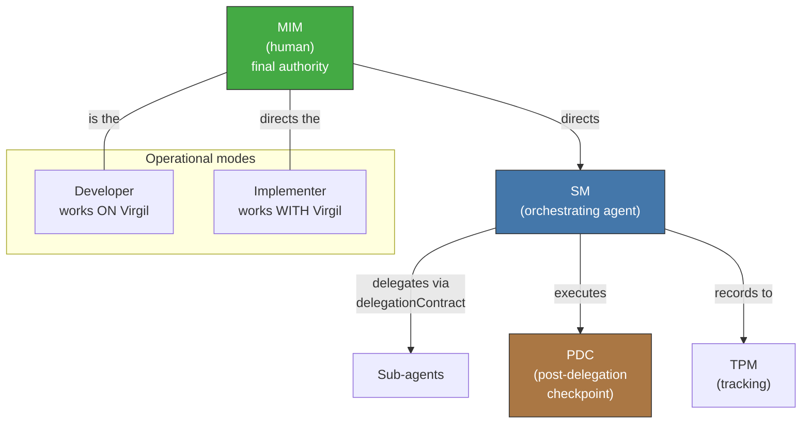

Delegation and PDC details in section 9c of this document.

> **Delegation of MIM approvals.** In teams where the MIM is also the sole developer, MIM approval points (coverage exceptions, project compliance profile declaration, break-glass) can be consolidated through a documented standing authorization: the MIM issues a project policy that pre-authorizes specific categories, reducing friction without eliminating traceability. Note: what can be delegated is the DECLARATION of the project's regulatory profile, not the activation of the human review gate — that activation is automatic and unconditional once the profile is declared (see section 7g).

## 1. What Virgil is

[↑ Back to index](#index)

Virgil is a project's knowledge/control plane. It is not a
framework, it is not a Scrum Master, it does not execute code. It
maintains identity, traceability, context and transitions.

Virgil adheres to the **Open Agentic Standard**: it publishes an
`AGENTS.md` in the consuming project as a discoverability convention, and
is invoked via **shell commands** (`virgil <command>`). Any
compatible agent can consume Virgil without coupling to a specific
provider.

> **Constitutional clarification (CC-1):** Virgil is distributed as an independent CLI binary (TypeScript/Node.js). It is an autonomous tool that any agent can discover and invoke via shell commands without additional coupling. This is the architectural realization of the commitment to the Open Agentic Standard described in the previous paragraph.

> **Constitutional clarification (CC-4):** The consumption model is agent-agnostic by constitutional design. Any agent capable of shell invocation — Claude, GPT, Gemini, OpenCode, Cursor, Windsurf, Kiro, or other future agents — can consume Virgil's CLI commands. The CLI is the single integration point; HostAdapter abstraction (section 5) is V2+ aspirational.
>
> **V2+ aspirational** — HostAdapter abstraction not required for V1. Current status: all agents invoke Virgil directly via CLI commands.

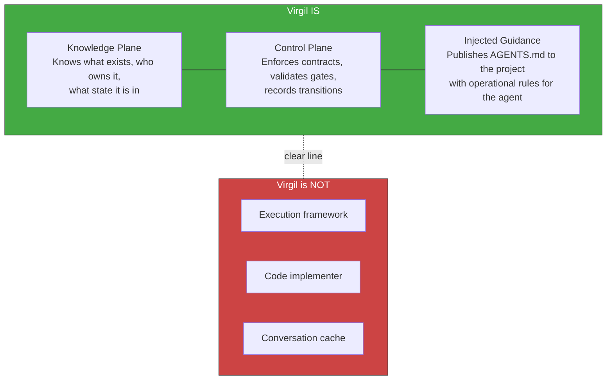

> **Constitutional clarification (CC-3):** Virgil operates as one of three complementary pillars in the AI-assisted development ecosystem: gentle-ai manages HOW agents work (review, receipt-driven development), engram manages MEMORY (persistent context across sessions), and Virgil manages WHAT and WHERE (the bridge between planning and codebase, with traceability). The "Virgil is NOT" boundaries stated above map directly to this separation: "Execution framework" and "Code implementer" correspond to gentle-ai's domain; "Conversation cache" corresponds to engram's domain.

Virgil does not adopt ceremonial roles (it is not a Scrum Master). But it DOES
inject operational guidance to the consuming agent via AGENTS.md. That guidance
should include:

- Orchestrator-minion pattern (how to delegate work to sub-agents)
- Token ownership and housekeeping (how to manage context)
- Planning boundary and stop conditions (when to stop)

> **Pending definition**: the current AGENTS.md documents the wire protocol and operations. The orchestration pattern and token management will be specified in the corresponding Method Pack, not in this anchor document. This item is out of scope for the Principia.

> **Scope of this document.** The Principia is the foundational dogma: philosophy, architecture and invariants. It is NOT a go-to-market document, an adoption guide, or a user manual. The target consumer profile (ICP), MVP strategy, competitive positioning and onboarding guides are separate deliverables derived FROM the Principia but are not part of it. The Core services (NestJS modules) constitute the minimum viable slice; Method Packs, codebaseMemory and Method Pack extensions are architectural provisions, not v1 requirements (ContextProviderPort backends, on the other hand, are part of the core architecture — see CC-2).

### 1a. Interpretive anti-drift rule

This document must be interpreted while preserving Virgil's **closed accountability cycle**. A reviewer — human or agent — must NOT abstract it into a generic framework of policies, observers, or interchangeable tooling if that abstraction eliminates or makes optional the mechanisms the Principia declares constitutional.

The canonical boundary is:

```text
planning deliverables
        ↓
R/G/R + Echo System
        ↓
canonical build artifacts
        ↓
EvidenceIngestion + Binding Layer
        ↓
certification gates
        ↓
Ledger / TraceabilityGraph
```

**These are NOT implementation details and are NOT overridable per project:**

- The five-step Echo System: Setup → Build → Static → Dynamic → E2E
- The order of Echo; scope can vary, the sequence cannot
- Macro Red/Green/Refactor and its independence per phase
- The existence of regenerable build artifacts as the canonical output of Echo
- The unambiguous association `EchoRun + sourceRevision + buildArtifactSet`
- EvidenceIngestion, Binding Layer and the Core's minimum quality gates
- The rule that certification is decided on evidence produced by the canonical path, not on the agent's claims

**These ARE substitutable/configurable as long as they preserve those contracts:**

- Concrete tools used within each Echo stage
- Commands, runners, scanners and CI/CD providers
- Triggers that fire Echo (hooks, CI, CD or other adapters)
- Git strategy, branch names, worktrees and commit conventions
- Physical location of build artifacts, as long as identity, provenance and reproducibility are preserved
- HostAdapter, ArtifactStoreAdapter, RAG backends and other extensions expressly defined by contract

**Anti-drift test:** if a reinterpretation allows Virgil to simply "observe whatever happened" and certify arbitrary evidence without going through Echo/build artifacts, that reinterpretation contradicts this Principia. Virgil is not a passive auditor: it defines the protocol by which execution acquires certifiable evidence.

**Deliberate normative force.** The Principia's absolute statements represent obligations of conformance and architectural direction, not descriptions of the current state of implementation. An AI or implementer must NOT: weaken them because a tool cannot fully enforce them today; replace them with a more generic abstraction; reinterpret foundational mechanisms as accidental details; or introduce operational caveats within the Principia when they belong to the Dogma or adapters. The current inability to enforce creates pending implementation work, not an exception to the principle.

> **Note on names:** `ECHO` within the PDC (ECHO → VERIFY → MARK → DECIDE) is the coherence-check step of the checkpoint. It is not the **Echo System** (Setup → Build → Static → Dynamic → E2E). They are distinct concepts even though they share a name.

---

## 2. How it is (structure)

[↑ Back to index](#index)

Three concentric layers. Each inner layer governs the outer ones.

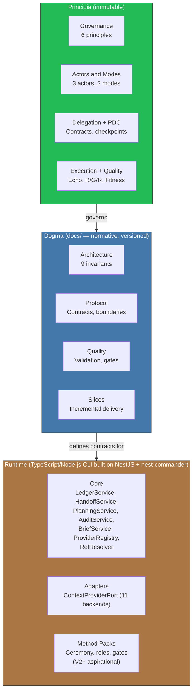

> **Amendment note (2026-08-31):** The Runtime layer is implemented as a TypeScript/Node.js CLI built on NestJS + nest-commander. Core services include: LedgerService, HandoffService, PlanningService, AuditService, BriefService, ProviderRegistry, and RefResolver. The ContextProviderPort contract supports 11 backends (filesystem, Confluence, GitHub Org, Azure DevOps, Teams, etc.).

With this immutable structure as foundation, Virgil manifests through predictable lifecycles: a state machine that governs projects and an invocation flow that guarantees traceability at every transition.

---

## 3. How it acts

[↑ Back to index](#index)

### 3a. Lifecycle of a project

Each phase iterates until its deliverable is consolidated. It is not a
straight line — it is a loop that converges toward a well-bounded handoff.

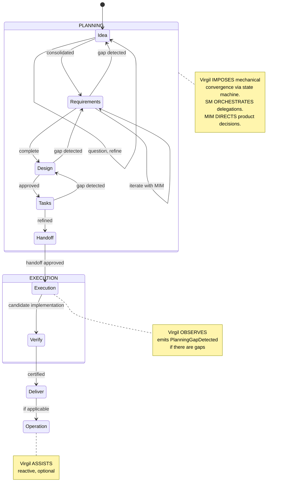

The project's state machine (via `virgil status`) indicates what
phase each feature and the overall project is in. A feature does not advance
until its deliverable is consolidated. PlanningService now manages the Idea → Requirement → Design → Task ceremony through the `virgil write` and `virgil transition` CLI commands.

**PlanningGapDetected**: if execution discovers that an approved
deliverable is ambiguous, contradictory or insufficient, it emits this signal,
blocks only the affected scope and returns control to planning. Execution
never rewrites an approved deliverable.

**FastForward**: the SM does not always run all phases with the same
ceremony. It evaluates a certainty gradient (FF-1 to FF-4) over the
existing context and compresses the phases proportionally — from
full ceremony (score 0-2) to direct execution (score 6-8). The SM computes the score based on observable, verifiable state. The scoring formula and its inputs plus result are recorded in the Ledger, making it auditable. FastForward compresses planning CEREMONY (deliberation phases), not Core quality gates — certification gates (R/G/R, mutation testing, fitness functions) run in full at ALL FastForward levels, from FF-1 to FF-4.

### 3b. Flow of an invocation

> **Amendment note (2026-08-31):** The canonical invocation flow below preserves the architectural sequence. In the current implementation, the agent invokes Virgil via `virgil <command>` (shell invocation), not via MCP/JSON-RPC. The HostAdapter layer is V2+ aspirational; the CLI binary handles resolution directly.

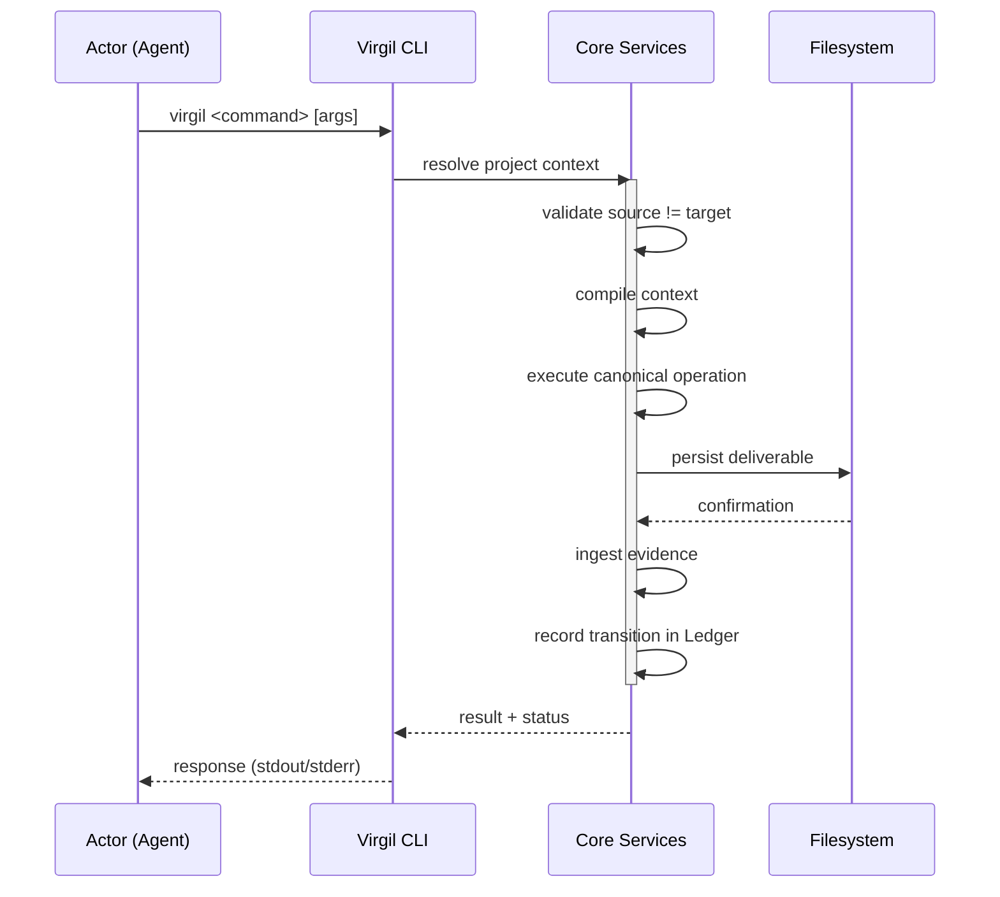

This canonical flow has deterministic steps and judgment-mediated steps. Certification gates (test pass/fail, mutation score, CRAP, coverage, CVE scan) are deterministic — binary, without subjectivity. Planning, escalation, ContextBrief compilation, architectural alignment and coherence-verification (PDC) steps involve judgment from the orchestrating agent, are not deterministic, and must leave traceable evidence. The Principia distinguishes both types explicitly.

The PDC is an orchestration-coherence safeguard that operates during
execution, but it is NOT a certification gate. Certification is determined exclusively by the Core-defined QA pipeline gates: deterministic mechanical gates (section 7e, 11d) and structured verification of architectural alignment (section 7e, ARCH gate). When the project declares a regulatory compliance profile, human review is added as an additional blocking gate (section 7g). The PDC can stop an incoherent delegation, but it does not certify or approve code.

> **Invocation identities**: `DogmaRef`, `ProjectRef` and `RunContext` are the three identities resolved at the start of every invocation. In the current implementation, the CLI resolves these from `virgil.json` and the project filesystem. This Principia names them as participants in the canonical flow but does not specify their fields — that contract belongs to the protocol layer (docs/protocol/).

> **Atomicity**: the flow shows sequential steps (persist →
> ingest evidence → record transition). If the process fails between
> steps, the recovery mechanism (section 10) reconciles state by
> deriving the current phase from existing deliverables, not from
> a stored pointer. The Ledger implements idempotency: recording
> an already-recorded transition is a no-op.

Behind every step is a deliberate principle we uncover next.

---

## 4. Why it acts this way

[↑ Back to index](#index)

Two complementary layers of principles. They are not mixed.

### 4a. Governance — HOW it is governed

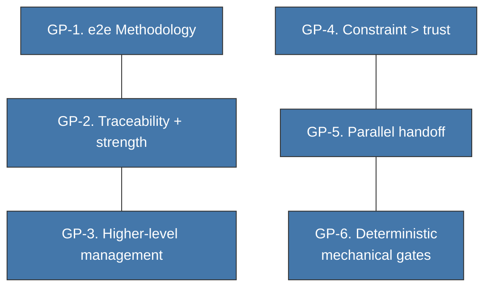

| # | Principle | In one sentence |
|---|-----------|-------------|
| 1 | e2e Methodology | Idea → certified code → operation. No jumps. |
| 2 | Traceability + strength | It is not enough for the link to exist; it must be strong. |
| 3 | Higher-level management | Health dashboard, not line-by-line review. |
| 4 | Constraint > trust | Enforceable constraints and gates, not agent promises. |
| 5 | Parallel handoff | Claiming over a handoff, not separate handoffs. |
| 6 | Deterministic mechanical gates | Binary at execution: passes or does not pass. Planning and escalation involve judgment; structured verification (ARCH) remains bounded and traceable (see 7e). |

### 4b. Architecture — HOW it is built

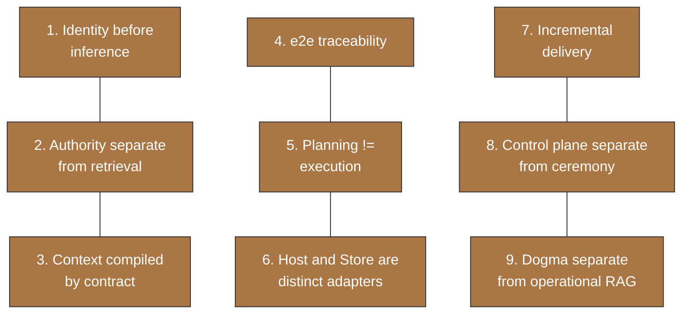

### 4c. How the two layers relate

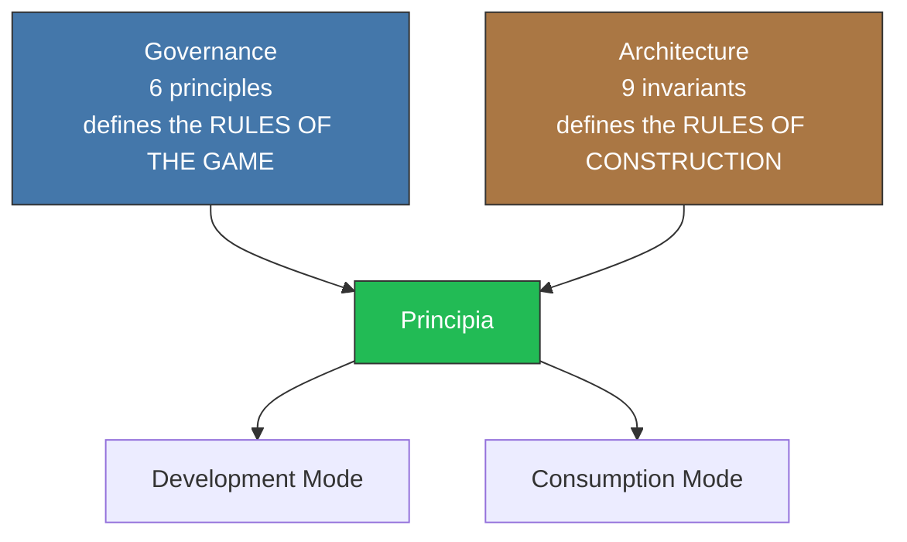

Both layers of principles converge in the Principia. What remains is to
know their components: what pieces implement these rules.

---

## 5. What parts compose it

[↑ Back to index](#index)

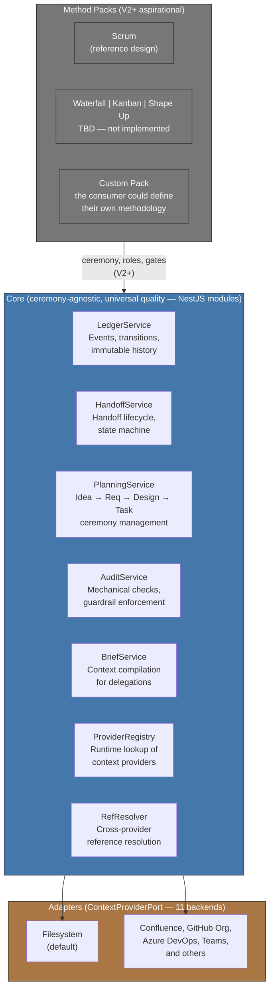

Each component has a clear responsibility. The Core imposes universal
quality invariants (Echo, testing, binding layer) regardless of
methodology. The Method Pack defines the ceremony: how many roles participate,
which ceremonial gates get compressed, how it iterates. Quality belongs to the
Core; ceremony belongs to the Pack.

> **V2+ aspirational** — Method Packs (pluggable ceremony system) are not required for V1. Current status: the handoff lifecycle is methodology-agnostic by design; PlanningService manages the Idea → Requirement → Design → Task ceremony directly.

Method Packs inherit quality gates (Red/Green/Refactor, mutation testing,
fitness functions) as non-negotiable universal invariants. A Pack can define
ADDITIONAL quality mechanisms but cannot reduce the Core's minimum.
"Ceremony-agnostic" means the Pack chooses the ceremony (sprints, kanban
boards, Shape Up cycles); "universal quality" means the R/G/R verification
pipeline + fitness functions apply without exception, regardless of the
ceremony chosen.

> **V2+ aspirational** — TraceabilityGraph (queryable Intent → decision → work → evidence graph) is not required for V1. Current status: the Ledger records events and `virgil ledger --handoff <id>` provides event trail; a formal graph projection is planned for V2+.

> **V2+ aspirational** — EvidenceIngestion / Binding Layer confidence levels (declared/inferred/verified) are not required for V1. Current status: the Ledger exists and records events, but structured confidence progression is not implemented.

> **Amendment note (2026-08-31):** HostAdapter is V2+ aspirational; current integration is via CLI commands. ArtifactStoreAdapter is V2+ aspirational; current implementation uses direct filesystem persistence for handoffs and ContextProviderPort (11 backends) for context retrieval.

> **Constitutional clarification (CC-5):** The TraceabilityGraph chain (Intent → decision → work → evidence) is the architectural realization of a bridge between product management (PM) tools and the codebase. "Intent" maps to artifacts from PM tools (stories, tickets, epics in Jira, Azure DevOps, GitLab, etc.); "decision" maps to design documents and specifications; "work" maps to code changes; "evidence" maps to test results and verification artifacts. This bridge — knowing WHAT to work on and WHERE in the codebase — constitutes Virgil's central value proposition, reinforced by GP-2: "It is not enough for the link to exist; it must be strong."

---

## 6. How the parts interact

[↑ Back to index](#index)

### 6a. Actors and modes

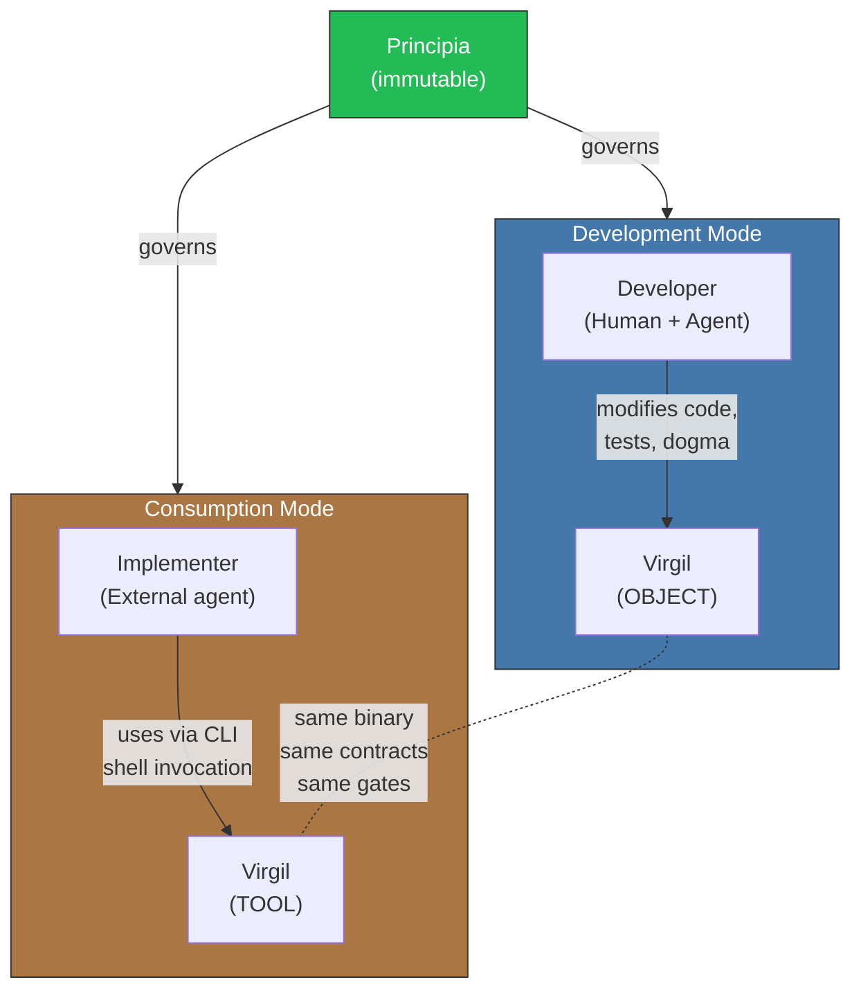

### 6b. Separation of concerns

Each piece has clear ownership. They are not mixed.

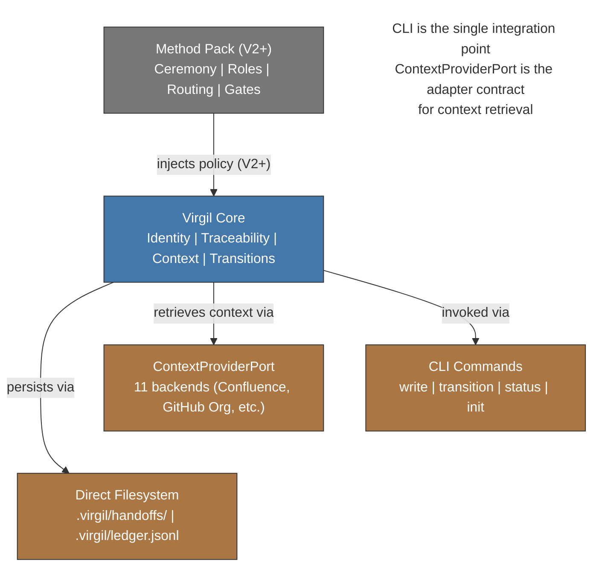

### 6c. Fundamental invariant

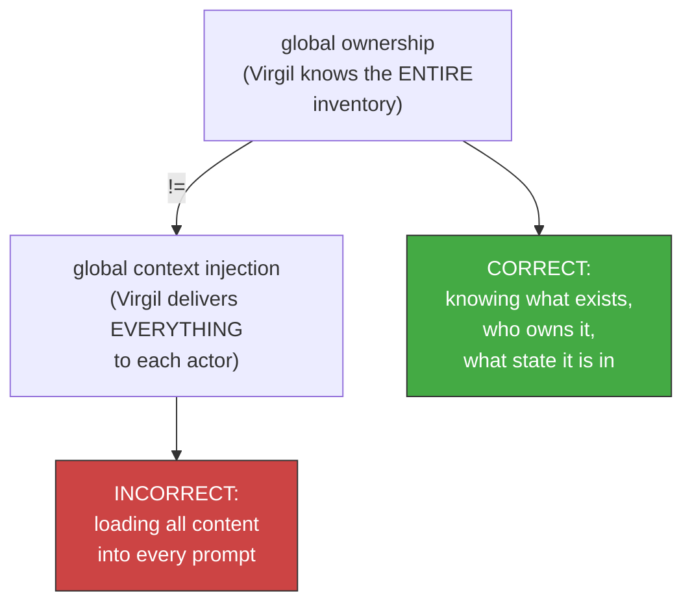

These fundamental invariants — what Virgil knows without inflating contexts — apply identically in both operational modes, producing a notable property: Virgil is both tool and object under the same rules.

---

## 7. How it guarantees quality

[↑ Back to index](#index)

Eight mechanisms form a nested accountability cycle. None
works in isolation.

### 7a. Echo System — deterministic pipeline

> **Amendment note (2026-08-31):** The Echo System is documented in AGENTS.md but is not mechanically enforced via hooks or CI yet. The 5-step sequence remains the normative pipeline; enforcement is pending.

Sequence of 5 steps executed in EVERY environment (dev, CI, CD).
The steps are always the same and in the same order. What varies
is the scope (dev prioritizes fast feedback, CI prioritizes completeness).

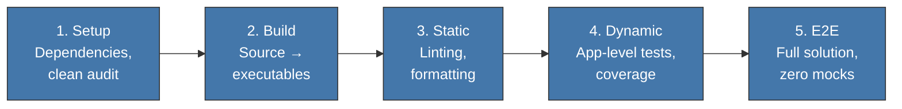

| Environment | Scope | Default trigger | Enforcement |
|----------|-------|---------------------|-------------|
| Dev | Selective, fast feedback | git hooks | Pre-commit, pre-push |
| CI | Complete | Push, PR | Pipeline stages |
| CD | Absolute trust | Tag, merge to main | Deployment gates |

Triggers are operation adapters and can change per project; **Echo does not change**. A project can fire the same scope via hooks, CI, a local runner or another mechanism as long as: (a) it produces the same Echo contract and its identified build artifacts, and (b) the trigger is automatic — not skippable by the executing agent.

In the default configuration, pre-commit hooks run STRUCTURAL fast-feedback checks (lint, type-check, formatting, static analysis). Integration tests against a real stack (App/Service tier) run at pre-push or in the CI pipeline, not at pre-commit. "Fast feedback" in the Dev context refers to structural checks, not the full integration suite.

### 7b. Deliverables vs Build Artifacts

Two types of outputs that must not be confused. Planning
documents are **deliverables** (PMBOK/ISO 21500). Build
pipeline outputs are **build artifacts** (DevOps/CI-CD). Virgil manages
deliverables; the Echo System generates build artifacts.

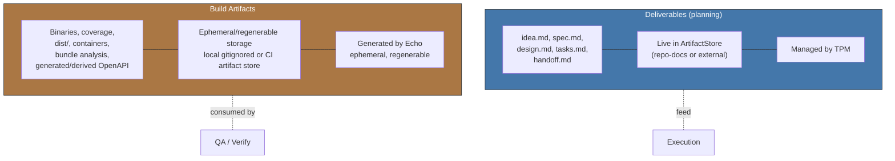

> **Nomenclature**: Virgil's code uses "Artifact" in entities
> such as ArtifactStore, ArtifactRepository and ArtifactStoreAdapter. These
> entities manage **deliverables**, not build artifacts. The
> code nomenclature is historical; this Principia defines the
> canonical terminology.

> **Evidence identity**: every set of build artifacts MUST be unambiguously linked to the `EchoRun` and the `sourceRevision` that produced it. QA never certifies "the latest report" implicitly; it certifies a `buildArtifactSet` attributable to a concrete revision. The artifact's physical location may vary; its identity and provenance may not.

> **OpenAPI**: the source contract defined in `prePhase` is a normative deliverable/contract. An OpenAPI JSON/YAML generated by the build from that contract or from the code is a derived build artifact. They do not share authority even if they may represent the same interface.

### 7c. Macro Red/Green/Refactor — batch TDD

TDD at the batch level, not function by function. First the ENTIRE
test suite, then ALL the implementation, then ALL the refactoring.

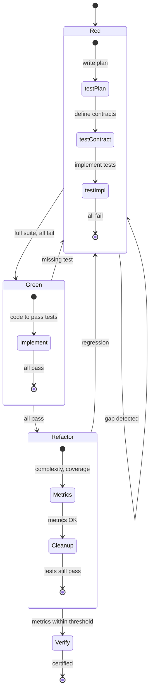

The current dogma defines 5 gates within this cycle:
**R0** (complete handoff) → **R1** (valid red) → **G1** (production-safe
green) → **F1** (safe refactor) → **V1** (independent
verify).

#### compositeAgent — parallel execution of R/G/R

> **V2+ aspirational** — compositeAgent / fitnessFunction runtime execution is not required for V1. Current status: not implemented at runtime level. The R/G/R pattern is followed manually by the executing agent.

When execution is parallelized across multiple lanes, each lane operates
within an **isolated mutation domain** and receives a compositeAgent: a
sub-agent that sequentially assumes multiple personalities within
that same domain, avoiding filesystem conflicts. Worktrees are the
current Dogma's reference implementation. The Principia's invariant
is isolation, not the mechanism: a valid mutation domain
must provide (a) isolated filesystem that does not interfere with other lanes,
(b) conflict detection at integration, and (c) per-lane revision
identity.

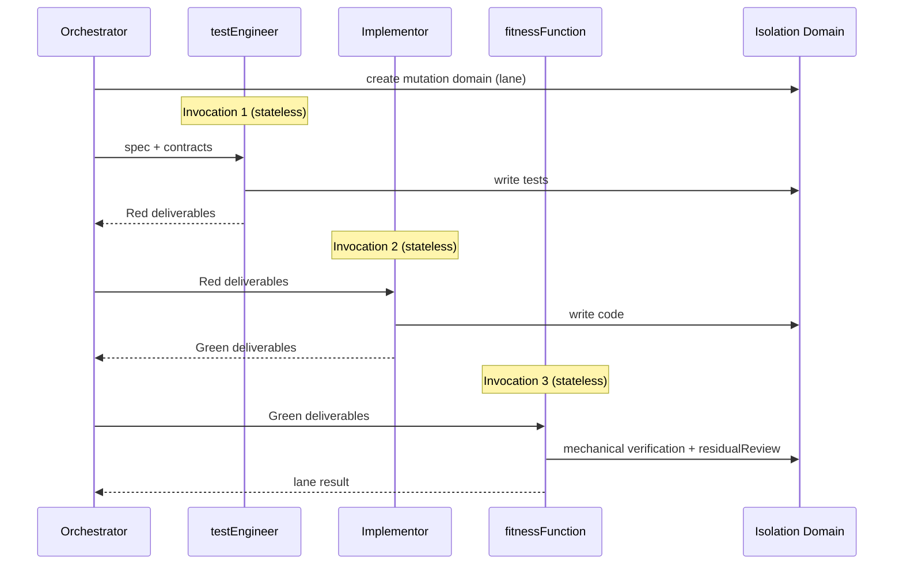

| Phase | Invocation | Responsibility |
|------|-----------|-----------------|
| Red | testEngineer (independent session) | Write tests per spec |
| Green | Implementor (independent session) | Code that passes the tests |
| Refactor | fitnessFunction (independent session) | Mutation, CRAP, complexity + residualReview |

A compositeAgent is NOT a monolithic agent — it is a SEQUENCE of
independent invocations orchestrated under a common label.
Each phase has its own contract and exit criteria.

**Independence invariant**: each compositeAgent phase (testEngineer, Implementor, fitnessFunction) runs as an independent agent invocation — new session, no conversational history. The Core implements this reset as a technical constraint (stateless invocation per phase), not as an instruction to the agent. Each phase receives only the deliverables and build artifacts produced by the previous phase, not the reasoning history. This mechanism satisfies Principle GP-4 (constraint > trust): independence is structural, not a promise of behavior.

> **Disambiguation**: "fitness functions" (plural, generic) designates a CATEGORY of quality gate (alongside mutation testing and R/G/R) applicable to the entire pipeline. `fitnessFunction` (singular, camelCase) designates a SPECIFIC invocation ROLE within the compositeAgent sequence (testEngineer → Implementor → fitnessFunction). Do not confuse them: the category is universal; the role is an invocation instance within a mutation domain.

### 7d. Testing Matrix — boundary model

The value of a test depends on WHERE the mock boundary is placed,
not on the classic pyramid.

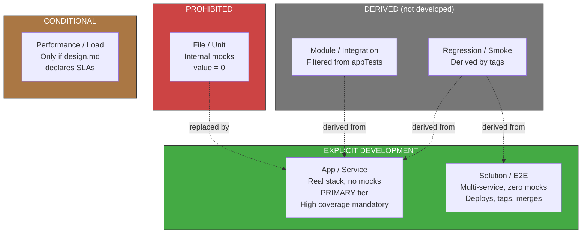

Virgil's current dogma also defines T0 (protocol/app replay),
T1 (agent-in-the-loop) and T2 (host-adapter conformance) as
specific levels for validating Virgil itself.

#### Traceability pattern: matrix → code

During Red, test cases are defined as a matrix with
static names. The test code imports those names. This
creates a RAG-searchable link from the documented matrix to the
test implementation.

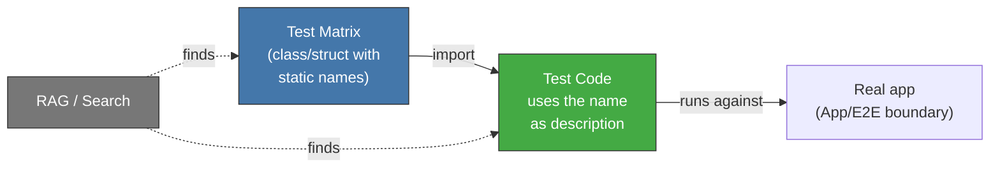

The pattern is technology-agnostic: in TypeScript it's a class with
`static readonly`, in Go it would be a `const` block or struct, in Rust a
`mod` with constants. What matters is that the matrix and the test
share a traceable identifier.

#### Binding Layer — link confidence

> **V2+ aspirational** — declared/inferred/verified confidence levels are not required for V1. Current status: the Ledger exists but structured confidence progression is not implemented.

The link between a test and the code that satisfies it is not binary
(exists/does not exist). It has three levels of confidence that progress
during the R/G/R cycle:

| State | Phase | Guarantees |
|--------|------|-----------|
| declared | Red | The test exists and references an AC |
| inferred | Green | A hook detected that code exercises the test |
| verified | Refactor | Mutation testing confirmed real strength (V2+ — mutation testing not configured) |

Only `verified` certifies strength — the others only confirm
existence.

### 7e. QA / Acceptance Gates — certification

> **Amendment note (2026-08-31):** The full certification chain is partially implemented. AuditService runs 6 mechanical checks against handoff guardrails; mutation score, CRAP, and CVE gates are V2+ aspirational. Coverage exists via vitest.

Certification combines deterministic mechanical gates (test pass/fail, mutation score, coverage, CRAP, CVE scan, module size) and structured verification gates (architectural alignment). Mechanical gates are binary: they pass or they do not. Structured verification gates (ARCH: implementation aligned with design.md) use documented, traceable semantic comparison, subject to the same demarcation as section 3b.

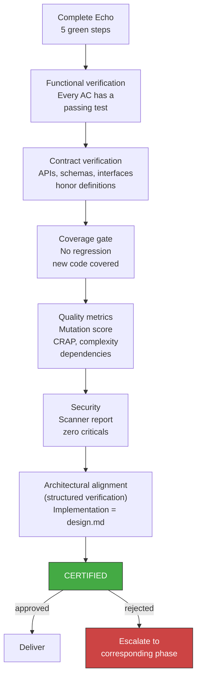

### 7f. droppableCode — coverage as a tool

> **V2+ aspirational** — droppableCode / safeToAutoDelete dead-code detection is not required for V1. Current status: not implemented. Coverage measurement exists via vitest but automated dead-code detection is not active.

Code with 0% coverage in appTests has no justification to
exist. Coverage is not a vanity metric — it is a dead-code
detector.

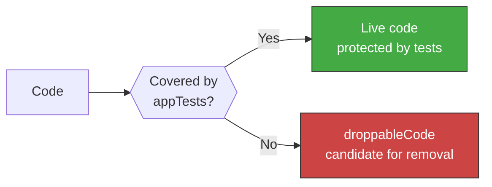

Code detected as droppableCode must be removed or justify its existence with an explicit, documented and reviewable exception. The concept **safeToAutoDelete** identifies the subset of droppableCode that meets mechanical safe-removal criteria: **no live dependents, no observed execution over N cycles, and no transitive coverage**. safeToAutoDelete enables automatic mechanical removal; droppableCode without those criteria requires a human decision (remove or justify exception).

The coverage threshold is mandatory and **never reduced**
without explicit MIM authorization. It is measured only on files with
real logic (selective coverage). Documented exceptions: defensive
code for rare failure modes, feature-flag paths not currently active,
adapter boilerplate for external interfaces not yet exercised,
and legacy code in the process of migration. Every exception requires an
explicit tag in the file and periodic review.

The same exception mechanism applies to mutation testing: the MIM may authorize documented exceptions for code where mutation testing is computationally prohibitive (heavy integration test suites, generated code, third-party adapters). Every exception requires an explicit tag, justification and periodic review. Mutation-score thresholds remain non-relaxable for non-exempted code.

### 7g. complianceByDesign — compliance as a side effect

> **V2+ aspirational** — complianceByDesign strict DTO shape assertions are not required for V1. Current status: strict DTO shape validation is not implemented. The principle remains valid; enforcement tooling is deferred.

If every test asserts the EXACT shape of the DTO (fields present,
fields absent, types), compliance verification is obtained without
separate suites.

```mermaid
flowchart TD
    STRICT["Strict assertions\ncomplete DTO shape"]
    ABUSE["abuseCases\nadversarial testing"]
    STRUCT["Structural validation\nschemas, hashing,\nencryption, A11y"]

    STRICT & ABUSE & STRUCT --> COMPLIANCE["Compliance\nas a side effect"]

    COMPLIANCE --> HIPAA["HIPAA\n(data layer)"]
    COMPLIANCE --> PCI["PCI DSS\n(data layer)"]
    COMPLIANCE --> GDPR["GDPR\n(data layer)"]

    style COMPLIANCE fill:#4a4,stroke:#333,color:#fff
```

Scope: covers EXCLUSIVELY the technical data-controls layer
(minimization, field-level access control, shape validation). It does NOT
cover organizational, physical, legal, procedural controls
or segregation of duties. When the project declares a regulatory compliance profile (HIPAA, PCI DSS, GDPR), the Method Pack MUST activate mandatory human review over authorization logic and domain modeling as a blocking gate. This activation is automatic for regulated profiles, not opt-in. For projects without a regulatory profile, human review remains optional and non-blocking. The Principia defines the technical capability; the project's compliance profile determines whether human review is required.

### 7h. Supply Chain Integrity — secure dependencies

[↑ Back to index](#index)

External dependencies are attack surface and a source of tech debt. Virgil imposes three invariants on the supply chain, agnostic of language and platform.

#### versionPinning — absolute reproducibility

> **V2+ aspirational** — exact version pinning (no ranges) is not required for V1. Current status: the project uses caret ranges (`^`) with a pnpm lock file (`pnpm-lock.yaml`). The lock file provides reproducibility; migrating to exact versions is aspirational.

All dependencies are declared with an EXACT version (no ranges, no compatibility prefixes). The dependency manager and its version are also declared explicitly in the project.

| Invariant | What it means | Why |
|------------|--------------|-----|
| Exact version | `1.2.3`, never `^1.2.3` or `~1.2.3` | Eliminates version drift between environments. What runs in CI is what runs in production |
| Versioned dependency manager | Manager version pinned to the project | Guarantees dependency-resolution parity across all environments |
| Lock file as artifact | The lock file is versioned and honored as source of truth | Captures the complete tree of transitive dependencies |

The invariant applies regardless of ecosystem (npm/pnpm/yarn, Go modules, Cargo, pip/uv, Maven/Gradle, etc.). The concrete implementation varies; the principle is universal: **zero version ambiguity**.

#### securityAudit — dependency gate

Before building, a vulnerability scan runs over the dependency tree. This check is a BLOCKING gate of step 1 (Setup) of the Echo System (section 7a).

```mermaid
flowchart LR
    DEPS["Dependency\ntree"] --> AUDIT["securityAudit\n(vulnerability\nscan)"]
    AUDIT -->|"0 high/critical\nvulnerabilities"| BUILD["→ Build\n(Echo step 2)"]
    AUDIT -->|"vulnerabilities\ndetected"| BLOCK["BLOCKED\nResolve before\ncontinuing"]

    style BUILD fill:#4a4,stroke:#333,color:#fff
    style BLOCK fill:#c44,stroke:#333,color:#fff
```

| Environment | Behavior |
|----------|---------------|
| Dev | Pre-push hook — warns, does not block |
| CI | Pipeline stage — blocking gate |
| CD | Deployment gate — absolute block |

The severity threshold (high, critical, or both) is defined by the Method Pack (V2+; currently configured per-project). The Core enforces that the scan runs; the Pack decides the threshold. The scanning tool is agnostic: each ecosystem has its equivalent (`pnpm audit`, `cargo audit`, `pip-audit`, `mvn dependency-check`, etc.). Note: the project uses pnpm as its package manager.

#### bumpDependencies — controlled tech-debt mitigation

Exact versions prevent drift but accumulate tech debt if not updated. The bumpDependencies cycle resolves this tension with a three-step process:

```mermaid
flowchart LR
    S1["1. Security Fix\nResolve\nknown\nvulnerabilities"]
    S2["2. Update Check\nIdentify and apply\navailable\nupdates"]
    S3["3. Security Fix\nRe-verify\npost-update"]

    S1 --> S2 --> S3

    S3 -->|"clean"| ECHO["Complete Echo\n(5 steps)"]
    S3 -->|"vulnerabilities"| ROLLBACK["Rollback +\ninvestigate"]

    style S1 fill:#47a,stroke:#333,color:#fff
    style S2 fill:#47a,stroke:#333,color:#fff
    style S3 fill:#47a,stroke:#333,color:#fff
    style ECHO fill:#4a4,stroke:#333,color:#fff
    style ROLLBACK fill:#c44,stroke:#333,color:#fff
```

1. **Security Fix**: resolve known vulnerabilities in current versions
2. **Update Check**: run an update checker that identifies new versions of all dependencies, applying updates with an exact version (without introducing ranges)
3. **Security Fix**: re-run the security scan against the updated versions — an update can INTRODUCE new vulnerabilities

After the complete cycle, the full Echo System runs (5 steps). If any gate fails, the update is reverted and the cause is investigated.

bumpDependencies is not an Echo step — it is a maintenance process that PRECEDES Echo. It runs explicitly (not automatically), typically on a cadence defined by the team (weekly, per sprint, or pre-release). The MIM may delegate the cadence to the Method Pack.

### Closed cycle

These mechanisms form a closed cycle: Echo executes, build
artifacts capture outputs, Red/Green/Refactor structures the execution
(parallelizable via compositeAgent), the Testing Matrix defines what counts
as proof, droppableCode detects dead code, complianceByDesign
verifies compliance, Supply Chain Integrity ensures secure and
up-to-date dependencies, and QA certifies the result. If QA rejects, it
escalates to the corresponding phase.

---

## 8. Where knowledge lives

[↑ Back to index](#index)

Three separate concerns: where deliverables are PERSISTED
(ArtifactStore), how deliverables and documentation are QUERIED (RAG),
and how the code's structure is UNDERSTOOD (codebaseMemory). RAG
acts as the documentary context's DBMS; codebaseMemory acts as the
code's structural graph. Both projections are **versioned**:
they declare a watermark (the revision against which they are synchronized)
and can detect drift relative to the repository's current state.

The canonical contextualization path is to query the appropriate
tool with bounded queries, not to load complete files into the
prompt. Reading files directly is not prohibited but has
a cost: it consumes tokens unnecessarily and operates outside
Virgil's traceability. Any modification that generates new commits
outside Virgil's flow moves HEAD beyond the watermark and
requires a **re-sync** that updates the projection. No
certification is valid if the RAG projection is not synchronized
with the revision being certified.

### 8a. ArtifactStore — persistence

```mermaid
flowchart TD
    VIRGIL["Virgil Core"]
    VIRGIL -->|"persists via"| ASA["Filesystem\n(.virgil/handoffs/)"]

    ASA --> DEFAULT["repo-docs (default)\n{target}/docs/virgil/\nlocal, RAG-friendly,\nno external dependencies"]

    ASA --> EXT["External adapters (TBD)"]

    subgraph EXTERNOS["Options via contract"]
        JIRA["Jira"]
        CONF["Confluence"]
        AZURE["Azure DevOps"]
        ASANA["Asana"]
        GH["GitHub Projects/Issues"]
        OTROS["Others\n(via adapter contract)"]
    end

    EXT --> EXTERNOS

    style DEFAULT fill:#4a4,stroke:#333,color:#fff
    style EXT fill:#777,stroke:#333,color:#fff
    style EXTERNOS fill:#777,stroke:#333,color:#fff
```

> **Constitutional clarification (CC-2):** The ContextProviderPort's provider implementations (Confluence, GitHub Org, Azure DevOps, Teams, and others that satisfy the port contract) are first-class extension points, not provisional functionality. The port contract is the universal interface; filesystem is the default with no external dependencies. Whatever satisfies the ContextProviderPort contract can connect — regardless of how many providers exist today. Note: ArtifactStoreAdapter as a formal abstraction is V2+ aspirational; current persistence is direct filesystem, and retrieval is via ContextProviderPort (11 backends).

### 8b. Namespace separation

```mermaid
flowchart LR
    subgraph VIRGIL_DOCS["Virgil/docs/"]
        DOGMA["Virgil Dogma\nread-only for consumers\nnormative and versioned"]
    end

    subgraph TARGET_DOCS["{target}/docs/"]
        MANAGED["{target}/docs/virgil/\nManaged namespace\nVIRGIL writes here"]
        CORPUS["{target}/docs/**\nProject corpus\nread-only for Virgil\n(opt-in for RAG)"]
    end

    DOGMA -.-|"are NOT the same"| TARGET_DOCS
    MANAGED -.-|"bounded\nwrite scope"| CORPUS

    style DOGMA fill:#47a,stroke:#333,color:#fff
    style MANAGED fill:#4a4,stroke:#333,color:#fff
    style CORPUS fill:#777,stroke:#333,color:#fff
```

> **Invariant**: `Virgil/docs/` (dogma) and `{target}/docs/` (project)
> share the name `docs` but do NOT share identity, ownership or
> write policy.

### 8c. Dual RAG — context DBMS

Architectural principle: **agents query instead of reading**.
The architecture favors querying the RAG (deliverables, documentation)
and codebaseMemory (code structure, section 8f) over direct
file reading. Virgil injects this guidance via AGENTS.md.
Contextualization via queries, not via prompts — direct
token savings.

#### Watermark and re-sync

RAG and codebaseMemory maintain a **watermark**: the revision
(commit SHA) against which the projection was last built or
synchronized. This watermark is the basis of three
mechanisms:

1. **Drift detection**: upon receiving a query, the projection compares
   its watermark against the current HEAD. If there is divergence, it reports:
   "last sync: `{sha}`, `{N}` commits behind" and suggests re-sync.
2. **Certification block**: Virgil does NOT certify code whose
   `sourceRevision` is not reachable from the RAG's watermark. The
   invariant is mechanical: sourceRevision must be reachable from
   the watermark in the commit graph (equivalent to
   `git merge-base --is-ancestor sourceRevision watermark`). The
   watermark is the Core's exclusive property and only updates
   as an effect of a re-sync that rebuilds or updates the
   projection — an agent cannot modify the watermark without
   running the sync process.
3. **Explicit re-sync**: the MIM or the agent can trigger a re-sync
   that updates the projection to the current HEAD. The trigger can be:
   - Explicit: the MIM instructs the agent ("sync Virgil").
   - Via PR: the PR includes RAG deltas and a sync signature (the
     signature specification is defined by the Dogma); on merge, the
     projection stays up-to-date without manual intervention.
   - Via hook (opt-in): a post-merge hook triggers re-sync
     automatically. This is the consumer's decision, not an
     obligation of the Principia.

```mermaid
flowchart TD
    QUERY["Query to RAG"]
    QUERY --> CHECK{{"HEAD reachable\nfrom watermark?"}}
    CHECK -->|"Yes"| RESULT["Result\nwith certainty"]
    CHECK -->|"No"| WARN["Warning: RAG\noutdated\nsuggest re-sync"]

    CERT["Certification"]
    CERT --> GATE{{"sourceRevision\nreachable from\nwatermark?"}}
    GATE -->|"Yes"| PASS["Gate passes"]
    GATE -->|"No"| BLOCK["BLOCKED\nre-sync required"]

    style RESULT fill:#4a4,stroke:#333,color:#fff
    style WARN fill:#a74,stroke:#333,color:#fff
    style PASS fill:#4a4,stroke:#333,color:#fff
    style BLOCK fill:#c44,stroke:#333,color:#fff
```

```mermaid
flowchart TD
    subgraph EVITAR["AVOID (anti-pattern)"]
        A1["Agent reads a complete file\n(thousands of tokens in prompt)"]
    end

    subgraph PREFERIR["PREFER (recommended pattern)"]
        A2["Agent queries the RAG\nor codebaseMemory\n(minimal tokens, bounded scope)"]
    end

    EVITAR -.-|"replaced by"| PREFERIR

    style EVITAR fill:#c44,stroke:#333,color:#fff
    style PREFERIR fill:#4a4,stroke:#333,color:#fff
```

Virgil defines two instances of the same RAG-as-DBMS pattern, one
per operational mode.

```mermaid
flowchart TD
    subgraph DEVRAG["devRag — Development Mode"]
        DR_SRC["Sources:\n./principia/ (immutable)\n./docs/ (normative)"]
        DR_ST["Storage:\nVirgil project files"]
        DR_ROL["Role: CTX DBMS\nfor developing Virgil"]
    end

    subgraph CONSRAG["consumerRag — Consumption Mode"]
        CR_SRC["Sources:\nVirgil dogma +\nthe project's own RAG"]
        CR_ST["Default storage:\n{target}/docs/\noverride via adapter"]
        CR_ROL["Role: CTX DBMS\nfor the consuming project"]
    end

    PRINCIPIA["Principia\n(immutable)"] -->|"feeds"| DEVRAG
    DEVRAG -->|"echo:\nsame pattern\ndifferent scope"| CONSRAG

    style DEVRAG fill:#47a,stroke:#333,color:#fff
    style CONSRAG fill:#a74,stroke:#333,color:#fff
    style PRINCIPIA fill:#2b5,stroke:#333,color:#fff
```

| Aspect | devRag | consumerRag |
|---------|--------|-------------|
| Mode | Development | Consumption |
| Sources | `./principia/` + `./docs/` | Virgil dogma + the project's own RAG |
| Storage | Virgil project files | `{target}/docs/` (default) |
| Override | N/A (fixed source) | Adapter interfaces: Jira, Confluence, Azure DevOps, Asana, WordPress, DBMS |
| Role | CTX DBMS for Virgil | CTX DBMS for the consuming project |

consumerRag defines **interfaces** — the client implements them with
whatever backend it needs. Whatever satisfies the adapter contract can
connect.

For hybrid queries (example: "what functions implement design decision X described in design.md"), the router runs both queries in parallel: Q_SEM to the RAG to locate the decision, Q_STR to codebaseMemory for the functions. Results are merged by the ContextCompiler with origin traceability.

### 8d. Tiered visibility

The main agent (orchestrator) has full RAG visibility
if it deems it necessary. Sub-agents receive a reduced scope:
only what is needed for their task.

```mermaid
flowchart TD
    RAG["RAG\n(devRag | consumerRag)"]

    RAG -->|"100% visibility\n(if deemed necessary)"| ORCH["Orchestrator\n(main agent)\nsees the ENTIRE inventory"]

    RAG -->|"bounded scope"| SUB1["Sub-agent A\nsees only deliverables\nfor its task"]
    RAG -->|"bounded scope"| SUB2["Sub-agent B\nsees only deliverables\nfor its task"]

    ORCH -->|"defines scope via\ndelegationContract"| SUB1 & SUB2

    style ORCH fill:#4a4,stroke:#333,color:#fff
    style SUB1 fill:#47a,stroke:#333,color:#fff
    style SUB2 fill:#47a,stroke:#333,color:#fff
    style RAG fill:#a74,stroke:#333,color:#fff
```

The sub-agent's scope is defined in the `delegationContract` (section
9c). The orchestrator decides which topic_keys or queries are visible for
each delegation.

### 8e. Memoization

> **V2+ aspirational** — in-memory memoization layer is not required for V1. Current status: brief queries read from disk. An in-memory cache is aspirational.

The RAG maintains an in-memory cache layer to speed up repeated
queries. It falls back to persistent storage when the cache is
invalidated or the session restarts.

```mermaid
flowchart LR
    QUERY["Query"] --> CACHE{{"In-memory\ncache?"}}
    CACHE -->|"hit"| RESULT["Result\n(immediate)"]
    CACHE -->|"miss"| FALLBACK["Fallback\nstructured local\nstorage\n(tech TBD)"]
    FALLBACK --> RESULT
    FALLBACK -->|"populate cache"| CACHE

    style CACHE fill:#4a4,stroke:#333,color:#fff
    style FALLBACK fill:#777,stroke:#333,color:#fff
```

The RAG is not the process's authority — the Ledger, the
ArtifactRepository and the evidence are the source of truth. The RAG and
the TraceabilityGraph are derived projections, reconstructible from
the Ledger and the deliverables. No projection is a source of truth;
if it desyncs, it is rebuilt from the authoritative sources.

### 8f. codebaseMemory — structural code graph

> **V2+ aspirational** — codebaseMemory is explicitly a Non-Goal for V1 per roadmap.md. Current status: not implemented. CodeGraph is used as an external tool for structural queries.

The RAG operates over deliverables and documentation — structured
data that is indexed semantically. Source code is different: it cannot
(and should not) be fully loaded into a RAG. For code, Virgil
uses a complementary tool: a deterministic
structural graph that maps relationships without embeddings.

```mermaid
flowchart TD
    subgraph ROUTING["Query routing"]
        Q_SEM["Semantic query\n'what does the spec say about auth?'\n'what is the design decision?'"]
        Q_STR["Structural query\n'who calls this function?'\n'what breaks if I change X?'\n'what tests cover this module?'"]
    end

    Q_SEM -->|"RAG"| RAG["devRag | consumerRag\n(deliverables, docs)"]
    Q_STR -->|"codebaseMemory"| CBM["AST Graph\n(entities, relationships)"]

    style Q_SEM fill:#47a,stroke:#333,color:#fff
    style Q_STR fill:#4a4,stroke:#333,color:#fff
    style RAG fill:#47a,stroke:#333,color:#fff
    style CBM fill:#4a4,stroke:#333,color:#fff
```

#### What it indexes vs what it excludes

codebaseMemory indexes STRUCTURE, not content.

```mermaid
flowchart TD
    subgraph INDEXA["Indexes (lightweight, deterministic)"]
        ENT["Entities\nfiles, modules, classes,\nfunctions, interfaces, types,\ntests, routes"]
        REL["Relationships\ncalls, imports, inheritance,\ncontains, test-covers,\ndata-flow"]
        META["Metadata\nsignatures, location,\nassociation with commits"]
    end

    subgraph EXCLUYE["Excludes (keeps it lightweight)"]
        EMB["Embeddings of\ncomplete source code"]
        VEC["Vector chunks\nline by line"]
        AMB["Ambiguous edges\n(no edge > dubious edge)"]
    end

    INDEXA -.-|"clear line"| EXCLUYE

    style INDEXA fill:#4a4,stroke:#333,color:#fff
    style EXCLUYE fill:#c44,stroke:#333,color:#fff
```

#### Deterministic construction

The graph is built by a deterministic AST parser, not by LLM
inference. This guarantees deterministic coverage of the parseable corpus,
speed, and **conservative soundness** of the edges: a relationship is
recorded only when sufficient structural evidence exists. Ambiguous
edges are omitted; the absence of an edge does not prove the absence of a
runtime or dynamic relationship.

```mermaid
flowchart LR
    SRC["Source code"] --> PARSE["AST Parser\n(deterministic)"]
    PARSE --> GRAPH["Node graph\nentities + relationships"]
    GRAPH --> STORE["Structured local\nstorage"]
    STORE --> QUERY["Structural\nqueries"]

    CHANGES["File change"] -->|"watcher +\ncontent hash"| PARSE

    style PARSE fill:#47a,stroke:#333,color:#fff
    style GRAPH fill:#4a4,stroke:#333,color:#fff
    style STORE fill:#777,stroke:#333,color:#fff
```

The update is incremental: a file watcher detects changes,
compares hashes, and re-parses only the modified files. There is no
full rebuild on every change.

#### Complement to the RAG, not a replacement

```mermaid
flowchart TD
    VIRGIL["Virgil"]
    VIRGIL --> RAG["RAG\nDeliverables DBMS\n(semantic)"]
    VIRGIL --> CBM["codebaseMemory\nCode graph\n(structural)"]

    RAG --> R_Q["'what does the design\nsay about the auth module?'"]
    CBM --> C_Q["'what functions depend\non AuthMiddleware?\nwhat tests cover them?'"]

    RAG ~~~ CBM

    NOTE["Same tiered visibility:\norchestrator sees the entire graph,\nsub-agents see bounded scope\n(via delegationContract)"]

    style RAG fill:#47a,stroke:#333,color:#fff
    style CBM fill:#4a4,stroke:#333,color:#fff
    style NOTE fill:none,stroke:none
```

codebaseMemory enables on-demand visualization of the project
as a node graph — without loading source code into the prompt, without
burning tokens, and with full ownership of the structure. It is the
tool that lets Virgil "see" the code without "reading it."

codebaseMemory maintains its own watermark, independent of the RAG's.
The incremental update via file watcher advances the watermark
automatically to the commit that triggered the change. The certification
invariant (section 8c) applies to both projections.

In parallel-lane scenarios (section 11c), each isolated mutation domain maintains its own instance of the graph. In the reference implementation those domains are worktrees. Divergent graphs are reconciled at integration: the integrated revision triggers incremental graph reconstruction from its AST. There is no graph shared between divergent lanes.

With knowledge organized as a document DBMS (RAG), a
structural graph (codebaseMemory) and tiered visibility by role,
the next step is to understand how that context flows between agents
during execution.

---

## 9. How context flows

[↑ Back to index](#index)

Fundamental rule: **raw context is never passed to a sub-agent**.
Context is delivered compiled (ContextBrief) or as a reference
(topic_key) for the sub-agent to read from the RAG.

### 9a. ContextBrief

The ContextCompiler selects deliverables, facts and boundaries to
produce a ContextBrief bounded to the actor's objective. The
selection remains traceable: what was included, where it came from, what was excluded.

Compiling the ContextBrief is a judgment step (section 3b) with an inherent hallucination surface: selection/summarization can omit or distort information. Traceability (what was included, where it came from, what was excluded) enables post-hoc audit, but does NOT prevent omission at compile time. This risk is mitigated by the PDC (post-delegation coherence check) and by reconstructing the ContextBrief upon PlanningGapDetected.

### 9b. Two delivery patterns

> **V2+ aspirational** — PatternB delivery (topic_key-based direct RAG reads) is not required for V1. Current status: only PatternA (curated injection) is implemented. PatternB requires a functioning RAG projection.

```mermaid
flowchart TD
    NEED["Sub-agent needs context"]
    NEED --> Q{{"Target known\nand deterministic?"}}

    Q -->|"Yes"| PB["PatternB (V2+)\nSM passes topic_key\nsub-agent reads directly from RAG\nsignificantly more economical"]
    Q -->|"No"| PA["PatternA (implemented)\nSM searches, curates, injects\nquality over cost"]

    style PB fill:#4a4,stroke:#333,color:#fff
    style PA fill:#47a,stroke:#333,color:#fff
```

| Pattern | When | Cost | Quality |
|--------|--------|-------|---------|
| PatternB (default) | Known, deterministic target | Low (passes `topic_key`; avoids materializing context) | Good |
| PatternA | Fuzzy search, high fan-out (8+) | High | Optimal |

Both patterns operate over the dual RAG (section 8c): devRag in
Development Mode, consumerRag in Consumption Mode.

### 9c. Delegation: SM → sub-agent → PDC

```mermaid
sequenceDiagram
    participant SM as SM
    participant SUB as Sub-agent
    participant TPM as TPM

    SM->>SUB: delegationContract<br/>(6 required fields)
    activate SUB
    SUB-->>SM: Output + Status Report
    deactivate SUB

    Note over SM: PDC mandatory
    SM->>SM: ECHO - coherent?
    SM->>SM: VERIFY - complete?
    SM->>TPM: MARK - persist
    SM->>SM: DECIDE - advance?
```

The 6 required fields of the delegationContract:

| Field | What it defines |
|-------|------------|
| Identity | Role name, reasoning tier (search / implementation / architecture), behavioral constraints |
| Scope | Explicit boundary of scope — which files, which actions, what is out of bounds |
| Verifiable objective | Binary criterion the SM evaluates against the output |
| Input | Resolved data the sub-agent needs — no references it must chase down |
| Output schema | Exact structure of the expected result |
| Injected rules | Project rules and constraints as literal text in the briefing — the sub-agent does NOT search for its own context |

**Identity** is not decorative — it defines how the
sub-agent reasons and operates. The reasoning tier is assigned by
task complexity, not by preference: a search does not require
architectural capability; a design decision is not delegated to search
capability. Rules arrive pre-digested because a stateless sub-agent
(GP-4: constraint > trust) has neither access to the source
registry nor responsibility for finding it.

Without a Status Report in the output, the SM treats it as FAILED.
Three consecutive failures for the same role activate the circuitBreaker.

> **Do not confuse**: the PDC's `ECHO` step validates the coherence of the delegated output. The **Echo System** runs Setup → Build → Static → Dynamic → E2E and produces build artifacts. The former is an orchestration checkpoint; the latter is the canonical evidence pipeline.

---

## 10. How it recovers

[↑ Back to index](#index)

> **Amendment note (2026-08-31):** Current implementation uses stored state (`META.json` per handoff) rather than Ledger-derived state. Deriving state from consolidated Ledger revisions is V2+ aspirational.

After a crash, compaction or new session, state is
reconstructed — it is not lost.

```mermaid
sequenceDiagram
    participant SM as SM
    participant TPM as TPM
    participant STORE as ArtifactStore

    SM->>TPM: what deliverables exist?
    TPM->>STORE: scan states
    STORE-->>TPM: list + revisions
    TPM-->>SM: deliverables + states + failure history

    SM->>SM: derive current phase
    SM->>SM: consult history<br/>(adjust strategy)
    SM->>SM: continue from<br/>derived phase
```

- The SM derives the phase from **consolidated revisions** of deliverables, not from the mere existence of files. A revision only participates in state derivation once its persistence and its required gate/evidence are confirmed; a partial revision after a crash does not advance the phase.
- Phase state is not stored as an authoritative pointer; it is derived from those consolidated revisions and from the Ledger
- Failure history is per-deliverable and cross-session
- `lastVerifiedAt` avoids unnecessary re-verification if the code
  did not touch the deliverable's scope
- External changes are classified: additive (record), contradictory
  (MIM decision), or from another cycle (record as context)

---

## 11. How it executes

[↑ Back to index](#index)

After planning produces an approved handoff, execution
transforms that handoff into a candidate implementation and **Verify**
certifies it against the canonical path's artifacts/evidence. Virgil
OBSERVES — it does not direct, it does not implement. It emits
PlanningGapDetected if it detects gaps.

### 11a. Execution pipeline

Five sequential phases. Each phase has its exit gate.

```mermaid
flowchart LR
    PRE["prePhase\nContracts:\nAPIs, schemas,\ninterfaces"]
    RED["Red\nEntire test\nsuite\n(all fail)"]
    GREEN["Green\nCode that\npasses tests\n(all pass)"]
    REFACTOR["Refactor\nMechanical\nverification\n(metrics OK)"]
    VERIFY["Verify\nCertification\n(QA gate)"]

    PRE --> RED --> GREEN --> REFACTOR --> VERIFY

    style PRE fill:#777,stroke:#333,color:#fff
    style RED fill:#c44,stroke:#333,color:#fff
    style GREEN fill:#4a4,stroke:#333,color:#fff
    style REFACTOR fill:#47a,stroke:#333,color:#fff
    style VERIFY fill:#2b5,stroke:#333,color:#fff
```

| Phase | What it produces | Exit gate |
|------|-------------|----------------|
| prePhase | Source contracts (OpenAPI source, schemas, interfaces) | All contracts defined |
| Red | Complete test suite | All fail (valid red) |
| Green | Implementation | All pass |
| Refactor | Metrics within threshold | Mutation, CRAP, complexity OK |
| Verify | Certification | Mechanical gates + structured verification (see 7e) |

### 11b. Contracts first — parallelism enabler

> **V2+ aspirational** — multi-lane parallel execution is not required for V1. Current status: no worktree/lane model exists. The contracts-first principle remains valid for sequential execution.

prePhase defines contracts BEFORE implementing. This allows
multiple lanes to work in parallel against the same interface.

```mermaid
flowchart TD
    CONTRACTS["prePhase\nAPIs, schemas, interfaces\n(defined and approved)"]

    CONTRACTS --> LANE1["Lane A\n(frontend)"]
    CONTRACTS --> LANE2["Lane B\n(backend)"]
    CONTRACTS --> LANE3["Lane C\n(infra)"]

    LANE1 & LANE2 & LANE3 -->|"merge"| INTEGRATION["Integration\n(cross tests)"]

    style CONTRACTS fill:#47a,stroke:#333,color:#fff
    style INTEGRATION fill:#4a4,stroke:#333,color:#fff
```

### 11c. Git strategy — isolation and traceability

> **V2+ aspirational** — multi-lane Git strategy with worktrees is not required for V1. Current status: no worktree/lane model exists. The four invariants below remain the normative target for when parallel execution is implemented.

The Principia does NOT impose GitFlow, trunk-based, or concrete branch names. It imposes four invariants:

1. Concurrent lanes must have **isolated mutation domains** while they diverge (isolated filesystem, conflict detection at integration, per-lane revision identity).
2. Every `buildArtifactSet` produced by Echo must be unambiguously linked to the `sourceRevision` that generated it.
3. Lane integration must re-run the required Echo on the integrated revision before that revision can be certified.
4. The identity and provenance of each lane must **survive integration** and be mechanically verifiable in the history. The canonical enforcement is `--no-ff` (no fast-forward merge); an alternative strategy is admissible only if it preserves equivalent evidence of lane identity and provenance.

The concrete Git strategy is configurable per project within these invariants. The current Dogma provides worktrees + branches as the reference implementation:

```mermaid
flowchart TD
    MAIN["main\n(stable, production)"]
    DEV["develop\n(integration)"]
    ITER["exec/iter-N\n(iteration)"]

    subgraph LANES["Reference: parallel lanes with worktrees"]
        L1["exec/iter-N/lane-auth"]
        L2["exec/iter-N/lane-api"]
        L3["exec/iter-N/lane-ui"]
    end

    L1 & L2 & L3 -->|"--no-ff"| ITER
    ITER -->|"--no-ff"| DEV
    DEV -->|"merge or squash\n(MIM decides)"| MAIN

    style MAIN fill:#4a4,stroke:#333,color:#fff
    style ITER fill:#47a,stroke:#333,color:#fff
    style LANES fill:#a74,stroke:#333,color:#fff
```

With that implementation, each lane runs in an isolated worktree and a compositeAgent (section 7c) operates within that mutation domain. Another project may use a different isolation mechanism as long as it satisfies the mutation domain properties and the four invariants of this section.

If a lane detects a contract violation mid-flight, the SM emits PlanningGapDetected and stops THAT lane. Other running lanes that depend on the same contract receive an invalidated-contract notification and enter a paused state pending reconciliation. Independent lanes (with no dependency on the violated contract) continue without interruption.

Commit conventions are Dogma defaults and may be overridden per project as long as Virgil can reconstruct phase, revision and evidence **by deterministic parsing** (not by LLM inference):

| Phase | Default prefix | Default frequency |
|------|-----------------|--------------------|
| prePhase | `contract:` | 1 per type |
| Red | `test:` | 1 per test or group |
| Green | `feat:` | 1 per passing test |
| Refactor | `refactor:` | 1 per atomic refactor |

### 11d. Mechanical verification — conditional human review

The Refactor phase uses metrics-based mechanical verification as the primary certification mechanism. Mechanical gates (section 7e) are the main quality channel. For projects with a regulatory compliance profile, the Method Pack additionally activates blocking human review over authorization logic and domain modeling (see section 7g). In both cases, final certification requires that ALL applicable gates pass — both the mechanical ones and the human-review ones when active.

Certification gates combine deterministic mechanical verification (test pass/fail, mutation score, coverage, CRAP, CVE scan) and structured verification (architectural alignment — see section 7e). Human review, when active due to a compliance profile, is also part of the applicable gates. The PDC operates during execution as a coherence safeguard (section 3b), but is not part of the certification pipeline — it can stop an incoherent delegation, it does not certify or approve code.

```mermaid
flowchart TD
    subgraph MECANICO["Mechanical verification (mandatory)"]
        MUT["Mutation testing (V2+)\nreal test strength"]
        CRAP["CRAP score (V2+)\nchange risk"]
        CYCL["Cyclomatic complexity\nsimple functions"]
        SIZE["Module size\nbounded LOC"]
        DEPS["Dependency structure\nzero cycles"]
        SEC["Security\nzero critical CVEs"]
    end

    subgraph RESIDUAL["AUTH/DDD review (optional by default; blocking with compliance profile — see 7g)"]
        AUTH["Authorization logic"]
        DDD["Domain modeling"]
    end

    MECANICO -->|"gate"| PASS{{"Passes?"}}
    PASS -->|"Yes"| VERIFY["Verify"]
    PASS -->|"No"| BACK["Re-delegate to\ncorresponding phase"]

    style MECANICO fill:#47a,stroke:#333,color:#fff
    style RESIDUAL fill:#777,stroke:#333,color:#fff
    style PASS fill:#4a4,stroke:#333,color:#fff
    style BACK fill:#c44,stroke:#333,color:#fff
```

The specific thresholds (mutation score, maximum CRAP, complexity)
are defined by the dogma per tier (strict, standard, relaxed). The
Principia defines the principle: **mechanical, not subjective**.

> **V2+ aspirational** — mutation testing and CRAP score are not configured for V1. Current status: coverage exists via vitest; mutation testing and CRAP metrics are planned for V2+.

### 11e. Accept/Reject — certification by gates

```mermaid
flowchart TD
    QA{{"QA: virgil health"}}

    QA -->|"passes"| CERT["CERTIFIED\ngit tag: qa/approved"]
    QA -->|"implementation gap"| GREEN["→ Green"]
    QA -->|"testing gap"| RED["→ Red"]
    QA -->|"contract gap"| PRE["→ prePhase"]
    QA -->|"planning gap"| PLANNING["→ Planning\n(PlanningGapDetected)"]

    style CERT fill:#4a4,stroke:#333,color:#fff
    style GREEN fill:#c44,stroke:#333,color:#fff
    style RED fill:#c44,stroke:#333,color:#fff
    style PRE fill:#c44,stroke:#333,color:#fff
    style PLANNING fill:#c44,stroke:#333,color:#fff
```

| Gap type | Rejection | Re-delegate to |
|-------------|---------|--------------|
| Code does not satisfy test | Incomplete implementation | Green |
| Incomplete test suite | Missing tests | Red |
| Contract violated | Broken interface | prePhase |
| Design not reflected in code | Divergent architecture | Refactor |
| Missing feature in planning | Insufficient deliverable | Planning |

Rejection is SPECIFIC — it identifies the exact phase that must
be corrected, not a generic "fix it." Every re-delegation goes through
the complete PDC (section 9c).

#### Emergency lane (break-glass)

> **Amendment note (2026-08-31):** Break-glass bookkeeping exists (LedgerService records break-glass events); authorization is procedural via AGENTS.md, not mechanical.

For P1 incidents in production, there is an expedited path that
compresses ceremony without eliminating it:

```mermaid
flowchart LR
    P1["P1 Incident\ndetected"]
    P1 -->|"MIM authorizes\nbreak-glass"| FIX["Direct fix\n(Red + Green\ncompressed)"]
    FIX -->|"immediate\ndeploy"| PROD["Production\nstabilized"]
    PROD -->|"within 72h\n(configurable:\nmin 24h, max 168h)"| CERT["Complete\ncertification\npost-hoc"]

    style P1 fill:#c44,stroke:#333,color:#fff
    style FIX fill:#a74,stroke:#333,color:#fff
    style CERT fill:#4a4,stroke:#333,color:#fff
```

| Restriction | Rule |
|-------------|-------|
| Authorization | Only the MIM can activate break-glass. In teams where the MIM is not always available, a standing policy issued by the MIM may pre-authorize activations under mechanically verifiable conditions: covered incident types, policy expiration date, and mandatory MIM notification within a defined window |
| Scope | Exclusively the incident fix — zero features |
| Certification | Complete post-hoc certification within 72 hours (configurable by the Method Pack, minimum 24h, maximum 168h) |
| Recording | The Ledger records the activation as an auditable event |

A standing policy does not transfer authority or expand scope: it declares closed conditions under which break-glass can be activated without the MIM's presence. Every activation must demonstrate it met the pre-authorized conditions, remain attributed to the active MIM policy, and notify the MIM within the window declared in the policy.

Break-glass is NOT a shortcut — it is a documented path with
explicit restrictions. A fix without post-hoc certification within
72 hours (or the configured window) is treated as critical technical debt.

### 11f. Evidence as queryable data

Everything that happens during execution is ingested as queryable
evidence, not as narrative documentation. For **code certification**,
test results, coverage, metrics, scanners and build results
are only eligible when linked to an `EchoRun` and its
`buildArtifactSet`. Evidence from planning, human decisions or operation
events can come from other sources, but does not replace the Echo
path for certifying code.

```mermaid
flowchart TD
    subgraph FUENTES["Evidence sources"]
        TESTS["Test results\npass/fail + AC ref"]
        COV["Coverage reports\n% per file"]
        METRICS["Metrics\nmutation, CRAP,\ncomplexity"]
        COMMITS["Commits\nSHA + phase + test ref"]
        PIPELINE["Echo pipeline\nlogs, reports"]
    end

    FUENTES --> INGESTION["EvidenceIngestion\n(kernel)"]
    INGESTION --> LEDGER["Ledger\n(immutable)"]
    INGESTION --> BINDING["Binding Layer\ndeclared → inferred → verified"]

    style INGESTION fill:#47a,stroke:#333,color:#fff
    style LEDGER fill:#4a4,stroke:#333,color:#fff
```

Evidence feeds the Binding Layer: every commit referencing
a test moves the link from `declared` to `inferred`. Mechanical
verification (mutation testing) moves it to `verified`.

> **V2+ aspirational** — structured Binding Layer confidence progression is not required for V1. Current status: the Ledger records events but declared/inferred/verified tracking is not implemented.

---

## 12. How it operates (optional)

[↑ Back to index](#index)

> **Amendment note (2026-08-31):** In the current implementation, watch/insights run unconditionally (no activation gate yet). Escalation is human-mediated: InsightEngine prints insights to console and the human decides whether to act.

The operation phase activates ONLY if the product has an active
operational surface (APIs, CLIs, services or operated tools). A
library on its own does not activate Operation; its API reference belongs
to Delivery/support documentation. It also does not apply to single-use
deliverables.

### 12a. Activation and role

```mermaid
flowchart TD
    DELIVER["Complete\nDelivery"]
    DELIVER --> Q{{"Operational\nsurface?"}}
    Q -->|"Yes\n(API, CLI, service)"| ACTIVE["Operation ACTIVE\nVirgil ASSISTS\n(reactive)"]
    Q -->|"No\n(library, one-shot)"| INACTIVE["Operation\nDOES NOT APPLY"]

    style ACTIVE fill:#47a,stroke:#333,color:#fff
    style INACTIVE fill:#777,stroke:#333,color:#fff
```

| Actor | Role in operation |
|-------|-----------------|
| MIM | User — consumes the product |
| Agent | operationalAssistant — executes MIM requests within the product's context |
| Virgil | Assists the agent with context, does NOT direct |

### 12b. Operation adapters

Two types of documentation belong directly to Operation; libraries keep `api-reference` as a Delivery/support artifact, without activating the operational phase by themselves.

```mermaid
flowchart LR
    OP["Operation"]
    OP --> RUNBOOK["ops-runbook\n(services, APIs)"]
    OP --> USAGE["usage-guide\n(CLIs, tools)"]
    DELIVERY["Delivery / Support"] --> APIREF["api-reference\n(libraries)"]

    style RUNBOOK fill:#47a,stroke:#333,color:#fff
    style USAGE fill:#47a,stroke:#333,color:#fff
    style APIREF fill:#47a,stroke:#333,color:#fff
```

### 12c. Escalation

If operation detects problems, it escalates back to the
corresponding cycle.

```mermaid
flowchart TD
    OP["Operation"]
    OP -->|"bug detected"| EXEC["→ Execution\n(Red-Green cycle)"]
    OP -->|"feature request"| PLAN["→ Planning\n(new cycle)"]
    OP -->|"missing doc"| DOC["→ Planning\n(produce runbook/guide)"]

    style EXEC fill:#a74,stroke:#333,color:#fff
    style PLAN fill:#47a,stroke:#333,color:#fff
    style DOC fill:#47a,stroke:#333,color:#fff
```

Operation never fixes bugs inline nor adds features without going
through the complete cycle. The e2e methodology principle (governance
principle 1) applies equally post-delivery.

---

## Self-reference rule

[↑ Back to index](#index)

This Principia governs BOTH modes with the same authority:

```mermaid
flowchart TD
    P["Principia\n(this document)"]

    P --> MD["Development Mode\nVirgil is the OBJECT\nDeveloper works\nON Virgil"]
    P --> MC["Consumption Mode\nVirgil is the TOOL\nImplementer works\nWITH Virgil"]

    MD --> MISMOS["Same principles\nSame contracts\nSame gates\nDifferent direction\nof agency"]
    MC --> MISMOS

    style P fill:#2b5,stroke:#333,color:#fff
    style MISMOS fill:#47a,stroke:#333,color:#fff
```

---

## Glossary

[↑ Back to index](#index)

| Term | Definition |
|---------|-----------|
| AGENTS.md | Discoverability file published by Virgil in the consuming project following the Open Agentic Standard. Contains operational rules injected for the agent (section 1) |
| ARCH | Architectural-alignment gate within the certification pipeline. Validates conformance with architecture principles (section 7e, 11d) |
| ArtifactRepository | **V2+ aspirational.** Originally a Core component for deliverables, revisions and provenance. Current implementation: HandoffService + filesystem (section 5) |
| ArtifactStoreAdapter | **V2+ aspirational.** Adapter contract for persistence and retrieval between the Core and external storage. Current implementation: direct filesystem for persistence, ContextProviderPort for retrieval (section 5, 3b) |
| Binding Layer | Three trust levels for contracts: declared (defined), inferred (derived from evidence), verified (confirmed by execution). **V2+ aspirational** — confidence progression not implemented (section 7d) |
| Break-glass | Emergency lane for P1 incidents that compresses ceremony with MIM authority and mandatory post-hoc certification (section 11e) |
| buildArtifactSet | Set of build artifacts produced by an EchoRun, unambiguously linked to a sourceRevision (section 7b) |
| bumpDependencies | Three-step maintenance cycle (security fix → update check → security fix) to update exact dependencies without introducing vulnerabilities (section 7h) |
| circuitBreaker | Mechanism that stops delegations after 3 consecutive failures and escalates to the MIM (section 9c) |
| codebaseMemory | **V2+ aspirational (Non-Goal for V1).** Structural code graph derived from AST. CodeGraph is used as an external tool (section 8f) |
| compositeAgent | **V2+ aspirational.** Sequence of independent invocations (testEngineer → Implementor → fitnessFunction) orchestrated under a common label within an isolated mutation domain (section 7c) |
| complianceByDesign | **V2+ aspirational.** Data-shape assertions integrated into development. Covers exclusively technical data controls (section 7g) |
| consumerRag | RAG projection of the consuming project in Consumption Mode. Complements devRag. See dual RAG (section 8c) |
| ContextBrief | Context package compiled for a delegation. Includes selected deliverables with origin traceability. Current implementation: handoff files (TASK.md + CONTEXT.md + ACCEPTANCE_CHECKLIST.md) (section 9a) |
| ContextCompiler | Core component that selects and compiles relevant deliverables into a ContextBrief. Current implementation: HandoffService (section 9a) |
| ContextProviderPort | **[New]** Adapter contract (port interface) for context retrieval from external sources. 11 backends implemented (Confluence, GitHub Org, Azure DevOps, Teams, etc.). Providers self-register on module initialization (section 5) |
| Core | Virgil's ceremony-agnostic core services (NestJS modules). Contains LedgerService, HandoffService, PlanningService, AuditService, BriefService, ProviderRegistry, RefResolver. Replaces the term "Kernel" from the original Principia (section 5) |
| CRAP score | **V2+ aspirational.** Change Risk Anti-Patterns — metric that combines complexity and coverage to assess change risk |
| delegationContract | Contract of 6 required fields accompanying every SM delegation: identity (role, tier, constraints), scope, verifiable objective, resolved input, output schema, rules injected as text (section 9c) |
| devRag | Virgil's RAG projection in Development Mode. Complements consumerRag. See dual RAG (section 8c) |
| DogmaRef | Identity reference to the operational dogma (docs/). Resolved at the start of every invocation from `virgil.json` and the project filesystem. Field contract defined in the protocol layer, out of scope for this Principia (section 3b) |
| droppableCode | **V2+ aspirational.** Code with 0% coverage in appTests. Must be removed or justify its existence with a documented exception (section 7f) |
| Echo System | 5-step pipeline for the execution of each phase: Setup → Build → Static → Dynamic → E2E. Documented in AGENTS.md; not mechanically enforced via hooks/CI yet (section 7a) |
| EchoRun | Concrete instance of Echo System execution that produces a buildArtifactSet linked to a sourceRevision (section 7b) |
| EvidenceIngestion | **V2+ aspirational.** Structured ingestion component for execution evidence. Current implementation: LedgerService (append-only JSONL) (section 5) |
| FastForward | Certainty gradient (FF-1 to FF-4) that allows compressing planning ceremony when observable evidence supports it (section 3a) |
| HostAdapter | **V2+ aspirational.** Adapter that translates discovery, invocation and envelopes between the host and Virgil. Current implementation: CLI commands are the single integration point (section 3b, 5) |
| Kernel | Virgil's ceremony-agnostic core. Now referred to as "Core" (NestJS modules). See Core (section 5) |
| Ledger | Immutable record of the project's events, transitions and history. Implemented as append-only JSONL at `.virgil/ledger.jsonl` |
| Method Pack | **V2+ aspirational.** Ceremony layer defining roles, flows and additional gates. The current handoff lifecycle is methodology-agnostic by design (section 5) |
| MIM | Mind in the Machine: human with final authority over the project. Approves, rejects, breaks ties. Its veto is non-negotiable (vocabulary) |
| mutation domain | **V2+ aspirational.** Isolation domain where an execution lane operates without interfering with other concurrent lanes. No worktree/lane model exists in V1 (section 7c, 11c) |
| PDC | Post-Delegation Checkpoint: orchestration-coherence safeguard (ECHO → VERIFY → MARK → DECIDE). It is not a certification gate (section 3b) |
| PlanningGapDetected | Escalation signal when execution detects a planning defect. Triggers re-planning |
| PlanningService | **[New]** Core service managing the Idea → Requirement → Design → Task ceremony through `virgil write` and `virgil transition` commands (section 3a, 5) |
| ProjectRef | Identity reference to the target project. Resolved from `virgil.json` at the start of every invocation. Field contract defined in the protocol layer, out of scope for this Principia (section 3b) |
| RAG | Read-optimized projection over deliverables and documentation. Not a source of truth — it is reconstructible (section 8e) |
| re-sync | Process that updates a projection (RAG or codebaseMemory) to the current HEAD and advances its watermark. Can be triggered explicitly, via PR with deltas, or via post-merge hook (section 8c) |
| RetrievalProjection | Formal name of the Core component that implements the read projections. Current implementation: RefResolverService (section 5) |
| RunContext | Execution context of the active run/change. Resolved from `virgil.json` at the start of every invocation. Field contract defined in the protocol layer, out of scope for this Principia (section 3b) |
| securityAudit | Blocking gate of Echo step 1 (Setup): vulnerability scan over the dependency tree. The Core enforces execution; the Method Pack (V2+) defines the severity threshold (section 7h) |
| SM | Session Manager: orchestrating agent that coordinates the session. Compiles context, delegates work, runs the PDC. It is not a Scrum Master (vocabulary) |
| safeToAutoDelete | **V2+ aspirational.** Subset of droppableCode that meets mechanical safe-removal criteria: no live dependents, no observed execution in N cycles, no transitive coverage (section 7f) |
| sourceRevision | Commit SHA that identifies the code revision that produced a buildArtifactSet. Must be reachable from the watermark for certification to be valid (section 7b, 8c) |
| Supply Chain Integrity | Three dependency invariants: exact version pinning, security audit as a gate, and bumpDependencies as a controlled update cycle (section 7h) |
| TPM | Task Progress Monitor: lightweight agent that scans states and reports to the SM without mutating deliverables (vocabulary) |
| TraceabilityGraph | **V2+ aspirational.** Derived projection connecting intent → decision → work → evidence. Current implementation: `virgil ledger --handoff <id>` provides event trail (section 5, 8e) |
| TransitionCommand | **[New]** CLI command (`virgil transition`) that changes a handoff's lifecycle status with precondition validation and Ledger recording (section 3a) |
| versionPinning | **V2+ aspirational** for exact pinning. Current implementation uses caret ranges with pnpm lock file. The lock file provides reproducibility (section 7h) |
| watermark | Revision (commit SHA) against which a projection (RAG or codebaseMemory) was last built or synchronized. Exclusive Core property. Certification gate: sourceRevision must be reachable from watermark in the commit graph (section 8c) |
| WriteCommand | **[New]** CLI command (`virgil write`) that creates or updates planning documents (idea, requirement, design, task) with provider context injection (section 3a) |

---

## Authority note

This document is immutable once consolidated.

**Source of truth**: `principia/constitution.md`

This Principia governs with equal force **Development Mode** (where Virgil is the object being worked on) and **Consumption Mode** (where Virgil is the tool being worked with). Both modes inherit the same principles of governance, architecture, contracts and gates.
