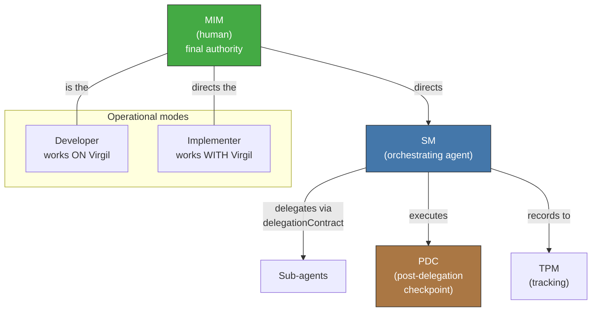

<!-- Virgil Principia
section_id: "vocabulary"
title: "Actor vocabulary"
source: "principia/constitution.md"
source_lines: [63, 99]
layer: identity
constitutional: true
actors: [MIM, Developer, Implementer, Virgil, SM, TPM, PDC]
glossary_terms: [MIM, SM, TPM, PDC, compositeAgent]
depends_on: []
referenced_by: [1, 2, 6]
keywords:
  - actors
  - roles
  - modes
  - Development
  - Consumption
  - vocabulary
  - MIM
  - SM
  - TPM
editorial_additions: [context_paragraph]
-->

> **Context:** This table and diagram define Virgil's canonical actors (MIM, Developer, Implementer, Virgil, SM, TPM, PDC) referenced throughout the Principia, including section "1. What Virgil is" and "6a. Actors and modes".

### Actor vocabulary

| Actor | What it is | When it acts |
|-------|--------|-------------|
| MIM | Human with final decision authority | Always — approves, rejects, breaks ties |
| Developer | Human + agent working ON Virgil | Development Mode |
| Implementer | External agent working WITH Virgil | Consumption Mode |
| Virgil | The binary — knowledge/control plane | Both modes |
| SM | SM (Session Manager) — orchestrating agent. The Method Pack injects this role: in the Scrum Pack it fulfills Scrum Master functions; in other Packs it fulfills the equivalent orchestration role defined by that Pack. Virgil (the binary) is NOT the SM — the SM is a role that operates WITHIN Virgil. | Execution — delegates, verifies, decides |
| TPM | Deliverable-tracking function | Execution — persists state, reports |
| PDC | Post-Delegation Checkpoint (ECHO → VERIFY → MARK → DECIDE) | After every SM delegation |

Delegation and PDC details in section 9c of this document.

> **Delegation of MIM approvals.** In teams where the MIM is also the sole developer, MIM approval points (coverage exceptions, project compliance profile declaration, break-glass) can be consolidated through a documented standing authorization: the MIM issues a project policy that pre-authorizes specific categories, reducing friction without eliminating traceability. Note: what can be delegated is the DECLARATION of the project's regulatory profile, not the activation of the human review gate — that activation is automatic and unconditional once the profile is declared (see section 7g).
