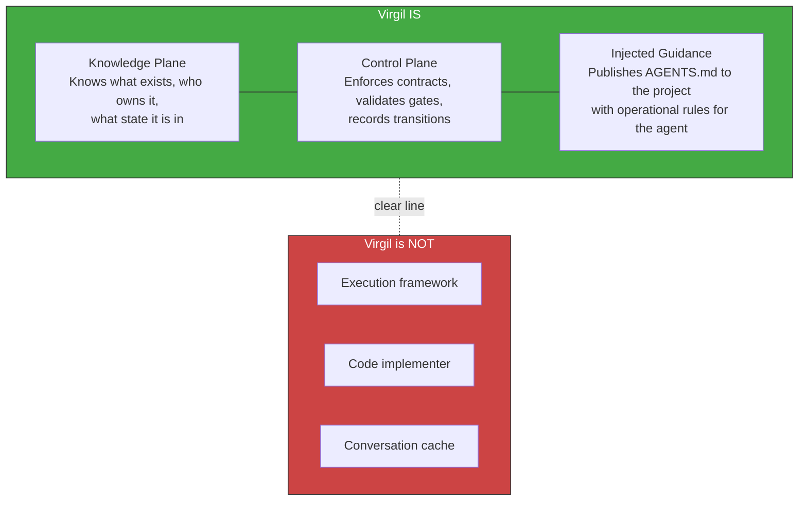

<!-- Virgil Principia
section_id: "1"
title: "What Virgil is"
source: "principia/constitution.md"
source_lines: [100, 146]
layer: identity
constitutional: true
actors: [MIM, Virgil]
glossary_terms: [Virgil, MCP, AGENTS.md, Open Agentic Standard, Kernel, Method Pack]
depends_on: ["vocabulary"]
referenced_by: [1a, 2, 5, 6]
keywords:
  - what Virgil is
  - knowledge plane
  - control plane
  - identity
  - Open Agentic Standard
  - AGENTS.md
-->

## 1. What Virgil is

[↑ Back to index](../README.md)

Virgil is a project's knowledge/control plane. It is not a
framework, it is not a Scrum Master, it does not execute code. It
maintains identity, traceability, context and transitions.

Virgil adheres to the **Open Agentic Standard**: it publishes an
`AGENTS.md` in the consuming project as a discoverability convention, and
communicates via **Model Context Protocol (MCP)** / JSON-RPC. Any
compatible agent can consume Virgil without coupling to a specific
provider.

Virgil does not adopt ceremonial roles (it is not a Scrum Master). But it DOES
inject operational guidance to the consuming agent via AGENTS.md. That guidance
should include:

- Orchestrator-minion pattern (how to delegate work to sub-agents)
- Token ownership and housekeeping (how to manage context)
- Planning boundary and stop conditions (when to stop)

> **Pending definition**: the current AGENTS.md documents the wire protocol and operations. The orchestration pattern and token management will be specified in the corresponding Method Pack, not in this anchor document. This item is out of scope for the Principia.

> **Scope of this document.** The Principia is the foundational dogma: philosophy, architecture and invariants. It is NOT a go-to-market document, an adoption guide, or a user manual. The target consumer profile (ICP), MVP strategy, competitive positioning and onboarding guides are separate deliverables derived FROM the Principia but are not part of it. The Kernel + the Scrum Method Pack (the only one implemented) constitute the minimum viable slice; the other Method Packs, codebaseMemory and extensions are architectural provisions, not v1 requirements.
