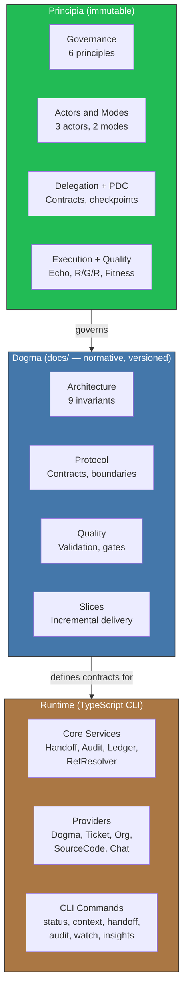

<!-- Virgil Principia
section_id: "2"
title: "How it is (structure)"
source: "principia/constitution.md"
source_lines: [194, 234]
layer: structure
constitutional: true
actors: []
glossary_terms: [Principia, Dogma, Runtime, Provider, Handoff, Ledger]
depends_on: ["vocabulary", "1"]
referenced_by: ["5", "6"]
keywords:
  - structure
  - three concentric layers
  - Principia
  - Dogma
  - Runtime
  - architecture
editorial_additions: [context_paragraph]
-->

> **Context:** This section describes Virgil's three-concentric-layer architecture — Principia, Dogma and Runtime — where each inner layer governs the outer ones.

## 2. How it is (structure)

[↑ Back to index](../README.md)

Three concentric layers. Each inner layer governs the outer ones.

With this immutable structure as foundation, Virgil manifests through predictable lifecycles: a state machine that governs projects and an invocation flow that guarantees traceability at every transition.
