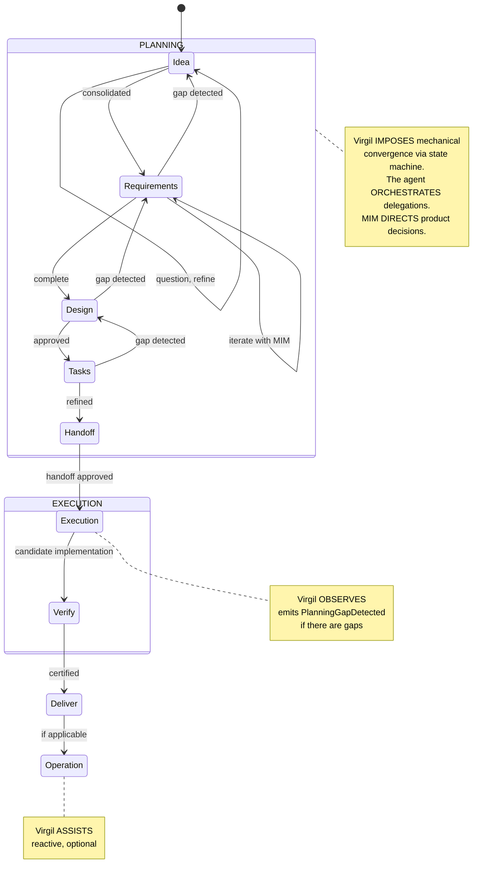

<!-- Virgil Principia
section_id: "3a"
title: "Lifecycle of a project"
source: "principia/constitution.md"
source_lines: [237, 290]
layer: lifecycle
constitutional: false
actors: [MIM]
glossary_terms: [FastForward, PlanningGapDetected]
depends_on: []
referenced_by: [7c-rgr, 11a-11b, 3b]
keywords:
  - lifecycle
  - state machine
  - state machine
  - PlanningGapDetected
  - FastForward
  - planning
  - execution
  - handoff
editorial_additions: [context_paragraph]
-->

> **Context:** MIM (the human who directs product decisions) is the actor that drives this state machine. The orchestrating agent delegates work within the boundaries MIM defines. The lifecycle ceremony can vary — the core services impose mechanical convergence, but the specific ceremony of each phase is configurable.

## 3. How it acts

[↑ Back to index](../README.md)

### 3a. Lifecycle of a project

Each phase iterates until its deliverable is consolidated. It is not a
straight line — it is a loop that converges toward a well-bounded handoff.

The project's state machine (via virgil_status) indicates what
phase each feature and the overall project is in. A feature does not advance
until its deliverable is consolidated.

**PlanningGapDetected**: if execution discovers that an approved
deliverable is ambiguous, contradictory or insufficient, it emits this signal,
blocks only the affected scope and returns control to planning. Execution
never rewrites an approved deliverable.

**FastForward**: the orchestrating agent does not always run all phases with the same
ceremony. It evaluates a certainty gradient (FF-1 to FF-4) over the
existing context and compresses the phases proportionally — from
full ceremony (score 0-2) to direct execution (score 6-8). The agent computes the score based on observable, verifiable state. The scoring formula and its inputs plus result are recorded in the Ledger, making it auditable. FastForward compresses planning CEREMONY (deliberation phases), not quality gates — certification gates run in full at ALL FastForward levels, from FF-1 to FF-4.

> **Runtime note:** The current implementation represents FastForward as `ffLevel` (1-4) in `META.json`. The full scoring formula is an architectural provision for future refinement.
