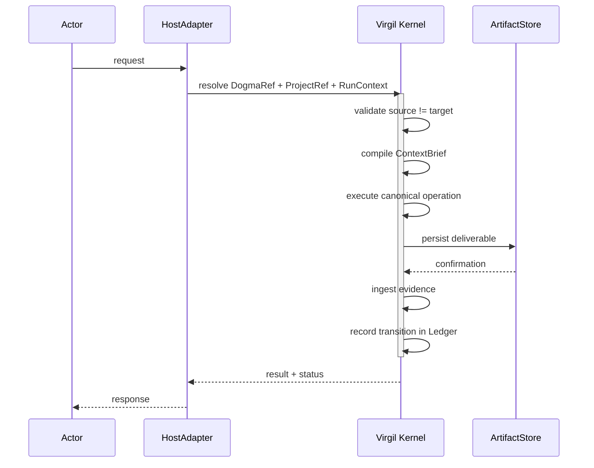

<!-- Virgil Principia
section_id: "3b"
title: "Flow of an invocation"
source: "principia/constitution.md"
source_lines: [291, 329]
layer: lifecycle
constitutional: true
actors: [PDC]
glossary_terms: [ContextBrief, Ledger, PDC, ARCH, DogmaRef, ProjectRef, RunContext]
depends_on: [3a, 9]
referenced_by: [7e, 7g, 11d, 4]
keywords:
  - invocation flow
  - HostAdapter
  - Virgil Kernel
  - ArtifactStore
  - ContextBrief
  - Ledger
  - PDC
  - deterministic gates
  - certification
editorial_additions: [context_paragraph]
-->

> **Context:** This canonical flow occurs within each lifecycle transition described in section 3a. The PDC (Orchestration Delegation Coherence) is an orchestration safeguard — important to distinguish it from the QA pipeline's certification gates (Echo System, detailed in section 7), which are the only ones that determine whether code is certified.

### 3b. Flow of an invocation

This canonical flow has deterministic steps and judgment-mediated steps. Certification gates (test pass/fail, mutation score, CRAP, coverage, CVE scan) are deterministic — binary, without subjectivity. Planning, escalation, ContextBrief compilation, architectural alignment and coherence-verification (PDC) steps involve judgment from the orchestrating agent, are not deterministic, and must leave traceable evidence. The Principia distinguishes both types explicitly.

The PDC is an orchestration-coherence safeguard that operates during
execution, but it is NOT a certification gate. Certification is determined exclusively by the Kernel-defined QA pipeline gates: deterministic mechanical gates (section 7e, 11d) and structured verification of architectural alignment (section 7e, ARCH gate). When the project declares a regulatory compliance profile, human review is added as an additional blocking gate (section 7g). The PDC can stop an incoherent delegation, but it does not certify or approve code.

> **Invocation identities**: `DogmaRef`, `ProjectRef` and `RunContext` are the three identities the HostAdapter resolves at the start of every invocation. This Principia names them as participants in the canonical flow but does not specify their fields — that contract belongs to the protocol layer (docs/protocol/).

> **Atomicity**: the flow shows sequential steps (persist →
> ingest evidence → record transition). If the process fails between
> steps, the recovery mechanism (section 10) reconciles state by
> deriving the current phase from existing deliverables, not from
> a stored pointer. The Ledger implements idempotency: recording
> an already-recorded transition is a no-op.

Behind every step is a deliberate principle we uncover next.
