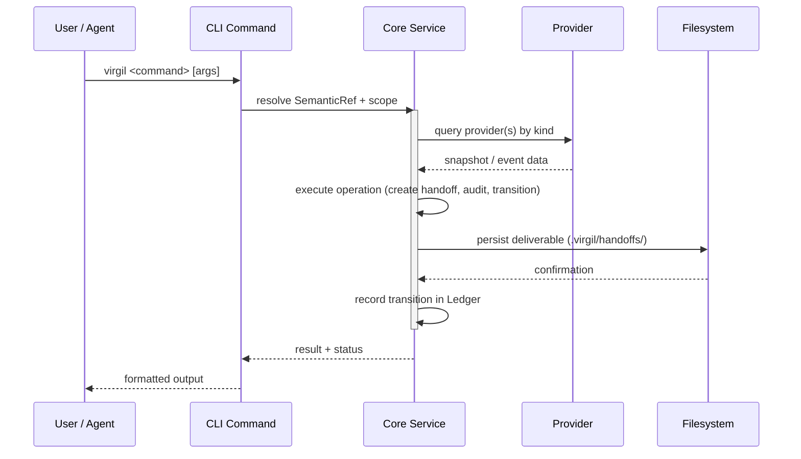

<!-- Virgil Principia
section_id: "3b"
title: "Flow of an invocation"
source: "principia/constitution.md"
source_lines: [291, 329]
layer: lifecycle
constitutional: true
actors: []
glossary_terms: [SemanticRef, Ledger, Provider, Handoff]
depends_on: [3a, 9]
referenced_by: [7e, 7g, 11d, 4]
keywords:
  - invocation flow
  - CLI command
  - Provider
  - SemanticRef
  - Handoff
  - Ledger
  - deterministic gates
  - certification
editorial_additions: [context_paragraph]
-->

> **Context:** This canonical flow occurs within each lifecycle transition described in section 3a. It distinguishes deterministic gates (binary pass/fail) from judgment-mediated steps (planning, escalation, architectural alignment).

### 3b. Flow of an invocation

This canonical flow has deterministic steps and judgment-mediated steps. Certification gates (audit checks: scope, forbidden paths, file count, line count, conflict markers, agent output) are deterministic — binary, without subjectivity. Planning, escalation, and architectural alignment steps involve judgment from the orchestrating agent, are not deterministic, and must leave traceable evidence. The Principia distinguishes both types explicitly.

> **Semantic refs**: `SemanticRef` follows the URI scheme `{kind}://{backend}/{id}` (e.g. `ticket://jira/PROJ-123`, `dogma://local/architecture.md`). The `RefResolverService` dispatches resolution to all providers of the matching kind — first successful resolution wins.

> **Atomicity**: the flow shows sequential steps (persist →
> record transition). If the process fails between
> steps, the recovery mechanism (section 10) reconciles state by
> deriving the current phase from existing deliverables, not from
> a stored pointer. The Ledger implements idempotency: recording
> an already-recorded transition is a no-op.

Behind every step is a deliberate principle we uncover next.
