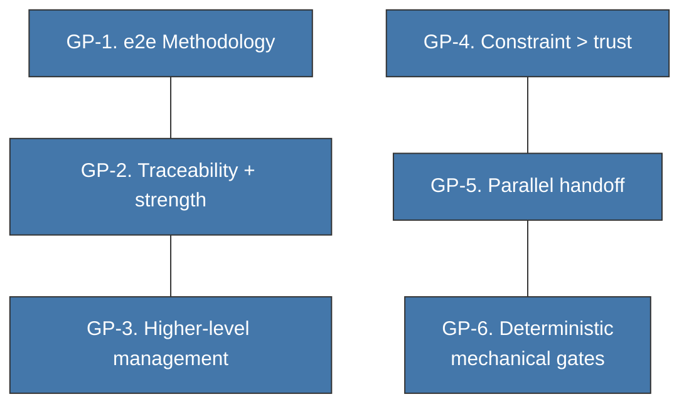
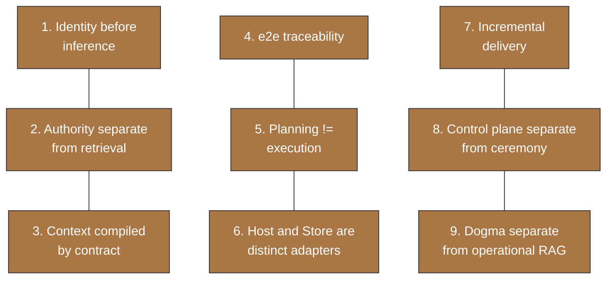
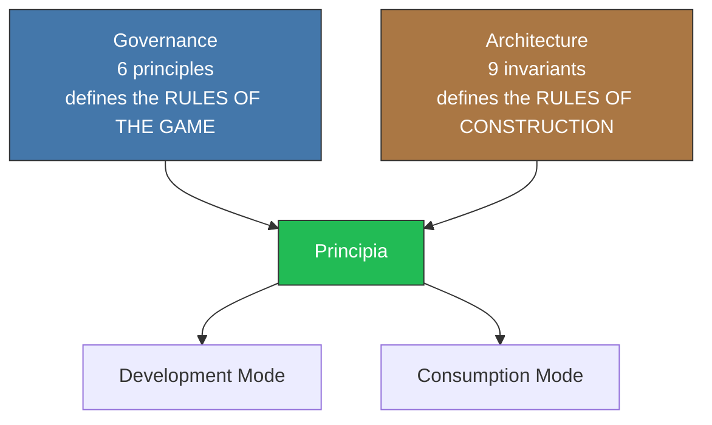

<!-- Virgil Principia
section_id: "4"
title: "Why it acts this way — Governance and Architecture"
source: "principia/constitution.md"
source_lines: [332, 416]
layer: principles
constitutional: true
actors: []
glossary_terms: [Governance, Architecture, Principia, Development Mode, Consumption Mode, ARCH]
depends_on: ["3b"]
referenced_by: ["5", "7e", "11d"]
keywords:
  - governance
  - architecture
  - governance principles
  - architectural invariants
  - constraint over trust
  - parallel handoff
  - deterministic mechanical gates
  - identity before inference
  - end-to-end traceability
  - Development Mode
  - Consumption Mode
-->

**In this chunk:**
- [4a. Governance — HOW it is governed](#4a-governance--how-it-is-governed)
- [4b. Architecture — HOW it is built](#4b-architecture--how-it-is-built)
- [4c. How the two layers relate](#4c-how-the-two-layers-relate)

## 4. Why it acts this way

[↑ Back to index](../README.md)

Two complementary layers of principles. They are not mixed.

### 4a. Governance — HOW it is governed

| # | Principle | In one sentence |
|---|-----------|-------------|
| 1 | e2e Methodology | Idea → certified code → operation. No jumps. |
| 2 | Traceability + strength | It is not enough for the link to exist; it must be strong. |
| 3 | Higher-level management | Health dashboard, not line-by-line review. |
| 4 | Constraint > trust | Enforceable constraints and gates, not agent promises. |
| 5 | Parallel handoff | Claiming over a handoff, not separate handoffs. |
| 6 | Deterministic mechanical gates | Binary at execution: passes or does not pass. Planning and escalation involve judgment; structured verification (ARCH) remains bounded and traceable (see 7e). |

### 4b. Architecture — HOW it is built

### 4c. How the two layers relate

Both layers of principles converge in the Principia. What remains is to
know their components: what pieces implement these rules.
