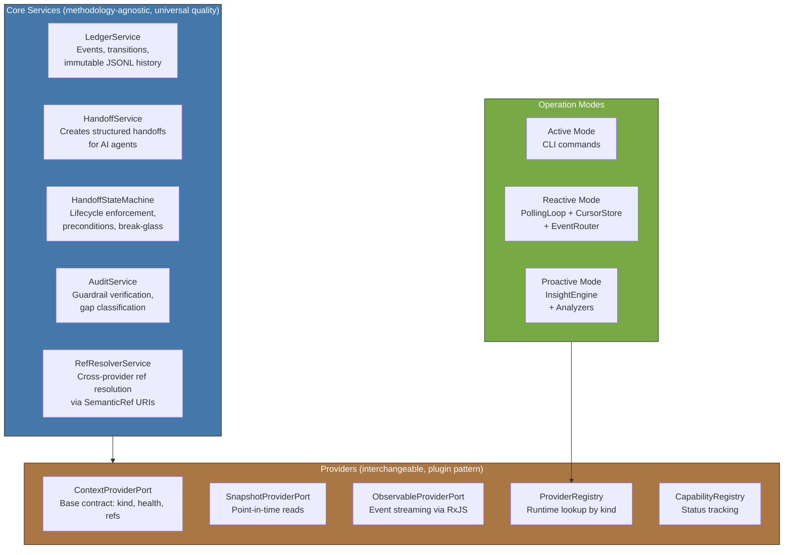

<!-- Virgil Principia
section_id: "5"
title: "What parts compose it"
source: "principia/constitution.md"
source_lines: [419, 459]
layer: components
constitutional: true
actors: []
glossary_terms: [Ledger, Provider, ProviderRegistry, CapabilityRegistry, HandoffService, HandoffStateMachine, AuditService, RefResolver, InsightEngine, PollingLoop, ContextProviderPort, SnapshotProviderPort, ObservableProviderPort]
depends_on: ["4", "1", "2"]
referenced_by: ["6", "8", "10"]
keywords:
  - components
  - core services
  - providers
  - port hierarchy
  - Ledger
  - HandoffService
  - AuditService
  - ProviderRegistry
  - CapabilityRegistry
  - RefResolver
  - InsightEngine
  - PollingLoop
  - methodology-agnostic
  - universal quality
editorial_additions: [context_paragraph, synonym_note]
-->

> **Context:** The distinction between "universal quality" (core services) and "ceremony" (methodology configuration) stems from the two layers of principles described in section 4: governance (the rules of the game) and architecture (the rules of construction). This component catalog is where both layers materialize into concrete pieces.

## 5. What parts compose it

[↑ Back to index](../README.md)

Each component has a clear responsibility. The core services impose universal
quality invariants (audit checks, state machine preconditions, ledger
recording) regardless of methodology. The handoff lifecycle is currently
methodology-agnostic by design.

> **[Architectural provision — not yet implemented]** Methodology extensions
> (analogous to the originally envisioned Method Packs) could define additional
> ceremony: how many roles participate, which ceremonial gates get compressed,
> how iteration works. Quality belongs to the core services; ceremony would
> belong to the methodology extension. An extension could define ADDITIONAL
> quality mechanisms but could not reduce the core's minimum gates.

> **[Architectural provision — not yet implemented]** RAG (RetrievalProjection)
> as a vectorized read projection over provider snapshots. Currently, providers
> deliver raw snapshots; the RAG layer would add semantic retrieval and bounded
> context compilation.
