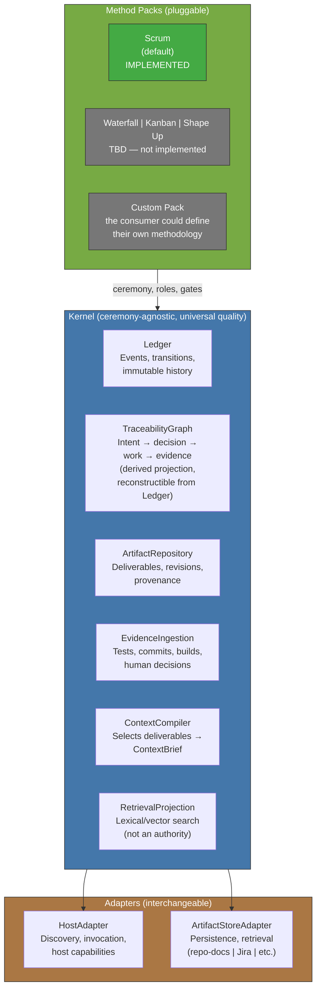

<!-- Virgil Principia
section_id: "5"
title: "What parts compose it"
source: "principia/constitution.md"
source_lines: [419, 459]
layer: components
constitutional: true
actors: []
glossary_terms: [Kernel, Ledger, TraceabilityGraph, ArtifactRepository, EvidenceIngestion, ContextCompiler, RetrievalProjection, HostAdapter, ArtifactStoreAdapter, Method Pack, ContextBrief]
depends_on: ["4", "1", "2"]
referenced_by: ["6", "8", "10"]
keywords:
  - components
  - Kernel
  - Adapters
  - Method Packs
  - Ledger
  - TraceabilityGraph
  - ArtifactRepository
  - EvidenceIngestion
  - ContextCompiler
  - RetrievalProjection
  - HostAdapter
  - ArtifactStoreAdapter
  - Scrum
  - ceremony-agnostic
  - universal quality
editorial_additions: [context_paragraph, synonym_note]
-->

> **Context:** The distinction between "universal quality" (Kernel) and "ceremony" (Method Pack) stems from the two layers of principles described in section 4: governance (the rules of the game) and architecture (the rules of construction). This component catalog is where both layers materialize into concrete pieces.

## 5. What parts compose it

[↑ Back to index](../README.md)

> **Synonym**: `RetrievalProjection` is the formal name of the Kernel component; `RAG` is the operational term used in the rest of this document. Both designate the same reconstructible read projection.

Each component has a clear responsibility. The Kernel imposes universal
quality invariants (Echo, testing, binding layer) regardless of
methodology. The Method Pack defines the ceremony: how many roles participate,
which ceremonial gates get compressed, how it iterates. Quality belongs to the
Kernel; ceremony belongs to the Pack.

Method Packs inherit quality gates (Red/Green/Refactor, mutation testing,
fitness functions) as non-negotiable universal invariants. A Pack can define
ADDITIONAL quality mechanisms but cannot reduce the Kernel's minimum.
"Ceremony-agnostic" means the Pack chooses the ceremony (sprints, kanban
boards, Shape Up cycles); "universal quality" means the R/G/R verification
pipeline + fitness functions apply without exception, regardless of the
ceremony chosen.
