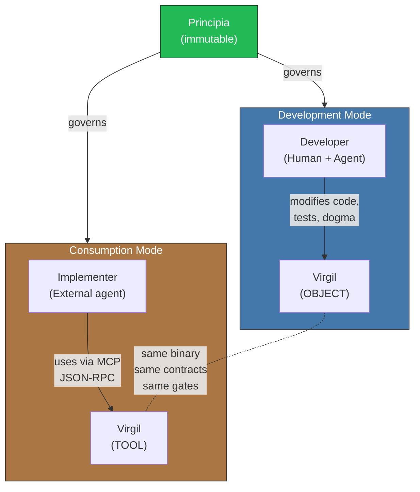
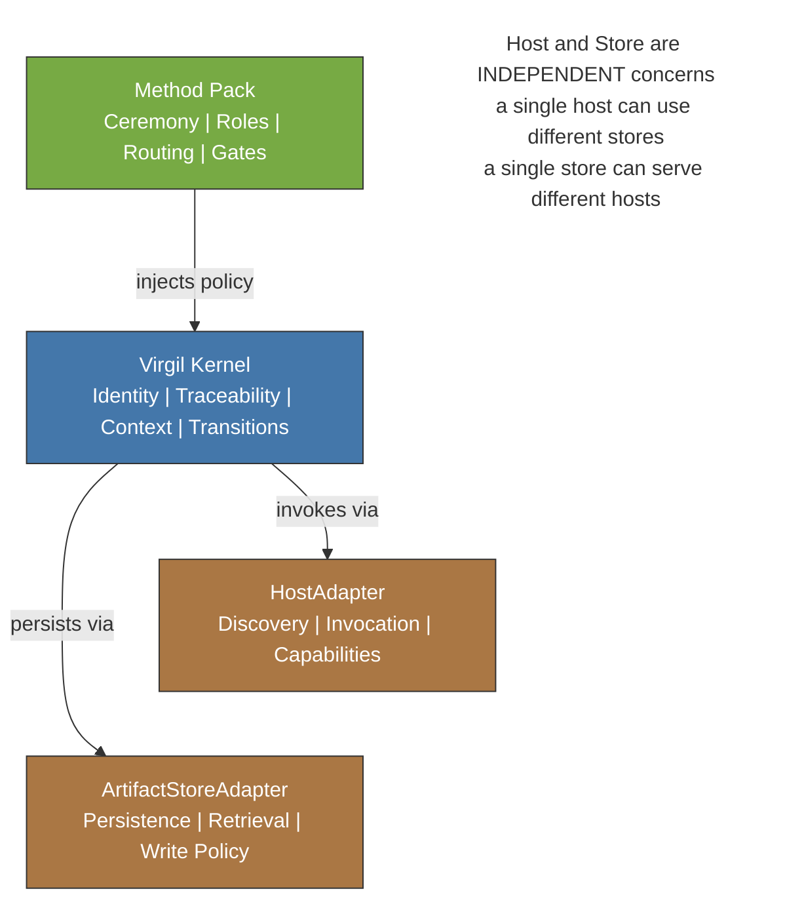
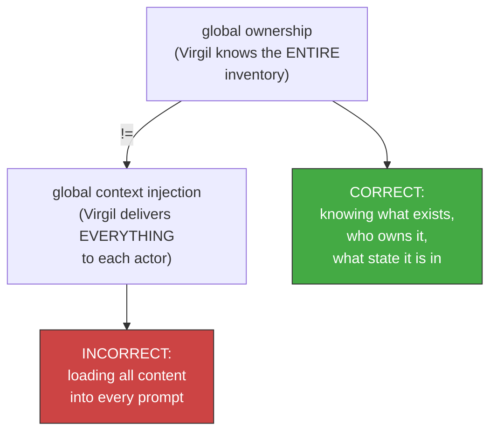

<!-- Virgil Principia
section_id: "6"
title: "How the parts interact"
source: "principia/constitution.md"
source_lines: [462, 534]
layer: interaction
constitutional: true
actors: [Developer, Implementer]
glossary_terms: [Development Mode, Consumption Mode, Principia, Method Pack, HostAdapter, ArtifactStoreAdapter, global ownership, global context injection]
depends_on: ["5", "vocabulary", "1", "2"]
referenced_by: ["authority"]
keywords:
  - actors and modes
  - Development Mode
  - Consumption Mode
  - separation of concerns
  - Method Pack
  - HostAdapter
  - ArtifactStoreAdapter
  - global ownership
  - global context injection
  - fundamental invariant
  - MCP JSON-RPC
editorial_additions: [context_paragraph]
-->

> **Context:** Method Pack, HostAdapter and ArtifactStoreAdapter are the components described in section 5 (parts catalog); here we show how those components and Virgil's two operational modes interact with each other without mixing responsibilities.

**In this chunk:**
- [6a. Actors and modes](#6a-actors-and-modes)
- [6b. Separation of concerns](#6b-separation-of-concerns)
- [6c. Fundamental invariant](#6c-fundamental-invariant)

## 6. How the parts interact

[↑ Back to index](../README.md)

### 6a. Actors and modes

### 6b. Separation of concerns

Each piece has clear ownership. They are not mixed.

### 6c. Fundamental invariant

These fundamental invariants — what Virgil knows without inflating contexts — apply identically in both operational modes, producing a notable property: Virgil is both tool and object under the same rules.
