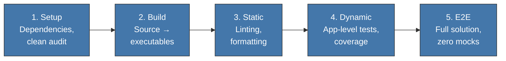

<!-- Virgil Principia
section_id: "7a"
title: "Echo System — deterministic pipeline"
source: "principia/constitution.md"
source_lines: [537, 576]
layer: quality
constitutional: true
actors: [SM, MIM]
glossary_terms: [Echo System, EchoRun, build artifact]
depends_on: []
referenced_by: [7b, 7c-rgr, 7e, 7h-pinning, 8f-construction, 11a-11b, 11f, 1a]
keywords:
  - Echo System
  - deterministic pipeline
  - Setup
  - Build
  - Static
  - Dynamic
  - E2E
  - dev CI CD
  - automatic triggers
  - pre-commit pre-push
editorial_additions: [context_paragraph]
-->

> **Context:** This section opens chapter 7 ("How it guarantees quality"), which describes eight nested accountability mechanisms. The first is the Echo System, the deterministic pipeline that produces the build artifacts the remaining gates consume.

## 7. How it guarantees quality

Eight mechanisms form a nested accountability cycle. None
works in isolation.

### 7a. Echo System — deterministic pipeline

Sequence of 5 steps executed in EVERY environment (dev, CI, CD).
The steps are always the same and in the same order. What varies
is the scope (dev prioritizes fast feedback, CI prioritizes completeness).

| Environment | Scope | Default trigger | Enforcement |
|----------|-------|---------------------|-------------|
| Dev | Selective, fast feedback | git hooks | Pre-commit, pre-push |
| CI | Complete | Push, PR | Pipeline stages |
| CD | Absolute trust | Tag, merge to main | Deployment gates |

Triggers are operation adapters and can change per project; **Echo does not change**. A project can fire the same scope via hooks, CI, a local runner or another mechanism as long as: (a) it produces the same Echo contract and its identified build artifacts, and (b) the trigger is automatic — not skippable by the executing agent.

In the default configuration, pre-commit hooks run STRUCTURAL fast-feedback checks (lint, type-check, formatting, static analysis). Integration tests against a real stack (App/Service tier) run at pre-push or in the CI pipeline, not at pre-commit. "Fast feedback" in the Dev context refers to structural checks, not the full integration suite.
