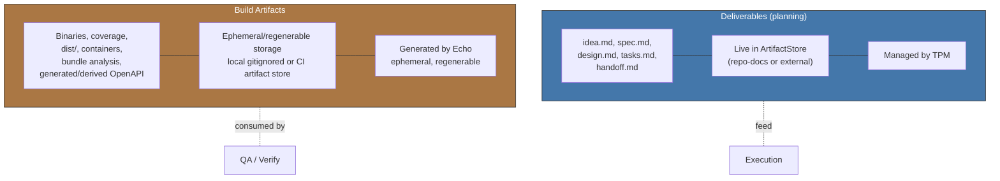

<!-- Virgil Principia
section_id: "7b"
title: "Deliverables vs Build Artifacts"
source: "principia/constitution.md"
source_lines: [577, 617]
layer: quality
constitutional: true
actors: [TPM]
glossary_terms: [deliverable, build artifact, ArtifactStore, EchoRun, sourceRevision, buildArtifactSet, prePhase]
depends_on: [7a, 8c-watermark]
referenced_by: [8, 11f, 1a]
keywords:
  - deliverables
  - build artifacts
  - ArtifactStore
  - ArtifactRepository
  - ArtifactStoreAdapter
  - PMBOK ISO 21500
  - DevOps CI-CD
  - evidence traceability
  - OpenAPI
editorial_additions: [context_paragraph]
-->

> **Context:** This section belongs to chapter 7 ("How it guarantees quality"). It distinguishes planning outputs (deliverables) from the outputs of the Echo System described in 7a (build artifacts), a terminological distinction the rest of the Principia treats as canonical.

### 7b. Deliverables vs Build Artifacts

Two types of outputs that must not be confused. Planning
documents are **deliverables** (PMBOK/ISO 21500). Build
pipeline outputs are **build artifacts** (DevOps/CI-CD). Virgil manages
deliverables; the Echo System generates build artifacts.

> **Nomenclature**: Virgil's code uses "Artifact" in entities
> such as ArtifactStore, ArtifactRepository and ArtifactStoreAdapter. These
> entities manage **deliverables**, not build artifacts. The
> code nomenclature is historical; this Principia defines the
> canonical terminology.

> **Evidence identity**: every set of build artifacts MUST be unambiguously linked to the `EchoRun` and the `sourceRevision` that produced it. QA never certifies "the latest report" implicitly; it certifies a `buildArtifactSet` attributable to a concrete revision. The artifact's physical location may vary; its identity and provenance may not.

> **OpenAPI**: the source contract defined in `prePhase` is a normative deliverable/contract. An OpenAPI JSON/YAML generated by the build from that contract or from the code is a derived build artifact. They do not share authority even if they may represent the same interface.
