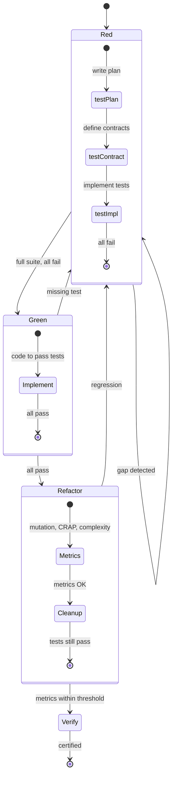

<!-- Virgil Principia
section_id: "7c-rgr"
title: "Macro Red/Green/Refactor — batch TDD"
source: "principia/constitution.md"
source_lines: [618, 661]
layer: quality
constitutional: true
actors: []
glossary_terms: [Red, Green, Refactor, R0, R1, G1, F1, V1]
depends_on: [7a, 3a]
referenced_by: [7c-composite, 7d-tiers, 7d-binding, 11a-11b]
keywords:
  - macro TDD
  - Red Green Refactor
  - test plan
  - test contract
  - mutation testing
  - CRAP
  - gates R0 R1 G1 F1 V1
  - batch TDD
editorial_additions: [context_paragraph]
-->

> **Context:** This section belongs to chapter 7 ("How it guarantees quality"), immediately after the deliverables vs build artifacts distinction (7b). It describes the macro TDD cycle that structures the execution of a complete batch, before introducing the compositeAgent that parallelizes it (section 7c-composite).

### 7c. Macro Red/Green/Refactor — batch TDD

TDD at the batch level, not function by function. First the ENTIRE
test suite, then ALL the implementation, then ALL the refactoring.

The dogma defines 5 gates within this cycle:
**R0** (complete handoff) → **R1** (valid red) → **G1** (production-safe
green) → **F1** (safe refactor) → **V1** (independent
verify).

> **[Implementation status]** Execution sub-phases (prePhase → Red → Green → Refactor → Verify) and their gates are an architectural provision. The current runtime treats `execution` as a single monolithic state in the handoff lifecycle state machine. Sub-phase tracking is on the roadmap as a refinement of the execution state.
