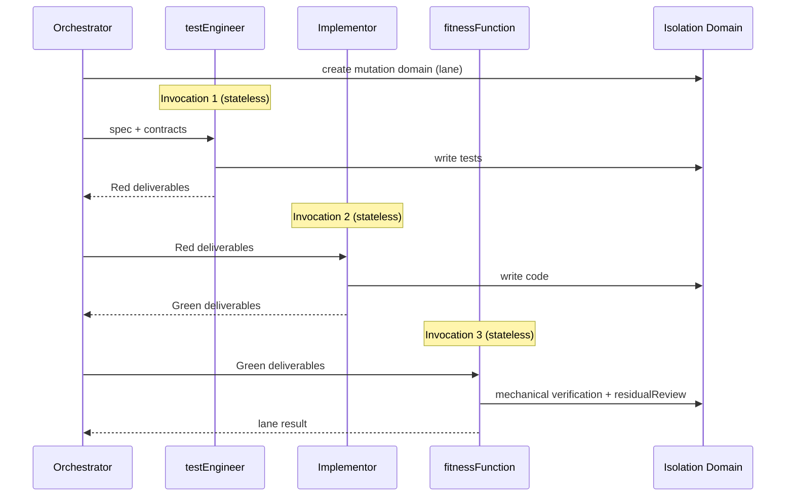

<!-- Virgil Principia
section_id: "7c-composite"
title: "compositeAgent — parallel execution of R/G/R"
source: "principia/constitution.md"
source_lines: [662, 711]
layer: quality
constitutional: true
actors: [SM, testEngineer, Implementor, fitnessFunction]
glossary_terms: [compositeAgent, mutation domain, worktree, delegationContract]
depends_on: [7c-rgr, 8f-construction]
referenced_by: [8f-construction, 11c]
keywords:
  - compositeAgent
  - mutation domain
  - worktree
  - filesystem isolation
  - stateless invocation
  - independence invariant
  - GP-4 constraint over trust
  - parallel lanes
editorial_additions: [context_paragraph, synonym_note]
-->

> **Context:** Continues directly from section 7c (Macro Red/Green/Refactor). When the execution of a batch is parallelized across multiple lanes, each lane uses a compositeAgent to traverse Red/Green/Refactor within an isolated domain. Mutation domains are also mentioned in sections 8f (structural code graph) and 11c (git strategy).

#### compositeAgent — parallel execution of R/G/R

When execution is parallelized across multiple lanes, each lane operates
within an **isolated mutation domain** and receives a compositeAgent: a
sub-agent that sequentially assumes multiple personalities within
that same domain, avoiding filesystem conflicts. Worktrees are the
current Dogma's reference implementation. The Principia's invariant
is isolation, not the mechanism: a valid mutation domain
must provide (a) isolated filesystem that does not interfere with other lanes,
(b) conflict detection at integration, and (c) per-lane revision
identity.

> **Synonym**: `Isolation Domain` is the descriptive name used in the sequence diagram; `mutation domain` is the canonical glossary term. Both designate the isolation domain in which an execution lane operates.

| Phase | Invocation | Responsibility |
|------|-----------|-----------------|
| Red | testEngineer (independent session) | Write tests per spec |
| Green | Implementor (independent session) | Code that passes the tests |
| Refactor | fitnessFunction (independent session) | Mutation, CRAP, complexity + residualReview |

A compositeAgent is NOT a monolithic agent — it is a SEQUENCE of
independent invocations orchestrated under a common label.
Each phase has its own contract and exit criteria.

**Independence invariant**: each compositeAgent phase (testEngineer, Implementor, fitnessFunction) runs as an independent agent invocation — new session, no conversational history. The runtime implements this reset as a technical constraint (stateless invocation per phase), not as an instruction to the agent. Each phase receives only the deliverables and build artifacts produced by the previous phase, not the reasoning history. This mechanism satisfies Principle GP-4 (constraint > trust): independence is structural, not a promise of behavior.

> **Disambiguation**: "fitness functions" (plural, generic) designates a CATEGORY of quality gate (alongside mutation testing and R/G/R) applicable to the entire pipeline. `fitnessFunction` (singular, camelCase) designates a SPECIFIC invocation ROLE within the compositeAgent sequence (testEngineer → Implementor → fitnessFunction). Do not confuse them: the category is universal; the role is an invocation instance within a mutation domain.
