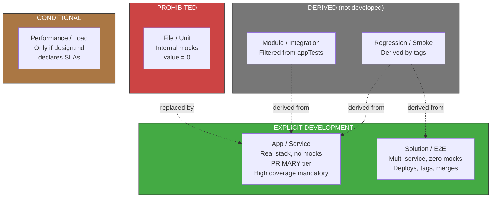

<!-- Virgil Principia
section_id: "7d-tiers"
title: "Testing Matrix — boundary model"
source: "principia/constitution.md"
source_lines: [712, 750]
layer: quality
constitutional: true
actors: []
glossary_terms: [Testing Matrix, File/Unit, Module/Integration, App/Service, Solution/E2E, Performance/Load, T0, T1, T2]
depends_on: [7c-rgr]
referenced_by: [7d-binding, 7e, 7f]
keywords:
  - testing matrix
  - mock boundary
  - testing pyramid
  - App/Service primary tier
  - Solution E2E
  - zero mocks
  - T0 protocol app replay
  - T1 agent-in-the-loop
  - T2 host-adapter conformance
editorial_additions: [context_paragraph]
-->

> **Context:** Belongs to chapter 7 ("How it guarantees quality"), immediately after the Red/Green/Refactor cycle (7c). It defines where the mock boundary must be placed for a test to have value, replacing the classic testing pyramid with a boundary model.

### 7d. Testing Matrix — boundary model

The value of a test depends on WHERE the mock boundary is placed,
not on the classic pyramid.

Virgil's current dogma also defines T0 (protocol/app replay),
T1 (agent-in-the-loop) and T2 (host-adapter conformance) as
specific levels for validating Virgil itself.
