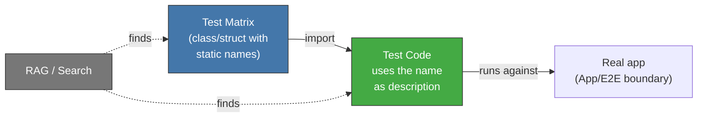

<!-- Virgil Principia
section_id: "7d-binding"
title: "Binding Layer — link confidence"
source: "principia/constitution.md"
source_lines: [751, 792]
layer: quality
constitutional: true
actors: []
glossary_terms: [Binding Layer, declared, inferred, verified, AC]
depends_on: [7c-rgr, 7d-tiers]
referenced_by: [11f]
keywords:
  - matrix-to-code traceability
  - RAG-searchable
  - Binding Layer
  - declared inferred verified
  - mutation testing confirms strength
  - static readonly
  - acceptance criteria
editorial_additions: [context_paragraph]
-->

> **Context:** Closes section 7d (Testing Matrix), continuing chapter 7 ("How it guarantees quality"). It first describes how test cases defined as a matrix during Red are linked to the test code, and then the three confidence levels (Binding Layer) that link traverses during the R/G/R cycle described in 7c. The full detail of the Binding Layer lives in its own document and is also referenced in section 11f (evidence as queryable data).

#### Traceability pattern: matrix → code

During Red, test cases are defined as a matrix with
static names. The test code imports those names. This
creates a RAG-searchable link from the documented matrix to the
test implementation.

The pattern is technology-agnostic: in TypeScript it's a class with
`static readonly`, in Go it would be a `const` block or struct, in Rust a
`mod` with constants. What matters is that the matrix and the test
share a traceable identifier.

#### Binding Layer — link confidence

The link between a test and the code that satisfies it is not binary
(exists/does not exist). It has three levels of confidence that progress
during the R/G/R cycle:

| State | Phase | Guarantees |
|--------|------|-----------|
| declared | Red | The test exists and references an AC |
| inferred | Green | A hook detected that code exercises the test |
| verified | Refactor | Mutation testing confirmed real strength |

Only `verified` certifies strength — the others only confirm
existence.
