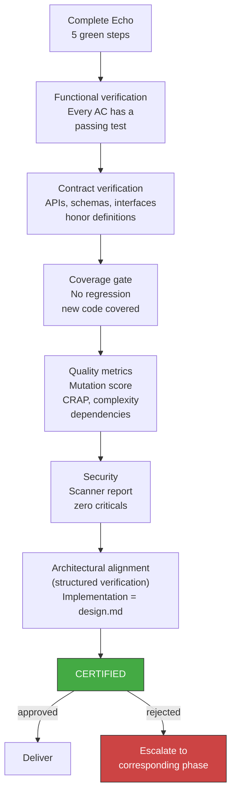

<!-- Virgil Principia
section_id: "7e"
title: "QA / Acceptance Gates — certification"
source: "principia/constitution.md"
source_lines: [793, 814]
layer: quality
constitutional: true
actors: [QA]
glossary_terms: [mechanical gate, structured verification gate, ARCH, CERTIFIED]
depends_on: [7a, 7d-tiers, 3b, 4]
referenced_by: [11e-routing, 1a, 11a-11b, 11d]
keywords:
  - QA
  - acceptance gates
  - certification
  - mutation score
  - CRAP
  - CVE scan
  - coverage gate
  - architectural alignment
  - semantic comparison
  - escalate to phase
editorial_additions: [context_paragraph]
-->

> **Context:** Belongs to chapter 7 ("How it guarantees quality"). It describes the final gate that certifies the result by combining deterministic mechanical verifications (produced by the Echo System from 7a) with structured verification of architectural alignment, subject to the same epistemic demarcation described in section 3b of the Principia.

### 7e. QA / Acceptance Gates — certification

Certification combines deterministic mechanical gates (test pass/fail, mutation score, coverage, CRAP, CVE scan, module size) and structured verification gates (architectural alignment). Mechanical gates are binary: they pass or they do not. Structured verification gates (ARCH: implementation aligned with design.md) use documented, traceable semantic comparison, subject to the same demarcation as section 3b.

