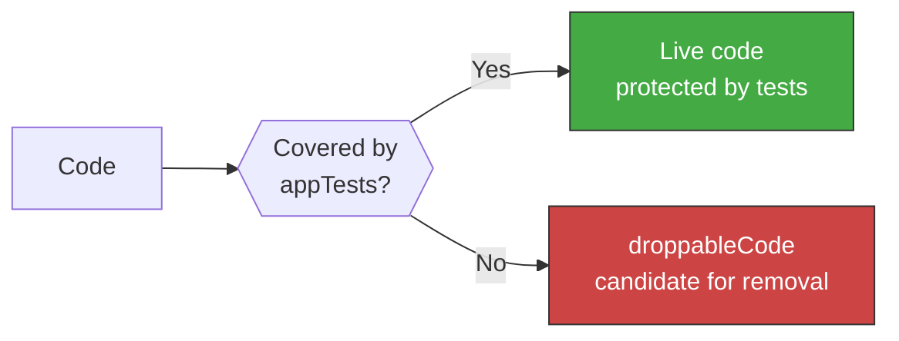

<!-- Virgil Principia
section_id: "7f"
title: "droppableCode — coverage as a tool"
source: "principia/constitution.md"
source_lines: [815, 842]
layer: quality
constitutional: true
actors: [MIM]
glossary_terms: [droppableCode, safeToAutoDelete, selective coverage]
depends_on: [7d-tiers]
referenced_by: [7g]
keywords:
  - droppableCode
  - safeToAutoDelete
  - dead code
  - coverage threshold
  - documented exceptions
  - mutation testing exceptions
  - automatic mechanical removal
editorial_additions: [context_paragraph]
-->

> **Context:** Belongs to chapter 7 ("How it guarantees quality"). It uses test coverage from the App/Service tier (defined in section 7d, Testing Matrix) not as a vanity metric but as a dead-code detector.

### 7f. droppableCode — coverage as a tool

Code with 0% coverage in appTests has no justification to
exist. Coverage is not a vanity metric — it is a dead-code
detector.

Code detected as droppableCode must be removed or justify its existence with an explicit, documented and reviewable exception. The concept **safeToAutoDelete** identifies the subset of droppableCode that meets mechanical safe-removal criteria: **no live dependents, no observed execution over N cycles, and no transitive coverage**. safeToAutoDelete enables automatic mechanical removal; droppableCode without those criteria requires a human decision (remove or justify exception).

The coverage threshold is mandatory and **never reduced**
without explicit MIM authorization. It is measured only on files with
real logic (selective coverage). Documented exceptions: defensive
code for rare failure modes, feature-flag paths not currently active,
adapter boilerplate for external interfaces not yet exercised,
and legacy code in the process of migration. Every exception requires an
explicit tag in the file and periodic review.

The same exception mechanism applies to mutation testing: the MIM may authorize documented exceptions for code where mutation testing is computationally prohibitive (heavy integration test suites, generated code, third-party adapters). Every exception requires an explicit tag, justification and periodic review. Mutation-score thresholds remain non-relaxable for non-exempted code.

> **[Implementation status]** droppableCode is an architectural provision — not yet implemented in the runtime. The principle is valid and will be enforced once coverage tooling is integrated with the Echo pipeline.
