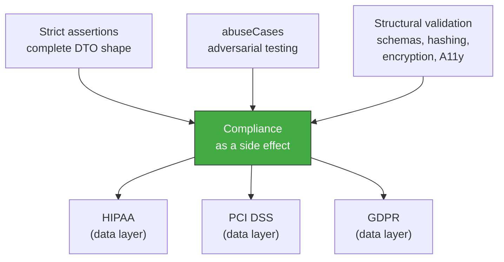

<!-- Virgil Principia
section_id: "7g"
title: "complianceByDesign — compliance as a side effect"
source: "principia/constitution.md"
source_lines: [843, 868]
layer: quality
constitutional: false
actors: [MIM]
glossary_terms: [complianceByDesign, abuseCases, compliance profile]
depends_on: [7f, 3b]
referenced_by: [11d]
keywords:
  - complianceByDesign
  - strict DTO assertions
  - abuseCases
  - structural validation
  - HIPAA
  - PCI DSS
  - GDPR
  - mandatory human review
  - regulatory blocking gate
editorial_additions: [context_paragraph]
-->

> **Context:** Belongs to chapter 7 ("How it guarantees quality"). It is conditional: the technical capability described here is universal, but activation of the human-review gate depends on whether the project declares a regulatory compliance profile — which is why this chunk is not constitutional in the same sense as the mechanical quality mechanisms.

### 7g. complianceByDesign — compliance as a side effect

If every test asserts the EXACT shape of the DTO (fields present,
fields absent, types), compliance verification is obtained without
separate suites.

Scope: covers EXCLUSIVELY the technical data-controls layer
(minimization, field-level access control, shape validation). It does NOT
cover organizational, physical, legal, procedural controls
or segregation of duties. When the project declares a regulatory compliance profile (HIPAA, PCI DSS, GDPR), the Method Pack MUST activate mandatory human review over authorization logic and domain modeling as a blocking gate. This activation is automatic for regulated profiles, not opt-in. For projects without a regulatory profile, human review remains optional and non-blocking. The Principia defines the technical capability; the project's compliance profile determines whether human review is required.
