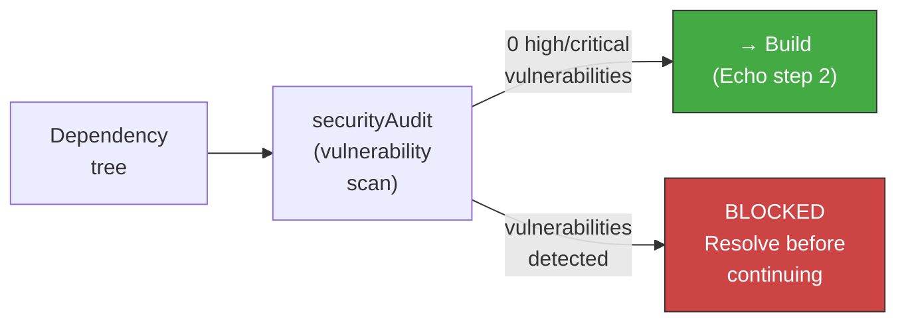

<!-- Virgil Principia
section_id: "7h-pinning"
title: "Supply Chain Integrity — versionPinning and securityAudit"
source: "principia/constitution.md"
source_lines: [869, 908]
layer: quality
constitutional: true
actors: []
glossary_terms: [versionPinning, securityAudit, lock file]
depends_on: [7a]
referenced_by: [7h-bump]
keywords:
  - supply chain integrity
  - versionPinning
  - exact version
  - lock file
  - securityAudit
  - vulnerability scan
  - Setup blocking gate
  - pnpm audit go vuln cargo audit pip-audit
editorial_additions: [context_paragraph]
-->

> **Context:** Opens section 7h of chapter 7 ("How it guarantees quality"), on supply chain integrity. The securityAudit described here is a blocking gate of step 1 (Setup) of the Echo System defined in section 7a.

### 7h. Supply Chain Integrity — secure dependencies

External dependencies are attack surface and a source of tech debt. Virgil imposes three invariants on the supply chain, agnostic of language and platform.

#### versionPinning — absolute reproducibility

All dependencies are declared with an EXACT version (no ranges, no compatibility prefixes). The dependency manager and its version are also declared explicitly in the project.

| Invariant | What it means | Why |
|------------|--------------|-----|
| Exact version | `1.2.3`, never `^1.2.3` or `~1.2.3` | Eliminates version drift between environments. What runs in CI is what runs in production |
| Versioned dependency manager | Manager version pinned to the project | Guarantees dependency-resolution parity across all environments |
| Lock file as artifact | The lock file is versioned and honored as source of truth | Captures the complete tree of transitive dependencies |

The invariant applies regardless of ecosystem (npm/pnpm/yarn, Go modules, Cargo, pip/uv, Maven/Gradle, etc.). The concrete implementation varies; the principle is universal: **zero version ambiguity**.

#### securityAudit — dependency gate

Before building, a vulnerability scan runs over the dependency tree. This check is a BLOCKING gate of step 1 (Setup) of the Echo System (section 7a).

| Environment | Behavior |
|----------|---------------|
| Dev | Pre-push hook — warns, does not block |
| CI | Pipeline stage — blocking gate |
| CD | Deployment gate — absolute block |

The severity threshold (high, critical, or both) is defined by the Method Pack. The Kernel enforces that the scan runs; the Pack decides the threshold. The scanning tool is agnostic: each ecosystem has its equivalent (`pnpm audit`, `go vuln check`, `cargo audit`, `pip-audit`, `mvn dependency-check`, etc.).
