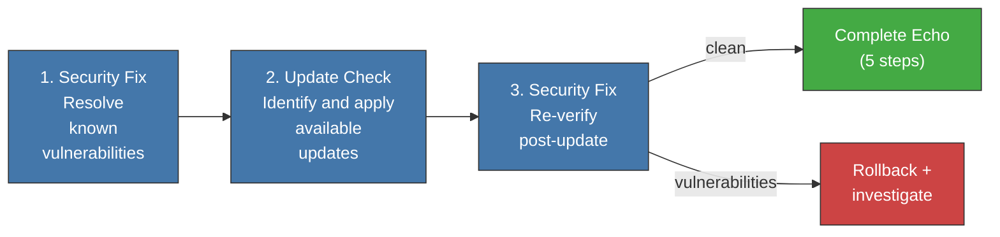

<!-- Virgil Principia
section_id: "7h-bump"
title: "bumpDependencies and the closed quality cycle"
source: "principia/constitution.md"
source_lines: [909, 948]
layer: quality
constitutional: true
actors: [MIM]
glossary_terms: [bumpDependencies, closed cycle]
depends_on: [7h-pinning]
referenced_by: []
keywords:
  - bumpDependencies
  - tech debt
  - update check
  - security fix
  - rollback
  - dependency maintenance
  - closed cycle
  - QA certifies result
editorial_additions: [context_paragraph]
-->

> **Context:** Closes section 7h of chapter 7 ("How it guarantees quality"), on supply chain integrity. Complements the versionPinning and securityAudit described in the earlier part of 7h: while those invariants fix exact versions, bumpDependencies is the controlled process that updates them without reintroducing risk. The last subsection ("Closed cycle") summarizes how all the mechanisms of chapter 7 fit together.

#### bumpDependencies — controlled tech-debt mitigation

Exact versions prevent drift but accumulate tech debt if not updated. The bumpDependencies cycle resolves this tension with a three-step process:

1. **Security Fix**: resolve known vulnerabilities in current versions
2. **Update Check**: run an update checker that identifies new versions of all dependencies, applying updates with an exact version (without introducing ranges)
3. **Security Fix**: re-run the security scan against the updated versions — an update can INTRODUCE new vulnerabilities

After the complete cycle, the full Echo System runs (5 steps). If any gate fails, the update is reverted and the cause is investigated.

bumpDependencies is not an Echo step — it is a maintenance process that PRECEDES Echo. It runs explicitly (not automatically), typically on a cadence defined by the team (weekly, per sprint, or pre-release). The MIM may delegate the cadence to the Method Pack.

### Closed cycle

These mechanisms form a closed cycle: Echo executes, build
artifacts capture outputs, Red/Green/Refactor structures the execution
(parallelizable via compositeAgent), the Testing Matrix defines what counts
as proof, droppableCode detects dead code, complianceByDesign
verifies compliance, Supply Chain Integrity ensures secure and
up-to-date dependencies, and QA certifies the result. If QA rejects, it
escalates to the corresponding phase.
