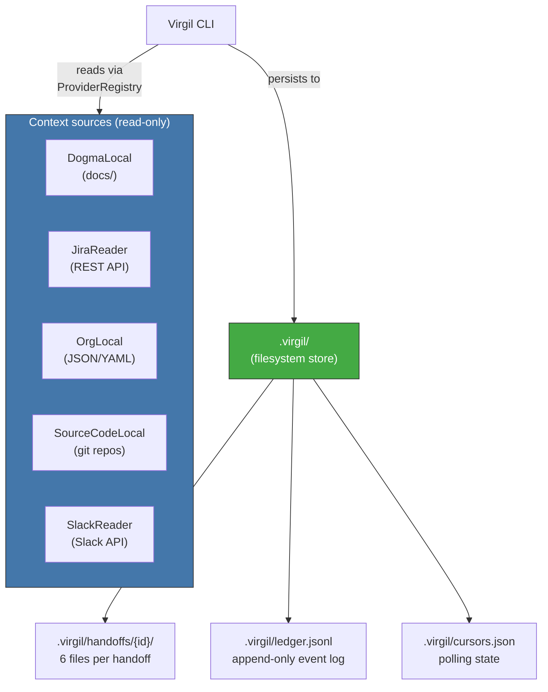
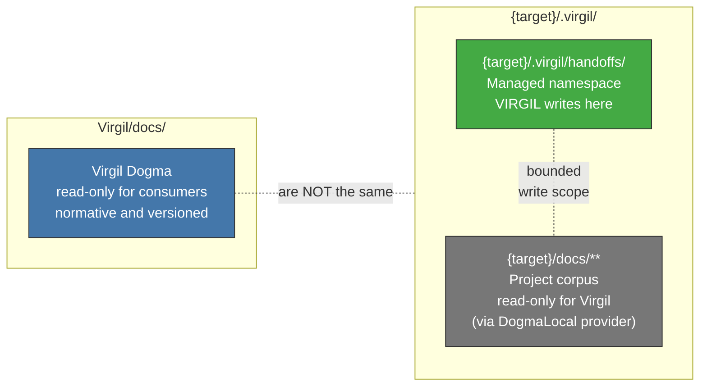

<!-- Virgil Principia
section_id: "8"
title: "Where knowledge lives"
source: "principia/constitution.md"
source_lines: [951, 1024]
layer: knowledge
constitutional: true
actors: []
glossary_terms: [RAG, codebaseMemory, watermark, re-sync]
depends_on: ["5", "7b"]
referenced_by: ["8c-dbms", "8c-watermark", "8c-dual", "8d-8e", "8f-concept", "8f-construction"]
keywords:
  - ArtifactStore
  - RAG
  - codebaseMemory
  - watermark
  - re-sync
  - namespaces
  - persistence
  - context DBMS
  - structural graph
editorial_additions: [context_paragraph]
-->

> **Context:** Introduces the three knowledge-management concerns in Virgil — persistence (ArtifactStore), documentary query (RAG) and structural understanding of code (codebaseMemory) — which are developed in detail in the following subsections (8c-8f).

## 8. Where knowledge lives

Three separate concerns: where deliverables are PERSISTED
(ArtifactStore), how deliverables and documentation are QUERIED (RAG),
and how the code's structure is UNDERSTOOD (codebaseMemory). RAG
acts as the documentary context's DBMS; codebaseMemory acts as the
code's structural graph. Both projections are **versioned**:
they declare a watermark (the revision against which they are synchronized)
and can detect drift relative to the repository's current state.

The canonical contextualization path is to query the appropriate
tool with bounded queries, not to load complete files into the
prompt. Reading files directly is not prohibited but has
a cost: it consumes tokens unnecessarily and operates outside
Virgil's traceability. Any modification that generates new commits
outside Virgil's flow moves HEAD beyond the watermark and
requires a **re-sync** that updates the projection. No
certification is valid if the RAG projection is not synchronized
with the revision being certified.

### 8a. Persistence — filesystem store

> **[Implementation status]** The current runtime persists all artifacts to the local filesystem under `.virgil/`. The provider plugin pattern (`ContextProviderPort` → `SnapshotProviderPort<T>` / `ObservableProviderPort<E>`) replaces the ArtifactStoreAdapter contract described in earlier versions of this document. Providers self-register via `registerIfConfigured()` and are skipped entirely when their configuration is absent — graceful degradation by design. External persistence backends (Jira, Confluence, Azure DevOps) are accessible as read-only context sources through the provider pattern, not as write adapters.

### 8b. Namespace separation

> **Invariant**: `Virgil/docs/` (dogma) and `{target}/.virgil/` (project handoffs)
> do NOT share identity, ownership or write policy. Virgil writes only to `.virgil/`;
> project documentation is read-only context accessed via the DogmaLocal provider.
