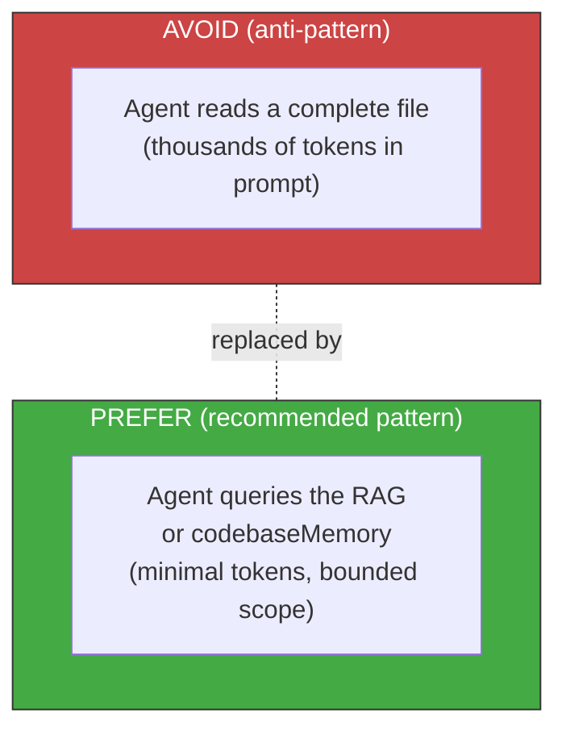

<!-- Virgil Principia
section_id: "8c-dbms"
title: "Dual RAG — context DBMS"
source: "principia/constitution.md"
source_lines: [[1025, 1040], [1081, 1096]]
source_lines_note: "Non-contiguous. Lines 1041-1080 (drift/re-sync mechanisms + first mermaid diagram) belong to chunk 8c-watermark (23). Lines 1034-1040 (the '#### Watermark and re-sync' heading and its lead sentence) are duplicated verbatim in chunk 23, which owns the full 1034-1080 range including body content."
layer: knowledge
constitutional: true
actors: []
glossary_terms: [RAG, codebaseMemory, watermark, AGENTS.md]
depends_on: ["8"]
referenced_by: ["8c-watermark", "8c-dual", "8f-concept"]
keywords:
  - RAG
  - context DBMS
  - codebaseMemory
  - watermark
  - anti-pattern
  - bounded queries
  - token savings
editorial_additions: [context_paragraph, cross_reference_note]
-->

> **Context:** RAG and codebaseMemory (structural code graph, section 8f) are the two versioned knowledge projections introduced in section 8. This fragment establishes the architectural principle of querying instead of reading, and presents the watermark mechanism that guarantees those projections stay synchronized with the repository (mechanics detailed in section 8c-watermark).

### 8c. Dual RAG — context DBMS

Architectural principle: **agents query instead of reading**.
The architecture favors querying the RAG (deliverables, documentation)
and codebaseMemory (code structure, section 8f) over direct
file reading. Virgil injects this guidance via AGENTS.md.
Contextualization via queries, not via prompts — direct
token savings.

#### Watermark and re-sync

RAG and codebaseMemory maintain a **watermark**: the revision
(commit SHA) against which the projection was last built or
synchronized. This watermark is the basis of three
mechanisms:

> **Cross-reference:** The complete watermark mechanics (drift detection, `git merge-base --is-ancestor`, re-sync triggers) are specified in [section 8c-watermark](23-rag-watermark.md). This section introduces the concept; section 8c-watermark defines the mechanism.
