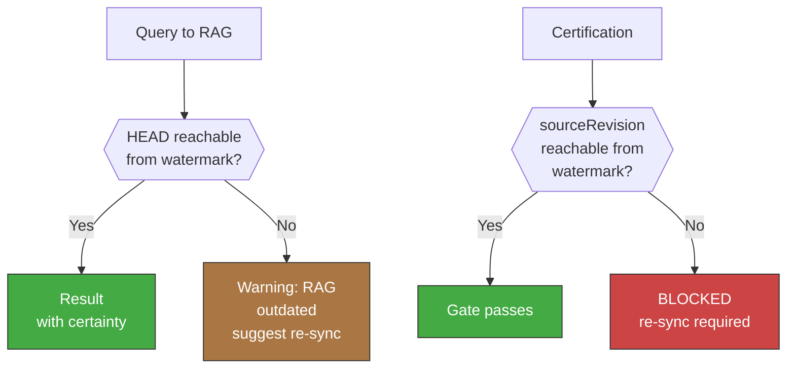

<!-- Virgil Principia
section_id: "8c-watermark"
title: "Watermark and re-sync"
source: "principia/constitution.md"
source_lines: [1034, 1080]
layer: knowledge
constitutional: true
actors: [MIM]
glossary_terms: [watermark, re-sync, sourceRevision, drift]
depends_on: ["8", "8c-dbms"]
referenced_by: ["7b", "8f-construction", "11f"]
keywords:
  - watermark
  - re-sync
  - drift
  - certification
  - sourceRevision
  - HEAD
  - merge-base
  - Dogma
editorial_additions: [context_paragraph, cross_reference_note]
-->

> **Context:** RAG (documentary context DBMS) and codebaseMemory (structural code graph, section 8f) are versioned projections of the repository (section 8). The **watermark** is the commit SHA against which one of those projections was last built or synchronized. This mechanism connects with the certification chain described in sections 7b (deliverables vs build artifacts) and 11f (evidence as queryable data).

> **Continuation of:** [RAG as DBMS](22-rag-dbms.md) introduces the watermark concept. This section defines the complete mechanism.

#### Watermark and re-sync

RAG and codebaseMemory maintain a **watermark**: the revision
(commit SHA) against which the projection was last built or
synchronized. This watermark is the basis of three
mechanisms:

1. **Drift detection**: upon receiving a query, the projection compares
   its watermark against the current HEAD. If there is divergence, it reports:
   "last sync: `{sha}`, `{N}` commits behind" and suggests re-sync.
2. **Certification block**: Virgil does NOT certify code whose
   `sourceRevision` is not reachable from the RAG's watermark. The
   invariant is mechanical: sourceRevision must be reachable from
   the watermark in the commit graph (equivalent to
   `git merge-base --is-ancestor sourceRevision watermark`). The
   watermark is the Kernel's exclusive property and only updates
   as an effect of a re-sync that rebuilds or updates the
   projection — an agent cannot modify the watermark without
   running the sync process.
3. **Explicit re-sync**: the MIM or the agent can trigger a re-sync
   that updates the projection to the current HEAD. The trigger can be:
   - Explicit: the MIM instructs the agent ("sync Virgil").
   - Via PR: the PR includes RAG deltas and a sync signature (the
     signature specification is defined by the Dogma); on merge, the
     projection stays up-to-date without manual intervention.
   - Via hook (opt-in): a post-merge hook triggers re-sync
     automatically. This is the consumer's decision, not an
     obligation of the Principia.

