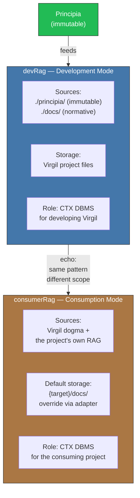

<!-- Virgil Principia
section_id: "8c-dual"
title: "devRag and consumerRag"
source: "principia/constitution.md"
source_lines: [1097, 1135]
layer: knowledge
constitutional: false
actors: []
glossary_terms: [devRag, consumerRag, Principia, adapter]
depends_on: ["8", "8c-dbms"]
referenced_by: ["9"]
keywords:
  - devRag
  - consumerRag
  - Development Mode
  - Consumption Mode
  - adapter interfaces
  - Jira
  - Confluence
  - Azure DevOps
  - Asana
editorial_additions: [context_paragraph]
-->

> **Context:** RAG operates as the documentary context's DBMS (section 8c). Virgil instantiates that same pattern in two variants according to operational mode: `devRag` when developing Virgil itself, and `consumerRag` when a consuming project uses it.

> **[Implementation status]** The dual RAG (devRag/consumerRag) is an architectural provision — not yet implemented. The current runtime uses the provider plugin pattern to access context sources: DogmaLocal for documentation, JiraReader for tickets, OrgLocal for team data, SourceCodeLocal for git state, and SlackReader for chat. The dual-mode concept maps to the Development Mode / Consumption Mode distinction (section 6a), which the runtime will support via `virgil.json` project manifest configuration.

Virgil defines two instances of the same RAG-as-DBMS pattern, one
per operational mode.

| Aspect | devRag | consumerRag |
|---------|--------|-------------|
| Mode | Development | Consumption |
| Sources | `./principia/` + `./docs/` | Virgil dogma + the project's own RAG |
| Storage | Virgil project files | `{target}/docs/` (default) |
| Override | N/A (fixed source) | Adapter interfaces: Jira, Confluence, Azure DevOps, Asana, WordPress, DBMS |
| Role | CTX DBMS for Virgil | CTX DBMS for the consuming project |

consumerRag defines **interfaces** — the client implements them with
whatever backend it needs. Whatever satisfies the adapter contract can
connect.
