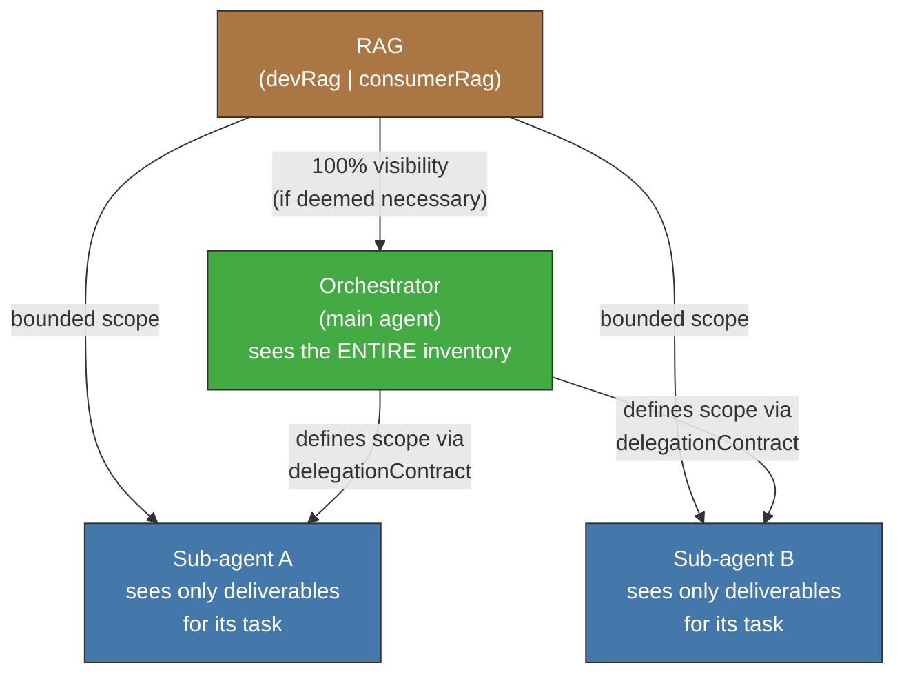
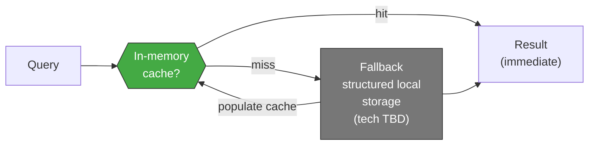

<!-- Virgil Principia
section_id: "8d-8e"
title: "Tiered visibility and memoization"
source: "principia/constitution.md"
source_lines: [1136, 1186]
layer: knowledge
constitutional: true
actors: [orchestrator]
glossary_terms: [delegationContract, RAG, Ledger, ArtifactRepository, TraceabilityGraph]
depends_on: ["8"]
referenced_by: ["9", "10"]
keywords:
  - tiered visibility
  - bounded scope
  - delegationContract
  - memoization
  - cache
  - Ledger
  - TraceabilityGraph
  - derived projections
editorial_additions: [context_paragraph]
-->

> **Context:** RAG (devRag | consumerRag, section 8c) is Virgil's documentary projection. These subsections describe how access to that projection is controlled based on the agent's role (tiered visibility) and how query performance is optimized (memoization), as well as clarifying the authority relationship between the RAG and the system's authoritative sources.

### 8d. Tiered visibility

The main agent (orchestrator) has full RAG visibility
if it deems it necessary. Sub-agents receive a reduced scope:
only what is needed for their task.

The sub-agent's scope is defined in the `delegationContract` (section
9c). The orchestrator decides which topic_keys or queries are visible for
each delegation.

### 8e. Memoization

The RAG maintains an in-memory cache layer to speed up repeated
queries. It falls back to persistent storage when the cache is
invalidated or the session restarts.

The RAG is not the process's authority — the Ledger, the
ArtifactRepository and the evidence are the source of truth. The RAG and
the TraceabilityGraph are derived projections, reconstructible from
the Ledger and the deliverables. No projection is a source of truth;
if it desyncs, it is rebuilt from the authoritative sources.
