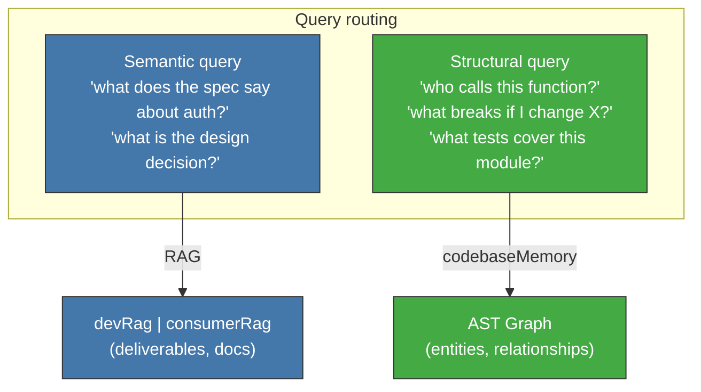

<!-- Virgil Principia
section_id: "8f-concept"
title: "codebaseMemory — structural code graph"
source: "principia/constitution.md"
source_lines: [1187, 1210]
layer: knowledge
constitutional: true
actors: []
glossary_terms: [codebaseMemory, RAG, AST graph]
depends_on: ["8", "8c-dbms"]
referenced_by: ["8f-construction", "9"]
keywords:
  - codebaseMemory
  - AST graph
  - semantic query
  - structural query
  - routing
  - RAG
editorial_additions: [context_paragraph]
-->

> **Context:** The RAG (section 8c) indexes deliverables and documentation semantically. Source code requires different treatment: this subsection introduces codebaseMemory, the complementary tool that maps code structure without embeddings (construction mechanics are detailed in section 8f-construction).

### 8f. codebaseMemory — structural code graph

The RAG operates over deliverables and documentation — structured
data that is indexed semantically. Source code is different: it cannot
(and should not) be fully loaded into a RAG. For code, Virgil
uses a complementary tool: a deterministic
structural graph that maps relationships without embeddings.

