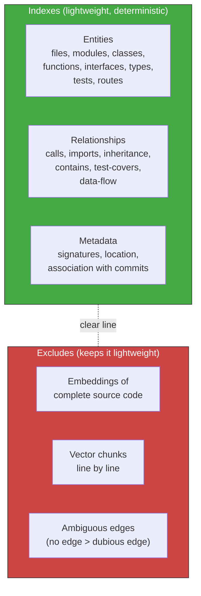
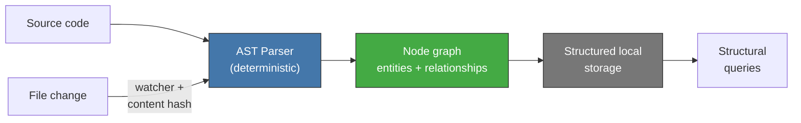
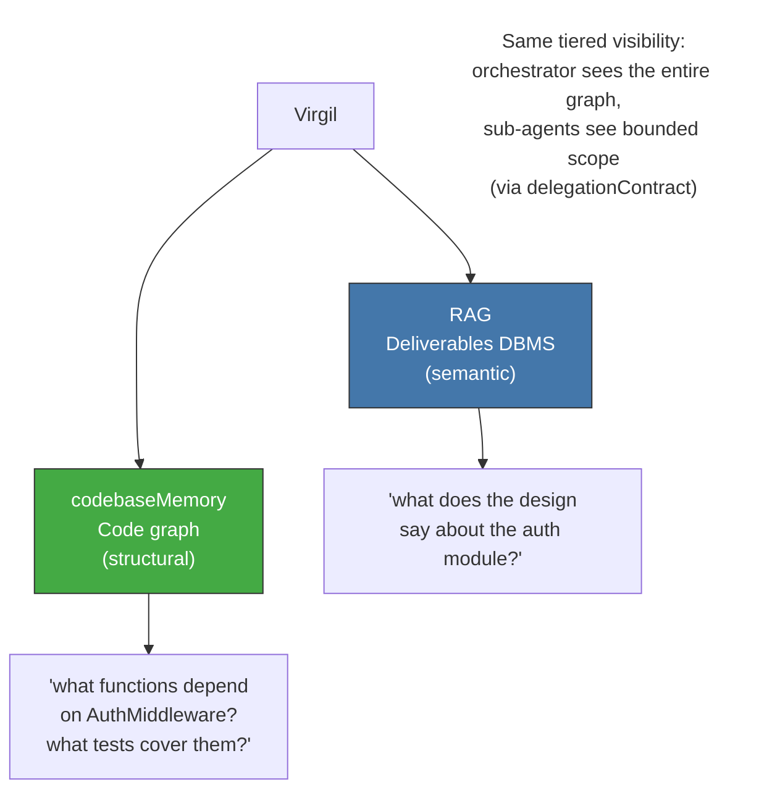

<!-- Virgil Principia
section_id: "8f-construction"
title: "codebaseMemory — construction, indexing and watermark"
source: "principia/constitution.md"
source_lines: [1211, 1298]
layer: knowledge
constitutional: true
actors: []
glossary_terms: [codebaseMemory, watermark, mutation domain, worktree, conservative soundness]
depends_on: ["8f-concept", "8c-watermark", "7a", "7c-composite", "8"]
referenced_by: ["7c-composite", "11c"]
keywords:
  - codebaseMemory
  - AST parser
  - deterministic construction
  - incremental update
  - file watcher
  - watermark
  - mutation domain
  - worktree
  - parallel lanes
  - conservative soundness
editorial_additions: [context_paragraph]
-->

> **Context:** codebaseMemory (section 8f-concept) is the deterministic structural graph that maps code entities and relationships, complementary to the RAG (section 8c). This fragment details what it indexes, how it is built, how it updates incrementally, and how it maintains its own watermark (a mechanism shared with the RAG, section 8c-watermark). It also connects with the isolated mutation domains described in sections 7c and 11c.

#### What it indexes vs what it excludes

codebaseMemory indexes STRUCTURE, not content.

#### Deterministic construction

The graph is built by a deterministic AST parser, not by LLM
inference. This guarantees deterministic coverage of the parseable corpus,
speed, and **conservative soundness** of the edges: a relationship is
recorded only when sufficient structural evidence exists. Ambiguous
edges are omitted; the absence of an edge does not prove the absence of a
runtime or dynamic relationship.

The update is incremental: a file watcher detects changes,
compares hashes, and re-parses only the modified files. There is no
full rebuild on every change.

#### Complement to the RAG, not a replacement

codebaseMemory enables on-demand visualization of the project
as a node graph — without loading source code into the prompt, without
burning tokens, and with full ownership of the structure. It is the
tool that lets Virgil "see" the code without "reading it."

codebaseMemory maintains its own watermark, independent of the RAG's.
The incremental update via file watcher advances the watermark
automatically to the commit that triggered the change. The certification
invariant (section 8c) applies to both projections.

In parallel-lane scenarios (section 11c), each isolated mutation domain maintains its own instance of the graph. In the reference implementation those domains are worktrees. Divergent graphs are reconciled at integration: the integrated revision triggers incremental graph reconstruction from its AST. There is no graph shared between divergent lanes.

> **[Implementation status]** codebaseMemory construction is an architectural provision. External tooling (CodeGraph) provides deterministic AST-based structural graphs with incremental update, file watching, and watermark tracking — matching this specification. Integration between Virgil and CodeGraph is on the roadmap but not a V1 requirement.
