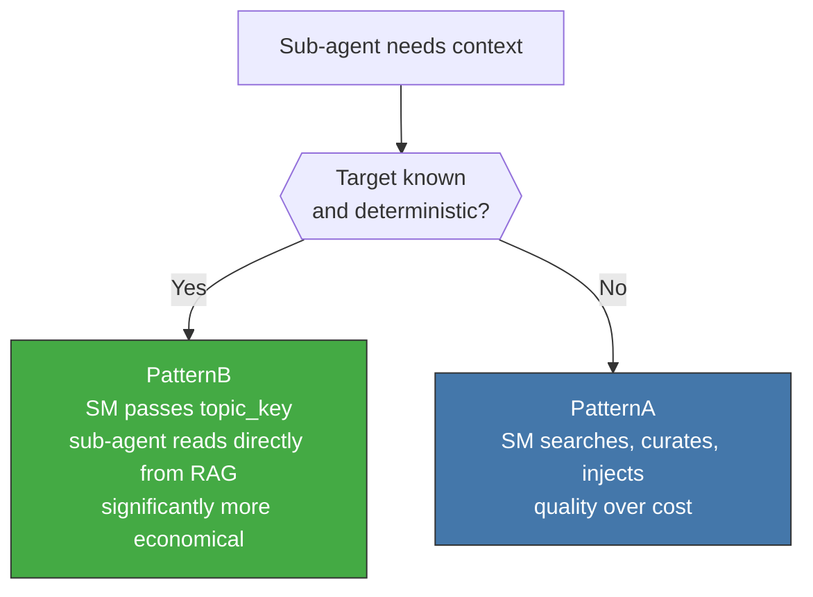
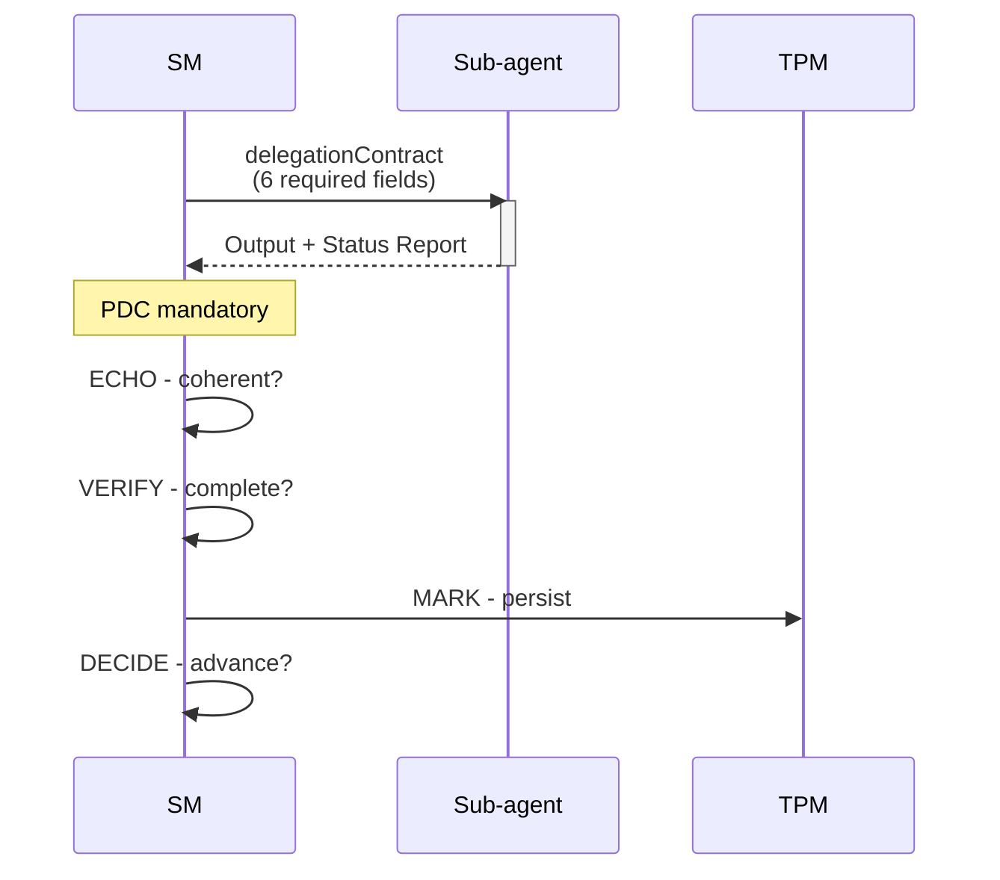

<!-- Virgil Principia
section_id: "9"
title: "How context flows"
source: "principia/constitution.md"
source_lines: [1301, 1382]
layer: context
constitutional: true
actors: [SM, sub-agent, TPM, ContextCompiler]
glossary_terms: [ContextBrief, ContextCompiler, PDC, delegationContract, circuitBreaker]
depends_on: ["8c-dual", "8d-8e", "8f-concept"]
referenced_by: ["3b", "10", "11e-routing"]
keywords:
  - ContextBrief
  - topic_key
  - PatternA
  - PatternB
  - delegation
  - PDC
  - ECHO VERIFY MARK DECIDE
  - Status Report
  - circuitBreaker
  - devRag consumerRag
editorial_additions: [context_paragraph]
-->

> **Context:** With knowledge organized as a document DBMS (RAG), a structural graph (codebaseMemory) and tiered visibility by role (section 8), the next step is to understand how that context flows between agents during execution.

**In this chunk:**
- [9a. ContextBrief](#9a-contextbrief)
- [9b. Two delivery patterns](#9b-two-delivery-patterns)
- [9c. Delegation: SM → sub-agent → PDC](#9c-delegation-sm--sub-agent--pdc)

## 9. How context flows

Fundamental rule: **raw context is never passed to a sub-agent**.
Context is delivered compiled (ContextBrief) or as a reference
(topic_key) for the sub-agent to read from the RAG.

### 9a. ContextBrief

The ContextCompiler selects deliverables, facts and boundaries to
produce a ContextBrief bounded to the actor's objective. The
selection remains traceable: what was included, where it came from, what was excluded.

Compiling the ContextBrief is a judgment step (section 3b) with an inherent hallucination surface: selection/summarization can omit or distort information. Traceability (what was included, where it came from, what was excluded) enables post-hoc audit, but does NOT prevent omission at compile time. This risk is mitigated by the PDC (post-delegation coherence check) and by reconstructing the ContextBrief upon PlanningGapDetected.

### 9b. Two delivery patterns

| Pattern | When | Cost | Quality |
|--------|--------|-------|---------|
| PatternB (default) | Known, deterministic target | Low (passes `topic_key`; avoids materializing context) | Good |
| PatternA | Fuzzy search, high fan-out (8+) | High | Optimal |

Both patterns operate over the dual RAG (section 8c): devRag in
Development Mode, consumerRag in Consumption Mode.

### 9c. Delegation: SM → sub-agent → PDC

The 6 required fields of the delegationContract:

| Field | What it defines |
|-------|------------|
| Identity | Role name, reasoning tier (search / implementation / architecture), behavioral constraints |
| Scope | Explicit boundary of scope — which files, which actions, what is out of bounds |
| Verifiable objective | Binary criterion the SM evaluates against the output |
| Input | Resolved data the sub-agent needs — no references it must chase down |
| Output schema | Exact structure of the expected result |
| Injected rules | Project rules and constraints as literal text in the briefing — the sub-agent does NOT search for its own context |

**Identity** is not decorative — it defines how the
sub-agent reasons and operates. The reasoning tier is assigned by
task complexity, not by preference: a search does not require
architectural capability; a design decision is not delegated to search
capability. Rules arrive pre-digested because a stateless sub-agent
(GP-4: constraint > trust) has neither access to the source
registry nor responsibility for finding it.

Without a Status Report in the output, the SM treats it as FAILED.
Three consecutive failures for the same role activate the circuitBreaker.

> **Do not confuse**: the PDC's `ECHO` step validates the coherence of the delegated output. The **Echo System** runs Setup → Build → Static → Dynamic → E2E and produces build artifacts. The former is an orchestration checkpoint; the latter is the canonical evidence pipeline.
