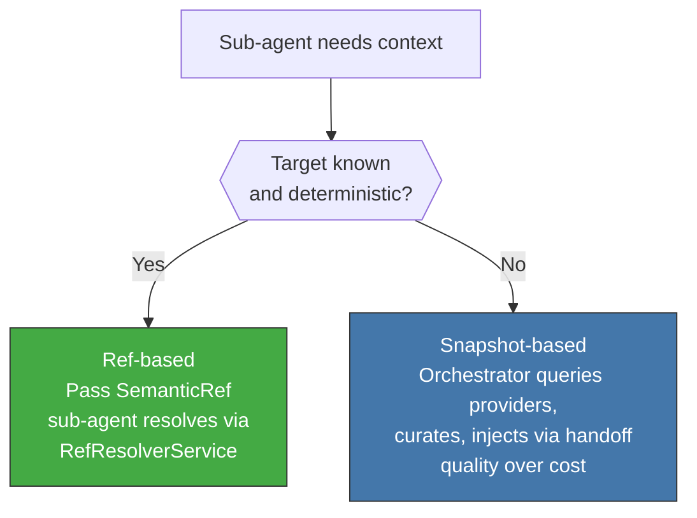
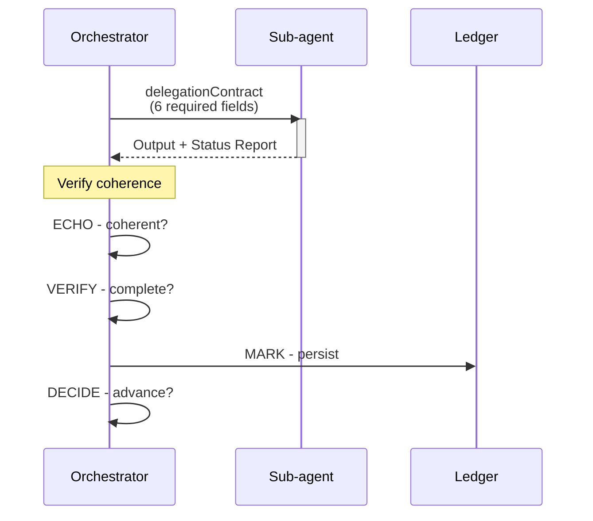

<!-- Virgil Principia
section_id: "9"
title: "How context flows"
source: "principia/constitution.md"
source_lines: [1301, 1382]
layer: context
constitutional: true
actors: [orchestrator, sub-agent]
glossary_terms: [delegationContract]
depends_on: ["8c-dual", "8d-8e", "8f-concept"]
referenced_by: ["3b", "10", "11e-routing"]
keywords:
  - ContextBrief
  - topic_key
  - PatternA
  - PatternB
  - delegation
  - PDC
  - ECHO VERIFY MARK DECIDE
  - Status Report
  - circuitBreaker
  - devRag consumerRag
editorial_additions: [context_paragraph]
-->

> **Context:** With knowledge organized as a document DBMS (RAG), a structural graph (codebaseMemory) and tiered visibility by role (section 8), the next step is to understand how that context flows between agents during execution.

**In this chunk:**
- [9a. ContextBrief](#9a-contextbrief)
- [9b. Two delivery patterns](#9b-two-delivery-patterns)
- [9c. Delegation: SM → sub-agent → PDC](#9c-delegation-sm--sub-agent--pdc)

## 9. How context flows

> **[Implementation status]** The context flow described below has been partially realized in the current runtime. The principle of structured context delivery (not raw dumps) is implemented through the provider plugin pattern and the handoff system. The specific mechanisms (ContextCompiler, ContextBrief, PDC, PatternA/PatternB) are architectural provisions for the RAG layer. The current runtime's context flow is: `ProviderRegistry` → `Provider.snapshot()` → `HandoffService.create()` → structured handoff files. SemanticRef (`{kind}://{backend}/{id}`) and `RefResolverService` provide cross-provider reference resolution.

Fundamental rule: **raw context is never passed to a sub-agent**.
Context is delivered in structured form (handoff files) or as a
semantic reference (`{kind}://{backend}/{id}`) for the sub-agent to
resolve through the provider registry.

### 9a. Context compilation

The orchestrating agent selects deliverables, facts and boundaries to
produce a structured context package bounded to the actor's objective. The
selection remains traceable: what was included, where it came from, what was excluded.

In the current runtime, `HandoffService.create()` performs this role:
it queries providers (ticket summary via `resolveRef`, documentation
via `snapshotDogma`, repository baseline via `detectRepoBaseline`) and
writes structured output files (TASK.md, CONTEXT.md,
ACCEPTANCE_CHECKLIST.md, META.json) to `.virgil/handoffs/{id}/`.

Compiling context is a judgment step (section 3b) with an inherent hallucination surface: selection/summarization can omit or distort information. Traceability (what was included, where it came from, what was excluded) enables post-hoc audit, but does NOT prevent omission at compile time.

### 9b. Two delivery patterns

| Pattern | When | Cost | Quality |
|--------|--------|-------|---------|
| Ref-based (default) | Known, deterministic target | Low (passes `SemanticRef`; avoids materializing context) | Good |
| Snapshot-based | Fuzzy search, high fan-out (8+) | High | Optimal |

### 9c. Delegation contract

The 6 required fields of the delegationContract:

| Field | What it defines |
|-------|------------|
| Identity | Role name, reasoning tier (search / implementation / architecture), behavioral constraints |
| Scope | Explicit boundary of scope — which files, which actions, what is out of bounds |
| Verifiable objective | Binary criterion the orchestrator evaluates against the output |
| Input | Resolved data the sub-agent needs — no references it must chase down |
| Output schema | Exact structure of the expected result |
| Injected rules | Project rules and constraints as literal text in the briefing — the sub-agent does NOT search for its own context |

**Identity** is not decorative — it defines how the
sub-agent reasons and operates. The reasoning tier is assigned by
task complexity, not by preference: a search does not require
architectural capability; a design decision is not delegated to search
capability. Rules arrive pre-digested because a stateless sub-agent
(GP-4: constraint > trust) has neither access to the source
registry nor responsibility for finding it.

Without a Status Report in the output, the orchestrator treats it as FAILED.
Three consecutive failures for the same role activate the circuitBreaker.

> **Do not confuse**: the delegation verification validates the coherence of the delegated output. The **Echo System** runs Setup → Build → Static → Dynamic → E2E and produces build artifacts. The former is an orchestration checkpoint; the latter is the canonical evidence pipeline.
