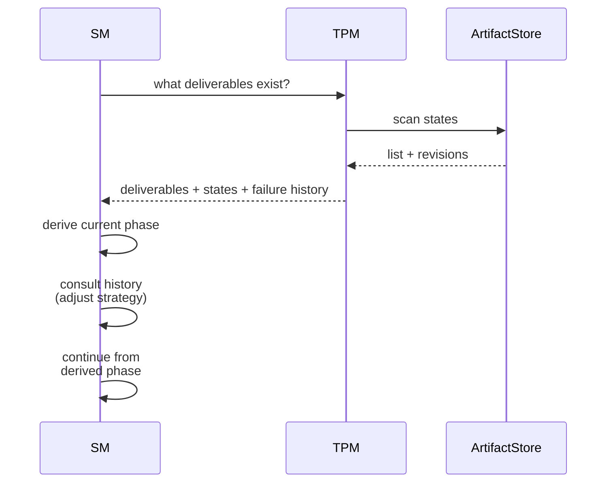

<!-- Virgil Principia
section_id: "10"
title: "How it recovers"
source: "principia/constitution.md"
source_lines: [1385, 1415]
layer: recovery
constitutional: true
actors: [SM, TPM]
glossary_terms: [Ledger, ArtifactStore]
depends_on: ["5", "8d-8e", "9"]
referenced_by: ["11a-11b"]
keywords:
  - recovery
  - crash
  - compaction
  - new session
  - consolidated revisions
  - derived phase
  - failure history
  - lastVerifiedAt
  - external changes
editorial_additions: [context_paragraph]
-->

> **Context:** The state of a Virgil project is not lost after a crash, compaction or new session — it is reconstructed from the Ledger and from the consolidated revisions of deliverables managed by the TPM (section 5).

## 10. How it recovers

After a crash, compaction or new session, state is
reconstructed — it is not lost.

- The SM derives the phase from **consolidated revisions** of deliverables, not from the mere existence of files. A revision only participates in state derivation once its persistence and its required gate/evidence are confirmed; a partial revision after a crash does not advance the phase.
- Phase state is not stored as an authoritative pointer; it is derived from those consolidated revisions and from the Ledger
- Failure history is per-deliverable and cross-session
- `lastVerifiedAt` avoids unnecessary re-verification if the code
  did not touch the deliverable's scope
- External changes are classified: additive (record), contradictory
  (MIM decision), or from another cycle (record as context)
