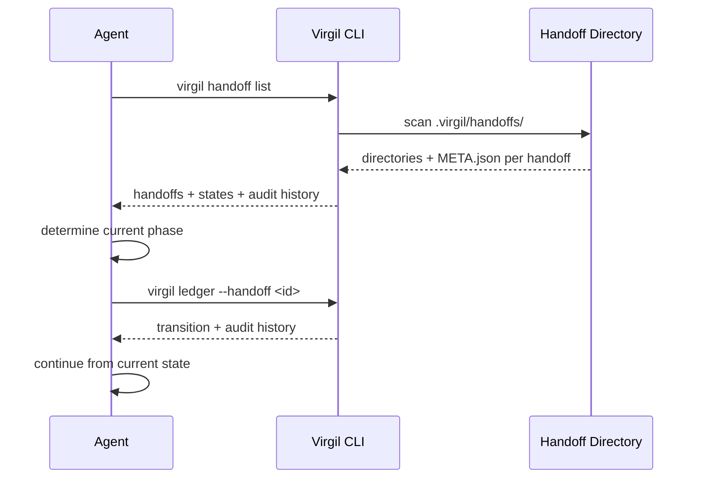

<!-- Virgil Principia
section_id: "10"
title: "How it recovers"
source: "principia/constitution.md"
source_lines: [1385, 1415]
layer: recovery
constitutional: true
actors: [Agent]
glossary_terms: [Ledger, HandoffStateMachine]
depends_on: ["5", "8d-8e", "9"]
referenced_by: ["11a-11b"]
keywords:
  - recovery
  - crash
  - compaction
  - new session
  - META.json
  - derived phase
  - failure history
  - external changes
  - deterministic state
editorial_additions: [context_paragraph]
-->

> **Context:** The state of a Virgil project is not lost after a crash, compaction or new session — it is deterministically reconstructed from the handoff directory structure, META.json state, and the Ledger.

## 10. How it recovers

After a crash, compaction or new session, state is
reconstructed — it is not lost.

- State is stored authoritatively in each handoff's `META.json` (`state` field). Recovery is deterministic: read META.json, read the Ledger for history.
- The `HandoffStateMachine` enforces valid transitions and preconditions — state cannot drift through partial writes because META.json is updated atomically.
- Failure history is available through the Ledger: every transition, audit, and break-glass event is recorded with timestamps.
- External changes are classified: additive (record), contradictory
  (MIM decision), or from another cycle (record as context).
